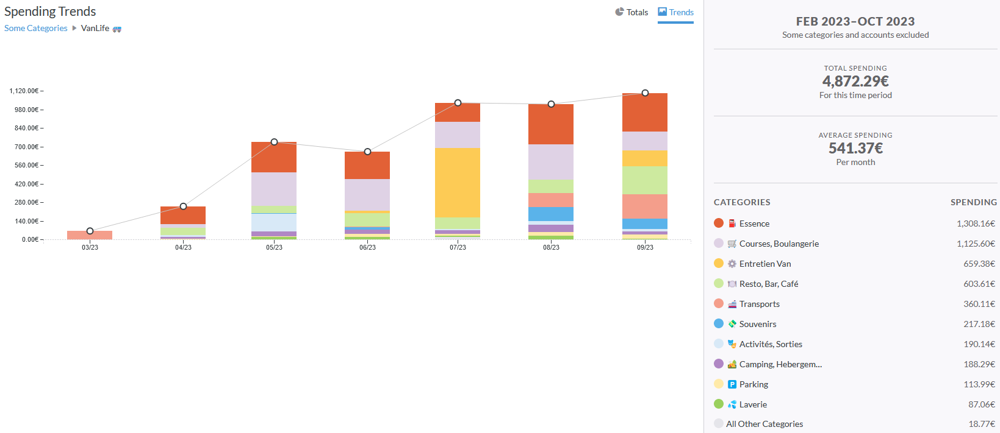

# Budget Pour Voyager En Van Pendant 6 Mois

Voyager en van, ça coute combien ? Eh bien, c'est ce que nous verrons dans ce post détaillé sur le budget de notre voyage en van.

<!-- more -->

## Introduction

Le 17 Avril 2023, nous sommes partis à l'aventure avec ma copine pour 166 jours en France, en Angleterre, au Pays de Galles, en Ecosse et en Irlande.

La question que tout le monde nous pose :

> Et voyager en van, combien ça coûte ?

Eh bien nous allons essayer d'y répondre au mieux dans ce post.

## Acheter Un Van Et L'aménager, Combien Ça Coûte ?

Nous avons acheté notre van 8000€ en juillet 2022. Ce dernier était un Renault Master II de 173098 km, déjà aménagé avec lit, électricité, eau, et réfrigérateur.

Nous avons effectué de nombreux travaux sur le van, notamment des [aménagements intérieurs](./Mod%C3%A9lisation%20Et%20R%C3%A9alisation%20Des%20Travaux%20D'am%C3%A9nagement%20D'un%20Van.md) et la refonte complète du [réseau électrique](./Conception%20Et%20Installation%20Du%20R%C3%A9seau%20%C3%89lectrique%20D'un%20Van.md).

Ces travaux ont un coût, auquel il faut rajouter le coût de la révision que nous avons fait avant de partir, comprenant le changement de 4 pneus, et de rotules de train avant. Un petit total à **1101,46€**.

Et au total, l'aménagement et tout le matériel acheté pour le van nous ont coûté **1466,78€** par personne, soit un total de **2933,56€**. Nous avions prévu un total de 2000€ mais avons dû rajouter la refonte du panneau électrique et une glacière à compression, nous propulsant un peu au-delà de nos attentes. Notons aussi que nous avons un peu "triché" en ajoutant les courses du départ dedans, et beaucoup de petits objets pratiques : Bassines, boites de rangement, etc.

Remarquez, comme on a prévu large de partout, on est bons.

## Préparer Son Budget De Voyage

Pour préparer notre budget, nous étions partis sur 8 mois de cavale, comprenant mars à octobre.

Pour chaque mois, nous avons préparé les dépenses dans leur ensemble :

- L'essence, budget principal. Préparé sur le pire scénario, à savoir 2€/L, une consommation de 10L/100km et une moyenne de 100km par jour.
- Les différents transports, notamment les ferries ou la traversée du tunnel sous la Manche.
- Les campings à raison d'un par semaine à 15€ la nuit. Prix choisi d'après la moyenne en France (cry in tarif anglais exorbitant).
- Les parkings (parfois plus chers que pour une voiture).
- Les courses.
- Les sorties en restaurants ou cafés à raison de 2 restaurants par mois.
- Le gaz, à raison d'une bouteille par mois pour être larges.
- Les laveries à raison d'une fois toutes les deux semaines à 15€.
- Les activités et visites.
- Les souvenirs pour nous et pour nos proches.
- Les dépenses personnelles.
- L'assurance du van tous les mois.

On arrive à un joyeux total de **12000€**, soit **6000€** par personne pour 8 mois de voyage ! Une somme rondelette, mais quand on voit le prix des locations à la semaine (van ou appartement hein), on se dit que somme toute, on est dans la tranche économe du voyage-game.

## La Réalité ?

Pour suivre nos dépenses, nous sommes des adorateurs de la [méthode de l'enveloppe](https://www.ynab.com/the-four-rules/),[^1] largement enseignée à Mathis par YNAB il y a quelques années. Nous avons utilisé [YNAB](https://www.ynab.com/) donc pour suivre les dépenses de Mathis, et [Splitwise](https://secure.splitwise.com) pour tenir compte des dépenses d'Elina. Les deux étant synchronisés par leurs API et un peu de magouille, un setup complexe mais fonctionnel qui nous donne des graphiques de dépenses précis !

Le voyage nous a couté **4872,29 €** par personne, soit **9744,58€**.

Nous avons voyagé **166 jours**, cela nous fait un budget total de **58,7€** par jour, et donc de **29,35€** par jour et par personne. Ce qui fait pour le côté nourriture (courses et restaurants) **10,4€** par jour et par personne. Un peu plus de 3€ le repas, on est restés au Crous en fait !

Notons que faire des cartes de fidélité à Morrisons ou ailleurs est une très belle option à envisager pour faire des économies, comme toujours. Idem utiliser des sites de cashback pour les achats de billets de ferries.

Donc au total, achat, aménagement et voyage compris, on arrive à :

- **20 678,14€** pour deux
- **10 339,07€** par personne

Il nous reste la révision après voyage et le contrôle technique avant vente tout de même, les dépenses ne sont pas terminées mais elles seront aussi compensées par la vente.

Bref, on est bien. Et on a bien profité !

Alors effectivement pour les plus attentifs, nous ne sommes pas parti en mars car nous avions encore notre CDD jusqu'en avril. Et le départ début avril a été repoussé pour qu'Elina puisse se préparer (ayant fini de travailler plus tard), et pour finir la refonte du réseau électrique qui fut retardée par… Chronopost. On balance ici. Au final, perdre mars et octobre n'était pas un problème étant données la température et la météo, on est presque contents d'avoir pu se concentrer sur les beaux jours uniquement !

Et sachant tout ce que nous avons pu faire, et les pépins mécaniques que nous avons eu… J'estime que nous nous en sommes très bien sortis ! Eh oui, plus de 1000 balles de frais au Pays de Galles pour changer le cylindre récepteur d'embrayage, l'embrayage et deux pneus, et rebelotte en Irlande pour deux nouveaux pneus avant. L'état de leurs routes et un problème de parallélisme n'ayant pas aidé, heureusement que le budget était tout de même large !

## Comment Réussir À Tenir Un Budget ?

Déjà, on ne le répètera jamais assez, mais prévoyez large.

Sur un voyage long comme ça, on commence radin. Eh oui, pas de plan précis du voyage, les pépins mécaniques peuvent arriver et on ne connait pas encore le coût des choses. Mais plus le voyage avance, plus on peut réévaluer nos dépenses et ainsi se faire de plus en plus plaisir financièrement parlant. C'est du moins ce qui nous est arrivé.

Pour l'essence, nous avions pris le pire scénario, et comme il s'agit de notre plus grande dépense avec les courses, nous avons bien économisé. Faut dire que l'essence était entre 1,6 et 1,8 pendant la majeure partie du voyage et non pas 2€/L. Et que nous avons consommé un peu moins que les 10L/100km prévus.

Pour les courses, beauuuucoup de conserves, des sandwichs que nous faisions le midi, des fruits, et peu de superflu. On évite les chips, les gâteaux hors de prix, etc. Bon on a craqué quelques fois, mais l'important était de se tenir à notre budget. Et cela nous a réussi aussi bien financièrement que physiquement étant donnée l'énergie qu'on avait chaque jour et à quel point nous avons séché. De belles habitudes de vie prises, et en plus des économies de faites ! La viande peu chère et de qualité des îles a aidé. Notons quand même que nous avons réajusté notre budget de 125€ par personne et par mois à un peu moins de 200€, pour manger bien et parce que nous le pouvions !

Au niveau des restaurants, on avait sous-estimé les arrêts en cafés. Toujours en surveillant le budget, les cafés restaient fréquents et on ne les avait pas comptés dans le budget initial. Mais, comme d'hab, on prévoit large et on n'a pas dépassé notre budget pour autant.

Parenthèse gaz, nous avons utilisé seulement 2 bouteilles R907 de gaz pour le voyage complet ! On s'attendait à largement plus, sachant qu'on faisait chauffer matin, midi et soir au début. Sûrement une économie grâce aux sandwichs le midi.

Pour les visites, nous avons économisé un max en prenant l'abonnement des locaux : English Heritage et National Trust. Visites et parkings gratuits dans la plupart des lieux, ça aide. Surtout vu le prix des visites dans ces pays. On a fait un peu d'à côté, déjà la plupart appartiennent à l'une des deux entités, et ceux qui n'y figurent pas sont pour la plupart des attrapes touristes. Ou alors nous avions déjà visité des lieux similaires, et/ou gratuits ! Il faut dire que sur 6 mois, rater une visite on s'en fiche, tout est tellement beau et intéressant qu'on se rattrape.

Notons quand même que de nombreux lieux gratuits et peu connus sont beaucoup plus intéressants que les lieux touristiques, nous pensons notamment à Downpatrick Head par rapport à Cliff of Moher, voire au sud du Pays de Galles par rapport aux Cornouailles.

Les transports en ferry sont peu onéreux si on s'y prend tôt, et pas que. D'Ecosse en Irlande, le trajet le moins cher toute période confondu, nous l'avons trouvé au comptoir de la compagnie 2h avant l'embarquement.

Notons quand même que pour trouver des campings de qualité mais pas cher, nous recommandons Park4Night, Searchforsites et PitchUp. Ce trio gagnant permet de trouver à coup sur un endroit sympa.

Pour les parkings, le même trio suffit mais on remplace PitchUp par Parkopedia.

Pour plus d'applications utiles en van, nous avons réalisé un autre [post sur le sujet](./Les%20Applications%20Indispensables%20Pour%20Voyager%20En%20Van.md).

En conclusion, on a fait quelques ajustements selon les catégories mais, même avec les petits pépins mécaniques, on est en-dessous du budget prévisionnel du voyage (on avait dépassé sur celui du pré départ, ça compense) et ça, c'est agréable !

## Conclusion (pour Faire Plaisir À Elina)

Voyager, ce n'est pas forcément cher. Mais il faut penser à beaucoup de choses, bien prévoir le tout et trouver les bons plans de partout ! Mais c'est possible !

En tout cas, même avec les coûts d'entretien, il vaut mieux acheter un van pour un voyage long, les locations étant hors de prix.

Et voyager en van reste bien plus abordable et confortable (au sens où l'on peut faire ce que l'on veut sans avoir beaucoup d'impératifs dans les journées) que les voyages traditionnels. On ne regrette pas !

[^1]: Méthode qui consiste à allouer une somme d’argent prédéfinie à différentes catégories de dépenses représentées par des enveloppes physiques ou virtuelles. Largement popularisée par YouNeedABudget, une application de gestion de budget.
