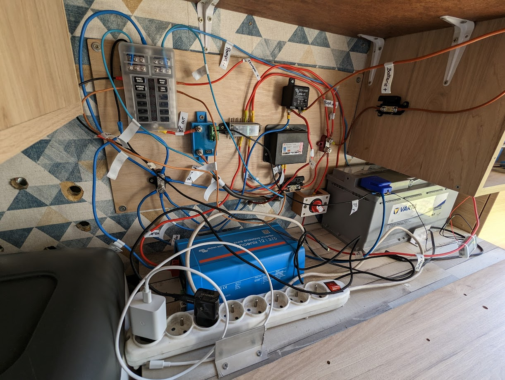

# Conception Et Installation Du Réseau Électrique D'un Van

Un des gros chantiers que nous avons dû réaliser pour notre voyage a été de refaire entièrement le réseau électrique du van.

<!-- more -->

## Etat Initial

Lorsque nous avons acheté le van, il était équipé des éléments suivants :

- Un [panneau solaire de 80W](https://www.camping-car-plus.com/high-tech-electricite/source-d-energie/panneaux-solaires/kit-panneau-solaire-e-ssential-inovtech-80w-5831.html)
- Une [batterie auxiliaire VARTA Professional Dual Purpose AGM 95 Ah / 105 AH](https://www.camping-car-plus.com/high-tech-electricite/source-d-energie/batteries/batterie-varta-professional-dual-purpose-agm-95-ah-6602.html) que nous pouvions relier à la batterie de démarrage du véhicule en parallèle pour la recharger à l'aide de l'alternateur.
- Un [convertisseur de tension Vechline 600W quasi-sinus](https://lcg-loisirs.fr/energie-high-tech/convertisseur-vechline-LCG3953)
- Un [frigo Trimixte XC-43G de 40L](https://www.cdiscount.com/auto/camping-car-caravaning/refrigerateur-a-poser-trimixte-xc-43g-40-litres/f-13330100101-inc3700628230212.html)
- Une [pompe à eau Flojet Triplex 2.9 12V 25 psi](https://www.amazon.fr/dp-Flojet-Triplex-2-9-12-V-25psi/dp/B01JUN0NDG/ref=as_li_ss_tl?__mk_fr_FR=%C3%85M%C3%85%C5%BD%C3%95%C3%91&dchild=1&keywords=flojet+12v&qid=1582580597&sr=8-1&linkCode=ll1&tag=fourgonamen07-21&linkId=b02653e5b721120ad7a1ab65ab86a8cf&language=fr_FR)

Et là vous vous dites, et bien parfait, quel est le problème ?

Il y en a plusieurs :

1. Il n'y a que le convertisseur et le panneau solaire qui sont protégées par un fusible. Aucun des autres appareils n'est aux normes.
2. Le convertisseur de tension est un quasi-sinus, il est donc déconseillé pour les appareils informatiques (téléphones, ordinateurs, etc.)
3. La batterie auxiliaire est reliée directement à la batterie de démarrage lorsque l'on enclenche une clef. Malheureusement, cela rend le système soumis à l'erreur humaine, et démarrer après avoir branché le système peut provoquer une montée de tension trop brusque pour la batterie auxiliaire.
4. Notre frigo consomme beaucoup trop d'électricité (~100W) pour une technologie de refroidissement inefficace.
5. Nous n'avons aucun moyen de contrôler le niveau de charge de la batterie.
6. Nous n'avons aucun moyen de protéger la batterie auxiliaire en l'empêchant de descendre sous les 50% et ainsi respecter son DOD.[^1]

## Améliorations Proposées

Etant donnée notre consommation prévue d'électricité, nous avons conservé la batterie et le système de charge solaire. Nos améliorations ont porté sur :

1. Achat et installation d'un [porte fusible complet](https://www.amazon.fr/gp/product/B07YDF3WJX/ref=ppx_yo_dt_b_asin_title_o03_s00?ie=UTF8&psc=1) pour protéger chaque circuit selon les normes.
2. Changement du convertisseur de tension pour un [Victron Phoenix VE.Direct 12/375](https://www.h2r-equipements.com/convertisseur-12v-230v-transformateur-bateau/17056-victron-phoenix-vedirect-12-375.html).
3. Installation d'un coupleur [séparateur Victron Energy Cyrix-CT 120A](https://www.h2r-equipements.com/coupleur-separateur-camping-car-fourgon-amenage/2376-victron-energy-cyrix-ct.html).[^2]
4. Changement du frigo pour une glacière à compression [Mobicool MCF40 de 38L](https://www.amazon.fr/MOBICOOL-Glaci%C3%A8re-compresseur-refroidissement-cong%C3%A9lateur/dp/B07ZZC6816). Consommation moyenne de 48W en 12V (~25Ah/24h).
5. Installation d'un [voltmètre](https://www.amazon.fr/gp/product/B0793PJSJM/ref=ppx_yo_dt_b_asin_title_o04_s00?ie=UTF8&th=1) pour contrôler la tension de la batterie. Attention, cela ne suffit absolument pas à connaitre l'état de charge d'une batterie, un capteur intelligent comme le [Victron BMV-712](https://www.amazon.fr/Victron-Energy-BMV-712-Moniteur-Batterie/dp/B075RTSTKS/ref=sr_1_1?__mk_fr_FR=%C3%85M%C3%85%C5%BD%C3%95%C3%91&crid=BADP7PRIKLOB&keywords=victron+bmv&qid=1696516595&sprefix=victron+bmv%2Caps%2C112&sr=8-1) est requis pour tenir compte de l['effet Peukert](https://esoxiste.com/la-batterie-pour-les-nuls/), mais nous auront tout de même une indication.
6. L'ajout d'un [Victron Battery Protect 65A](https://www.h2r-equipements.com/protection-basse-tension-fourgon-amenage-camping-car/18131-victron-battery-protect-65-a.html) afin de couper le courant à la batterie si une certaine tension est atteinte et réenclencher le circuit uniquement lorsqu'une nouvelle tension jugée suffisante est atteinte. Cela nous permet, en ayant la correspondance tension-capacité restante d'une batterie AGM, de bloquer la décharge à 50% de DOD. Du moins, lorsque le panneau solaire ne fonctionne pas : en effet, lorsque le panneau solaire charge la batterie, la tension augmente mais la batterie n'a pas pour autant récupéré sa charge.

## Schéma Électrique Final

Remarque : Le câble noir permettant de contrôler l'allumage du convertisseur de tension par le batterie protect n'a pas été utilisé étant donné que notre convertisseur de tension possède une sécurité intégrée pour éviter les décharges lourdes de batterie.

[^1]: **Depth of discharge** (**DoD**) is an important parameter appearing in the context of rechargeable battery operation. More informations [here](https://www.solaris-store.com/content/43-principe-de-fonctionnement-d-une-batterie-solaire).
[^2]: Plus d'informations sur les coupleurs séparateurs et leur fonctionnement [ici](https://www.youtube.com/watch?v=YIDDCP6phbo&t).
