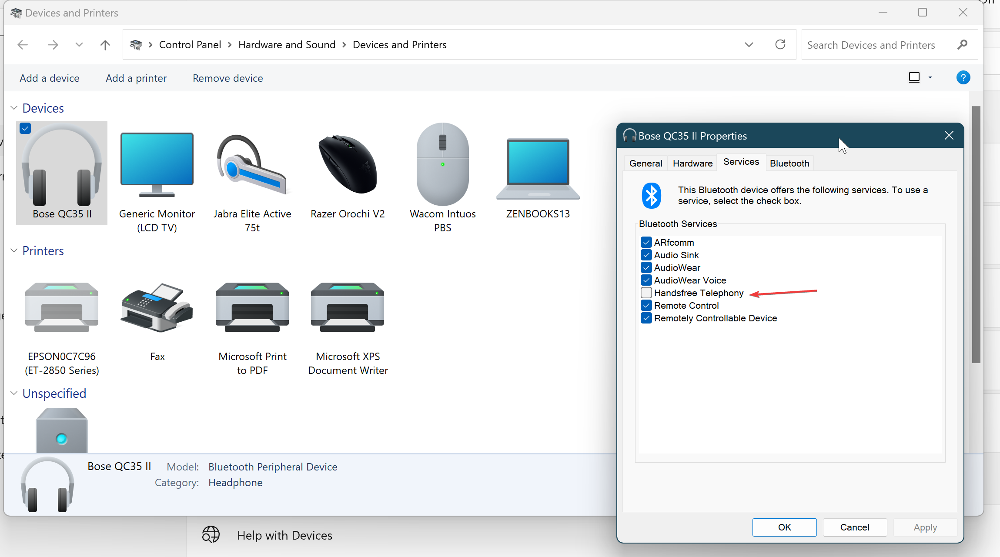
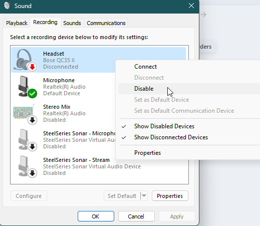

# Fix Bose QC35 Headset Communication Issue on Windows 11

The Bose QC35 headset has terrible sound settings by default on windows because of the handsfree telephony mode activated by default. Here's how to change it.

<!-- more -->

Source : [[deleted by user] : r/bose](https://www.reddit.com/r/bose/comments/kbdf4e/deleted_by_user/)

1. Open settings.
2. Click devices
3. On the right click devices and printers
4. Find your headphones and double click them
5. Click the services tab
6. Disable "handsfree telephony"

In order for the settings to be kept, one should do this as well :

