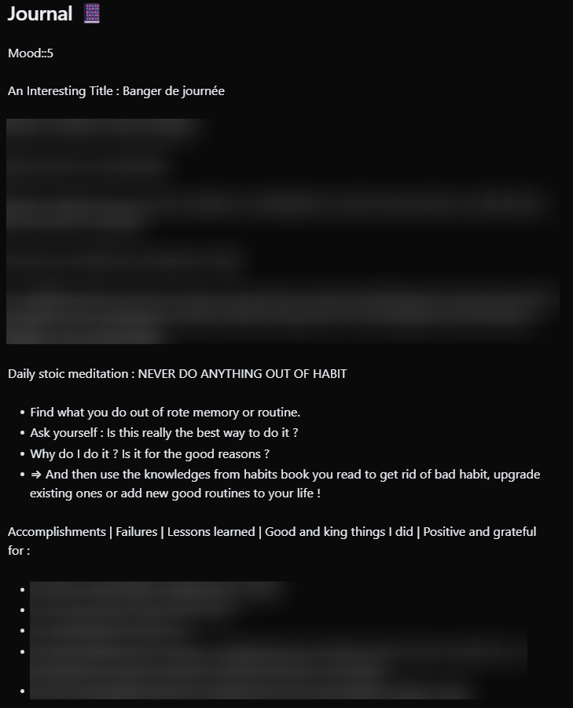
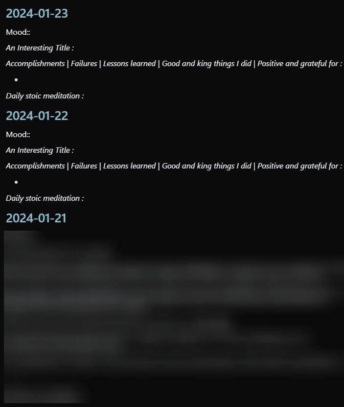
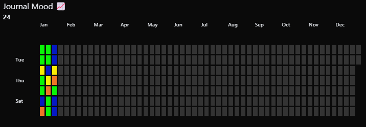

# How I Reverse Engineered Daylio Backup to Allow for Csv File Importing

Here's how I managed to reverse engineer the Daylio backup format to import my journal data from plain markdown notes in Obsidian.

<!-- more --> [Site Unreachable](https://mathisgauthey.github.io/How%20I%20Reverse%20Engineered%20Daylio%20Backup%20to%20Allow%20for%20Csv%20File%20Importing.md/)

## Introduction

On May 1st 2023, I decided to use Obsidian as my all-in-one organisation app. It used to allow me to :

- Do my journaling (formerly Daylio)
- Manage my GTD setup for tasks and projects (formerly Todoist)
- Do some daily planning along with periodic reviews and goals (weekly, monthly, quarterly, yearly)
- Log my workouts
- Take notes alongside tasks, and manage my knowledge

But I recently came to the conclusion that Obsidian is not cheap, and according to the [Unix philosophy](https://www.wikiwand.com/en/Unix_philosophy#Origin) :

> Make each program do one thing well. To do a new job, build afresh rather than complicate old programs by adding new "features".

Well, I use Obsidian for saving articles and files, taking notes from these resources, and sharing them on my website. **It's all about knowledge, and it should stay this way**.

I moved my workflow to respective software :

- Workout logging ⇒ Hevy
- GTD and planning ⇒ TickTick and Google Calendar
- Journaling ⇒ Daylio

Daylio was set to make a come back, but how could I transfert my data back ? Well, as there is no officially supported way to import data to Daylio, I needed to find one.

I remember I used to export my Daylio to csv and use [Obsidian-Daylio-Parser](https://github.com/DeutscheGabanna/Obsidian-Daylio-Parser) to import them to Obsidian. Maybe I can take the other route ?

## Exporting My Journal Entries From Obsidian

### The Idea

My journaling workflow was simple on Obsidian.



I took note on my daily note (`YYYY-MM-DD.md`) in the `## Journal 📔` section. The section naming evolved, but always had the `Journal` keyword.

That's a start. I used to query my daily notes journal entries using this dataviewjs script :



```javascript
const header = '#+ [^\n]*?Journal[^\n]*?'

// You can update this to filter as you like - filtering for just your daily notes would be good
const pages = dv.pages('"-Daily-Notes"').filter(page => page.file.name.includes("2024")).sort(x => x.file.name, 'desc')

// This regex will return text from the Summary header, until it reaches
// the next header, a horizontal line, or the end of the file
const regex = new RegExp(`\n${header}\r?\n(.*?)(\n#+ |\n---|$)`, 's')

for (const page of pages) {
    const file = app.vault.getAbstractFileByPath(page.file.path)
    // Read the file contents
    const contents = await app.vault.read(file)
    // Extract the summary via regex
    const summary = contents.match(regex)
    if (summary) {
        // Output the header and summary
        dv.header(2, "[["+file.basename+"]]")
        dv.paragraph(summary[1].trim())
    }
}
```

Basically, I search for files in my `-Daily-Notes` folder, sort them, look for the journal section and take the notes inside with a clickable filename.

But I also had some heatmap-calendar script to query moods :



```javascript
dv.span("Journal Mood 📈")
const calendarData = {
    year: 2024,  // (optional) defaults to current year
    colors: {    // (optional) defaults to green
        scale:        ["#f2120d", "#ef7626", "#faed03", "#0af508", "#051ac3"]
    },
    showCurrentDayBorder: true, // (optional) defaults to true
    defaultEntryIntensity: 4,   // (optional) defaults to 4
    intensityScaleStart: 1,    // (optional) defaults to lowest value passed to entries.intensity
    intensityScaleEnd: 5,     // (optional) defaults to highest value passed to entries.intensity
    entries: [],                // (required) populated in the DataviewJS loop below
}

//DataviewJS loop
for (let page of dv.pages('"-Daily-Notes"').where(p => p.mood)) {
    //dv.span("<br>" + page.file.name) // uncomment for troubleshooting
    calendarData.entries.push({
        date_created: page.file.name,     // (required) Format YYYY-MM-DD
        intensity: page.mood, // (required) the data you want to track, will map color intensities automatically
        content: await dv.span(`[](${page.file.name})`), // (optional) Add text to the date cell
        color: "",          // (optional) Reference from *calendarData.colors*. If no color is supplied; colors[0] is used
    })
}

renderHeatmapCalendar(this.container, calendarData)
```

And finally, some sort of title on journal entries inspired from reddit : `An Interesting Title : TITLE`.

I need to be able parse all that to Daylio. Let's recap.

### The Goals (based on the Csv Export of Daylio)

- Take the date from the filename, add an arbitrary time and create an [epoch timestamp](https://www.epochconverter.com/).
- Query the entire `Journal` section of each daily-note.
- Take the `mood::x` key and add it as a daily evaluation from 1 to 5 for Daylio moods. And remove that part afterward.
- Take the title for the new Daylio note title. And remove that part afterward.

### The Script

```python
# encoding: utf-8
import os
import re
import pandas as pd
import csv
from datetime import datetime

# Columns for the CSV file
columns_names = ["date", "time", "datetime", "mood", "note_title", "note"]

# Create an empty dataframe with the columns
df = pd.DataFrame(columns=columns_names)

# Source directory of the markdown files
src_dir = "src/auto/"

# Get the list of files in the source directory
filenames = os.listdir(src_dir)
filenames.sort()

# Create an empty list to store the data
csv_rows = []

# Regex patterns
header = '#+ [^\n]*?Journal[^\n]*?' # Matches the header of the journal section
journal_section = re.compile(fr'\n{header}\r?\n(.*?)(\n#+ |\n---|$)', re.DOTALL) # Matches the journal section
mood_entry = re.compile(r'(?i)(?<=mood::)\d+') # Matches the mood entry
title = re.compile(r'An Interesting Title\s*:\s*(.*)') # Matches the title of the note

# Dictionary to convert the mood to a number according to daylio backup format
mood_dict = {
    "1": "5",
    "2": "4",
    "3": "3",
    "4": "2",
    "5": "1"
}

for filename in filenames:
    with open(src_dir + filename, "r", encoding="utf-8") as f:

        # Get the date from the filename
        date = filename.replace(".md", "")
        time = "23-59-59"
        # Convert the date and time to epoch timestamp
        datetime_str = f"{date} {time}"
        datetime_object = datetime.strptime(datetime_str, "%Y-%m-%d %H-%M-%S")
        epoch_timestamp = int(datetime_object.timestamp())

        # Initialize the variables
        mood = ""
        note_title = ""
        journal_entry = ""

        # Read the file content
        file_content = f.read()

        # Get the journal section
        section_match = journal_section.search(file_content)
        if section_match:
            journal_entry = section_match.group(1)

            # Get the mood entry
            mood_match = mood_entry.search(journal_entry)
            if mood_match:
                mood = mood_match.group(0)
                mood = mood_dict[mood]
                journal_entry = re.sub(r'^[Mm]ood::\d$', '', journal_entry, flags=re.MULTILINE)

            # Get the note title
            title_match = title.search(journal_entry)
            if title_match:
                note_title = title_match.group(1)
                journal_entry = re.sub(r'An Interesting Title\s*:\s*(.*)', '', journal_entry, flags=re.MULTILINE)

            # Remove the leading and trailing newlines
            journal_entry = journal_entry.lstrip('\n').rstrip('\n')
            # Replace the newlines with HTML line breaks like in the daylio backup format
            # journal_entry = journal_entry.replace('\n', '<br>')

        # Add the data to the list
        csv_rows.append([date, time, epoch_timestamp, mood, note_title, journal_entry])

# Create a dataframe from the list
df_extended = pd.DataFrame(csv_rows, columns=columns_names)

# Concatenate the dataframes
df = pd.concat([df, df_extended])

# Export the dataframe to a CSV file
df.to_csv("output.csv", index=False)
```

### Difficulties Encountered

- The regex. They are a pain. I won't explain much because ChatGPT exists, and you can use [regex101 to build, test, and debug regex](https://regex101.com/).

## Importing Data to Daylio

Well, at first I thought I could import from CSV just like I exported as CSV. Nope. And support told me no as well, it's related to their take on privacy policies.

So… I searched the internet and found two interesting links (that you can take a look at, if you go further down this article). I needed to reverse engineer the Daylio backup file.

### Explanation

Basically :

1. A Daylio backup is a file like that : `backup_DATE.daylio`. Actually, it's a zip file. So you can use 7zip to open it.
2. You then found yourself with a `backup.daylio` file which is just a base64 encoded json, and an `assets` folder for pictures. Copy the `backup.daylio` file out of the archive.
3. You need to use a [tool](https://www.base64decode.org/) to decode the base64 file.
4. Then you can lint it so that it become easier to modify.
5. I then created a script to convert my CSV file from above to some json entries that I'll paste inside the `"dayEntries": []` part of the json file.
6. You can also edit the `"metadata" > "number_of_entries"` key as well, even thought it changed nothing appart from the detected amount of notes when using Daylio import functionality.
7. You then need to use another [tool](https://codebeautify.org/jsonminifier) to compress the json.
8. Finally, you [encore](https://www.base64encode.org/) it back and replace the old one in the `.daylio` archive.
9. Go to `Daylio > More > Backup & Restore > Advanced Options > Import` and select your backup zip file `backup_DATE.daylio` that you previously modified by changing the `backup.daylio` file inside.

### The Script

Nothing too hard here, just some csv to json parsing :

```python
import csv
import json
from datetime import datetime

csv_file_path = 'output.csv'
json_file_path = 'output.json'
data = []
id = 1790

with open(csv_file_path, 'r') as csv_file:
    csv_reader = csv.DictReader(csv_file)
    for row in csv_reader:
        # Convert date and time to datetime object
        date_obj = datetime.strptime(row['date'] + ' ' + row['time'], '%Y-%m-%d %H-%M-%S')
        mood=3
        if row['mood']:
            mood = int(row['mood'])

        # Prepare data for JSON
        entry = {
            "id": id,  # You can generate an ID here if needed
            "minute": date_obj.minute,
            "hour": date_obj.hour,
            "day": date_obj.day,
            "month": date_obj.month-1,
            "year": date_obj.year,
            "datetime": int(date_obj.timestamp() * 1000),
            "timeZoneOffset": 7200000,  # Assuming a constant offset
            "mood": mood,
            "note": row['note'],
            "note_title": row['note_title'],
            "tags": [],
            "assets": [],
            "isFavorite": False
        }
        data.append(entry)
        id += 1

# 2. **Write to JSON File**: Save the transformed data to a JSON file.

with open(json_file_path, 'w', encoding="utf-8") as json_file:
    json.dump({"dayEntries": data}, json_file, indent=2)
```

### Difficulties Encountered

- Daylio export to csv functionnality is using a scale from terrible (1) to wonderful (5) day. That's what I used in Obsidian. The json is storing it in reverse, so I needed to adapt my `markdown-to-csv.py` script to make it different.
- Daylio is using some weird numbering on months. January is 0, December is 11. It was what was making my app crash when importing my modified backup. I couldn't find out until I tried to just add a random new entry and the month was not the one I specified.
- Epoch timestamp was using milliseconds, and I was using seconds at first, leading to issues.
- I needed to find the timeZoneOffset for my region, fortunately, it already [exists](https://www.epochconverter.com/timezones).
- I needed to increment an ID, even thought it seems like Daylio does it on backup export only as it is reversed… Don't tell me Daylio is changing the ID of all entries when adding a new one. Please. Anyway, I incremented.

## Conclusion

I managed to move my notes from Obsidian to Daylio, using pandas, manipulating encoded json files, and epoch timestamps. It was fun, and instructive. I became lazy and did not automate the whole process as this is just a one-time job. But I sure hope it'll help some other people.

## Sources and Inspirations

- [Sorry but how the f\*ck isn't there a 3rd party import option? : r/Daylio](https://www.reddit.com/r/Daylio/comments/s2c6en/comment/hvc7i8r/?utm_source=share&utm_medium=web2x&context=3)
- [Reverse-engineering Daylio backups | Joel Auterson](https://www.joelotter.com/posts/2022/01/daylio/)
