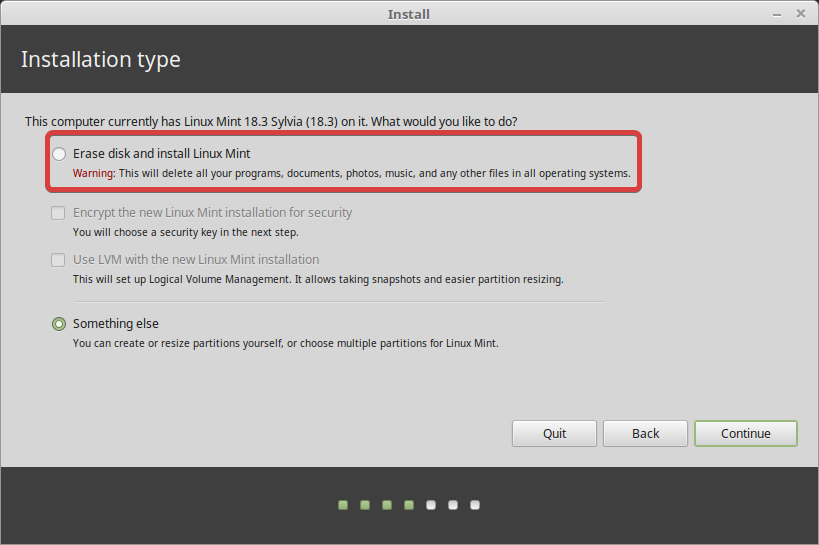
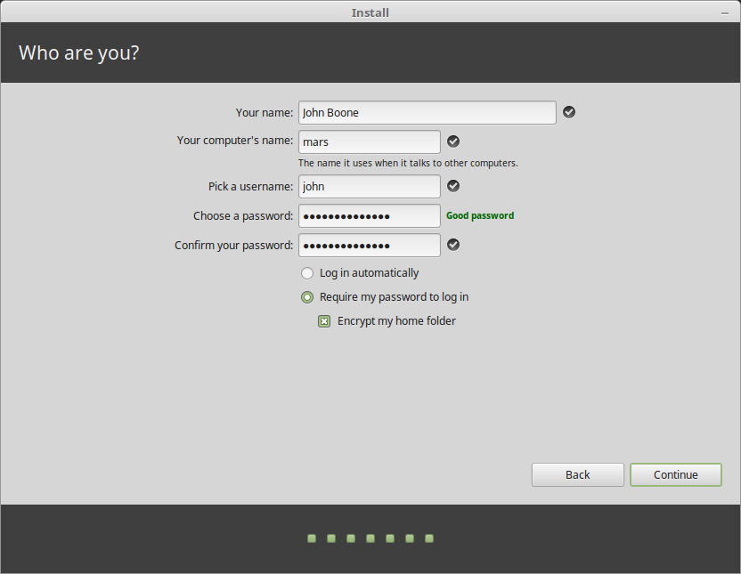
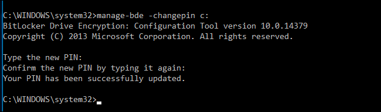
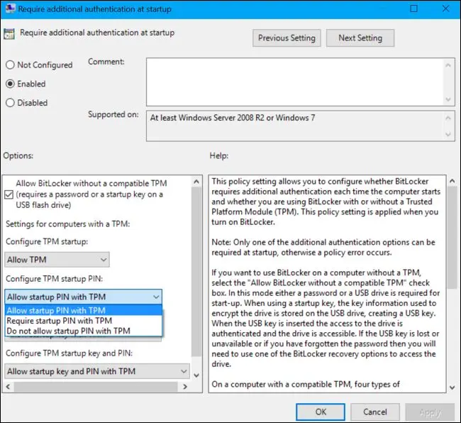
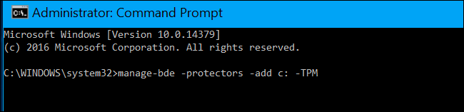

# How to Do an Encrypted Dual Boot Using Windows 11 and Linux Mint

On this post, I'll provide a full guide on how to create an encrypted and independent dual boot setup using two drives.

<!-- more -->

## Objective

Our goal is to create a completely independant encrypted dual boot setup for Linux Mint and Windows 11. How is it independant ? We'll make sure that GRUB (Linux Bootloader) will install itself on the Linux Drive, and won't be on your Windows drive with Windows Bootloader. That means you'll be able to remove any of the two drives and use them on any other machine you want.

The setup will work as follow :


## References

- [Dual Booting Ubuntu With Windows 10 Pro With BitLocker Encryption - It's FOSS](https://itsfoss.com/dual-boot-ubuntu-windows-bitlocker/)
- [Dual boot Windows + Linux with encryption - Super User](https://superuser.com/questions/1287714/dual-boot-windows-linux-with-encryption)
- [How to encrypt a dual boot setup with two drives (SSD) - General Linux Question - It's FOSS Community](https://itsfoss.community/t/how-to-encrypt-a-dual-boot-setup-with-two-drives-ssd/9272/2)
- [How to encrypt a dual boot setup with two drives (SSD) - Linux Mint Forums](https://forums.linuxmint.com/viewtopic.php?f=46&t=376911&p=2197098#p2197098)
- [[SOLVED] Dual booting Mint on a second drive independently. - Linux Mint Forums](https://forums.linuxmint.com/viewtopic.php?f=46&t=375199&p=2185321#p2185321)
- Special thanks to AndyMH who helped me on Reddit, and kept helping me by mail and on the [Linux Mint Forums](https://forums.linuxmint.com/index.php).

## Before Doing Anything

### Requirement

In order to follow this guide you need :

- Two drives (SSD[^1] or HDD,[^2] it doesn't matter at all). Verify that the second drive you just installed is recognized by Windows by opening the Windows File Explorer.

> From now on during this guide, your C drive will be the one referenced as your Windows Drive. And your D drive as the one that will get Linux Mint.

- Windows 11 Pro Edition : Cheap keys can be bought at Cdiscount for ~1€. That also means you need a motherboard that supports TPM 2.0 in order to have Windows 11 (At least that's what I read on the internet).

> Alternative path : Using VeraCrypt instead of Bitlocker as an encrypting software for the Windows side of the dual boot. I don't know anything about it, but you might pioneer something.

- A USB Key of at least 16 gb (I don't know exactly, it just worked for me with that size).
- A computer that might be compatible with Linux thanks to your hardware. If you want to verify, you can check with :
   	- [Linux Mint - Community](https://community.linuxmint.com/hardware/welcome) : Linux Mint known compatible devices.
   	- [Certified hardware | Ubuntu](https://ubuntu.com/certified) : Ubuntu certified devices.
   	- [Ubuntu-MSI-laptops](https://doc.ubuntu-fr.org/liste_portables_msi) : This is an example, but there is a page for many laptop brands for instance.
- An internet connection might help (a lot).

### Backup

First, **backup your computer**. If you follow this guide, it could work. But it might as well fail, and you'll thank your past-self if you have a backup.

I am personnaly using [Macrium Software | Reflect Free Edition](https://www.macrium.com/reflectfree) and an eHDD (_external hard drive_) to create a full image backup in case things get messy. Whatever you choose to do, do a backup.

### Enable and Disable Bitlocker Encryption to Make Sure it Works Well

**Before doing anything, we want to make sure that Bitlocker is working properly.**

- Search on Windows for "Manage Bitlocker".
- Encrypt your C Drive. Use the "Encrypt entire drive" option along with the "New encryption mode" that will use your TPM.
- Backup your recovery key. Print it, put it in the cloud, do whatever you want, but keep it.

> **Be careful. Every time you'll exit the encryption wizard, the backup key is changing. So remember to back it up again if you cancelled it to prepare yourself some spaghetti.**

- Let the encryption process do its thing.
- Reboot and make sure it works.
- Now that ~~hopefully~~ everything works well, go back to "Manage Bitlocker" and "Turn off Bitlocker". Yes, you heard me. Do you want a safe dual boot process ? We just verified that everything works well. That's it.

> Make sure to turn if off completely. You don't want to just suspend encryption, you want to turn it off.

<u>Edit :</u> _As we will remove the Windows Drive (physically or by using some manipulation with Gparted), it should also work if you keep it Bitlocker encrypted. Or if it isn't yet encrypted. They should be completely independent anyway. But I'm a crazily paranoid man, that's why I'm putting it here._

## Setup Preparation

### Preparing Your Windows Setup for the Dual Boot Experience

Windows has many things that could make your dual-boot setup goes wrong. That's why we'll make sure everything goes as smooth as possible by doing the following things :

- Remove **fast-boot** by going into the old alimentation settings of windows, choose actions when button pressed and remove fast boot, hibernate and (optional) sleep mode. Then, open a cmd as admin and type `powercfg -h off`. _Search for hiberfil.sys for additional information on how to deactivate fast-boot._
- Remove **fast boot** from the Bios as well.
- Remove **secure-boot** from your Bios.
- Remove **Intel Fast Start** from Bios.

_I won't be explaining much moredependentis dependent on your system. Google will be your best friend, but don't hesitate to ask for help somewhere._

### Preparing Your Linux Mint Installation Medium

- Follow the instructions on the Linux Mint wiki and download the .iso ([Choose the right edition—Linux Mint Installation Guide documentation](https://linuxmint-installation-guide.readthedocs.io/en/latest/choose.html)).
- Verify your ISO (integrity and authenticity : [Verify your ISO image—Linux Mint Installation Guide documentation](https://linuxmint-installation-guide.readthedocs.io/en/latest/verify.html)).
- Create the bootable media with Etcher ([Create the bootable media—Linux Mint Installation Guide documentation](https://linuxmint-installation-guide.readthedocs.io/en/latest/burn.html)).

That's it. **You're ready**. Things are going to become interesting now.

## Beginning the Dual-boot Process

- Shut down your laptop.
- Connect your USB key to the laptop and boot. It should go on Linux live by default, if not, change your boot order in your Bios.

### Windows Hard-drive Disconnection

_In order to create a completely independent dual-boot setup, we want to disconnect the Windows Drive before doing the Linux Mint installation. If you can physically disconnect the drive, go on, do it, and skip the following Gparted part. If you're using a laptop and/or don't want to bother, read the following._

- Run Gparted by searching for it in the admin section of the applications. Find your Windows disk with 4 partitions (EFI, MS reserved, C:, and a recovery partition).

> The drive may appear as nvme0n1 and the first partition as nvme0n1p1 if this is an nVME SSD. Otherwise, in linux, the first drive in the system is sda, the next sdb and so on. The first partition on a drive would be sda1, the next sda2 and so on.

- Select the EFI partition (fat32, size less than 500mb, and flags **BOOT** and **ESP** set).
- Select “manage flags”.
- Uncheck the **BOOT** and **ESP** flags.
- The partition will now appear with the **msftdata** flag.
- Close Gparted.

### Installing Linux Mint

- Launch install Mint. Follow the instructions ([Install Linux Mint—Linux Mint Installation Guide documentation](https://linuxmint-installation-guide.readthedocs.io/en/latest/install.html)). But **be careful**, you will need to click on "Continue testing" at the end of the installation process if you chose to disconnect the Windows Drive virtually using Gparted and flags.



- Select "Erase disk and install Linux Mint". Make sure there is no OS detected on the actual drive and that it is your second drive, and it will do his partitioning thing on the newly added drive. I think you can choose to use LVM and LUKS full disk encryption here. Do it. **But be careful, maybe you keyboard setup is not the one you physically have.** Type your password on the search bar to be sure!
- Choose a short computer and username. For instance, I'm using "MSI-GL75" as a computer name and my first name as my username. You'll thank me later.



- Select "Require my password to log in" and tick "Encrypt my home folder".
- <u> **Select "Continue testing" at the end of the installation process.**</u>
- Run Gparted and enable back the **ESP** and **BOOT** flags on the EFI Windows partition.
- Reboot and go into bios settings.
- Put Ubuntu at the top of the list of the boot order.
- You should now boot immediatelyinto Linux Mint instead Grub dual-boot menu. It is normal.
- Open up a terminal with `ctrl+alt+` and type `sudo update-grub`. Grub config will be updated by finding the Windows EFI partition. Grub will now be working

Now you should have a working dual-boot setup with Linux Mint encrypted. But wait a bit, we still need to encrypt Windows and change a few things.

Oh, and don't forget to **think about a backup for Linux Mint**. You now have **Macrium Reflect** for Windows. There's **Timeshift** and **Backintime** that can help backing up your system files and personall files respectively.

## After Installing Linux Mint : A Few Things to Change

### A Beautiful Grub Menu

You want a beautiful Grub boot menu like that and not just a command line type of dual-boot screen ? Follow these instructions : [Grub Boot Menu — Linux Mint User Guide documentation](https://linuxmint-user-guide.readthedocs.io/en/latest/grub.html)


Open a terminal, and type the following command :

```
apt install --reinstall -o Dpkg::Options::="--force-confmiss" grub2-theme-mint
```

Or if you have a high-DPI screen :

```
apt install --reinstall -o Dpkg::Options::="--force-confmiss" grub2-theme-mint-2k
```

Don't forget to do a `sudo update-grub` afterward to update the Grub config file.

### A Grub Menu That Remembers the Last OS You Chose

Self-explicit.

I followed [keepitsimpleengineer](https://askubuntu.com/users/30982/keepitsimpleengineer)'s answer in this topic :

> [grub2 - How do I set Windows to boot as the default in the boot loader? - Ask Ubuntu](https://askubuntu.com/questions/52963/how-do-i-set-windows-to-boot-as-the-default-in-the-boot-loader/82965#82965).

You just need to open a terminal and type the following command :

```
sudo nano -B /etc/default/grub
```

Change the value of `GRUB_DEFAULT` to `saved`:

```
GRUB_DEFAULT=saved
```

Enable the [SAVEDEFAULT functionality](http://www.gnu.org/software/grub/manual/grub.html#Simple-configuration) by adding the following line bellow `GRUB_DEFAULT` :

```
GRUB_SAVEDEFAULT=true
```

Now you have to run

```
sudo update-grub
```

to update the system generated `grub.cfg` file in the `/boot/grub/` directory.

### Solve Timezone Issues When You Switch OS

If you [dual boot Windows and Ubuntu](https://itsfoss.com/install-ubuntu-1404-dual-boot-mode-windows-8-81-uefi/) or any other Linux distribution, you might have noticed a time difference between the two operating systems.

When you [use Linux](https://itsfoss.com/why-use-linux/), it shows the correct time. But when you boot into Windows, it shows the wrong time. Sometimes, it is the opposite and Linux shows the wrong time and Windows has the correct time.

That’s strange specially because you are connected to the internet and your date and time is set to be used automatically.

Don’t worry! You are not the only one to face this issue. You can fix it by using the following command in the Linux terminal:

```
timedatectl set-local-rtc 1
```

If you want some explanations, follow this link to get the full guide :

> [[Solved] Wrong Time in Windows 10 After Dual Boot With Linux](https://itsfoss.com/wrong-time-dual-boot/)

### Prepare Group Policies for Windows Encryption

### Allow Complexe Password and Not Just Pin

- Open the Group Policy Editor (type `gpedit` after opening the start menu) and navigate to Administrative Templates > Windows Components > Bitlocker Drive Encryption > Operating System Drives
- Enable "Allow enhanced PINS for startup" : Allows you to use a real password and not just numbers for your encryption.

### Add a Password at Startup

You can follow [Chris Hoffman](https://www.howtogeek.com/author/chrishoffman/)'s guide entirely, as this is the one I used here :

> [How to Enable a Pre-Boot BitLocker PIN on Windows](https://www.howtogeek.com/262720/how-to-enable-a-pre-boot-bitlocker-pin-on-windows/)

#### Step One: Enable BitLocker (If You Haven’t Already)


This is a BitLocker feature, so you have to use BitLocker encryption to set a pre-boot PIN. This is only available on Professional and Enterprise editions of Windows. Before you can set a PIN, you have to [enable BitLocker for your system drive](https://www.howtogeek.com/192894/how-to-set-up-bitlocker-encryption-on-windows/).

Note that, if you go out of your way to [enable BitLocker on a computer without a TPM](https://www.howtogeek.com/howto/6229/how-to-use-bitlocker-on-drives-without-tpm/), you’ll be prompted to create a startup password that’s used instead of the TPM. The below steps are only necessary when enabling BitLocker on computers with TPMs, which [most modern computers have](https://www.howtogeek.com/237232/what-is-a-tpm-and-why-does-windows-need-one-for-disk-encryption/).

If you have a Home version of Windows, you won’t be able to use BitLocker. You may have the [Device Encryption](https://www.howtogeek.com/173592/windows-8.1-will-start-encrypting-hard-drives-by-default-everything-you-need-to-know/) feature instead, but this works differently from BitLocker and doesn’t allow you to provide a startup key.

#### Step Two: Enable the Startup PIN in Group Policy Editor

Once you’ve enabled BitLocker, you’ll need to go out of your way to enable a PIN with it. This requires a Group Policy settings change. To open the Group Policy Editor, press Windows+R, type “gpedit.msc” into the Run dialog, and press Enter.

Head to Computer Configuration > Administrative Templates > Windows Components > BitLocker Drive Encryption > Operating System Drives in the Group Policy window.

Double-click the “Require Additional Authentication at Startup” Option in the right pane.


Select “Enabled” at the top of the window here. Then, click the box under “Configure TPM Startup PIN” and select the “Require Startup PIN With TPM” option. Click “OK” to save your changes.


#### Step Three: Add a PIN to Your Drive

You can now use the `manage-bde` command to add the PIN to your BitLocker-encrypted drive.

To do this, launch a Command Prompt window as Administrator. On Windows 10 or 8, right-click the Start button and select “Command Prompt (Admin)”. On Windows 7, find the “Command Prompt” shortcut in the Start menu, right-click it, and select “Run as Administrator”

Run the following command. The below command works on your C: drive, so if you want to require a startup key for another drive, enter its drive letter instead of `c:` .

```
manage-bde -protectors -add c: -TPMAndPIN
```

You’ll be prompted to enter your PIN here. The next time you boot, you’ll be asked for this PIN.

> **Tip:** If you see an error, run the `gpupdate` command on its own line before running the `manage-bde` command shown above. This will force Windows to apply your group policy changes.


To double-check whether the TPMAndPIN protector was added, you can run the following command:

```
manage-bde -status
```

(The “Numerical Password” key protector displayed here is your recovery key.)


#### How to Change Your BitLocker PIN

To change the PIN in the future, open a Command Prompt window as Administrator and run the following command:

```
manage-bde -changepin c:
```

You’ll need to type and confirm your new PIN before continuing.




#### How to Remove the PIN Requirement

If you change your mind and want to stop using the PIN later, you can undo this change.

First, you’ll need to head to the Group Policy window and change the option back to “Allow Startup PIN With TPM”. You can’t leave the option set to “Require Startup PIN With TPM” or Windows won’t allow you to remove the PIN.




Next, open a Command Prompt window as Administrator and run the following command:

```
manage-bde -protectors -add c: -TPM
```

This will replace the “TPMandPIN” requirement with a “TPM” requirement, deleting the PIN. Your BitLocker drive will automatically unlock via your computer’s TPM when you boot.




To check that this completed successfully, run the status command again:

```
manage-bde -status c:
```


If you forget the PIN, you’ll need to provide the BitLocker recovery code you should have saved somewhere safe when you enabled BitLocker for your system drive.

### Prevent Bitlocker From Asking for Your Recovery Code Everytime You Boot

Link to the answer by [ouk](https://superuser.com/users/872535/ouk) :

> [windows 10 - BitLocker asking for protection code after Ubuntu installation - Super User](https://superuser.com/questions/1278841/bitlocker-asking-for-protection-code-after-ubuntu-installation/1714144#1714144)

- Open the Group Policy Editor (type `gpedit` after opening the start menu) and navigate to Administrative Templates > Windows Components > Bitlocker Drive Encryption > Operating System Drives
- Enable "Configure TPM platform validation profile for native UEFI firmware configurations" : The standard configuration includes PCR 0, 2, 4, 7 and 11. You should only keep 0, 2 and 11.
   	- PCR 7 is disabled when Secure Boot is.
   	- PCR 4 should be disabled to allow Grub to work properly with the `GRUB_DEFAULT=saved` feature enabled.

## Activate Bitlocker

Just turn on Bitlocker like before on your Windows drive, don't forget to save the recovery key because it will change, and that's it, you've done it.

You can now be a proud encrypted dual-boot user. Tell it to your mom, it's quite uncommon for people to do it I guess.

[^1]: Solid State Drive : [Solid-state drive - Wikiwand](https://www.wikiwand.com/en/Solid-state_drive)
[^2]: Hard Drive Disk : [Hard disk drive - Wikiwand](https://www.wikiwand.com/en/Hard_disk_drive)
