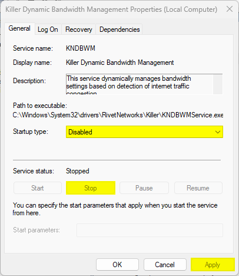

# How to Fix a Slow Upload Speed with a Killer E2400 Gigabit Ethernet Controller

Having trouble with upload speed on your MSI laptop ? Here's a fix.

<!-- more -->

## Introduction

You are having Google Drive upload issues and can't figure out what's wrong ? You go to [nPerf.com](https://www.nperf.com/en/) and you see that you have an issue.

> Why am I having such a bad upload speed, what's going on ? I'm having 95mbps download but 3mbps upload.

> **Proceeds to check cables, router, drivers, everything seems to be good… I'm clueless.**

Well there mate, your issue is that you have a **Killer device** !

## How to Fix This Crap

1. First, go to your Windows control center or app manager and get rid of everything that has Killer in the name. Killer performance suite, killer network manager, killer network center, whatever the name, get rid of it.
2. Then, you'll need to go to MajorGeeks and download their [Killer Uninstaller tool](https://www.majorgeeks.com/files/details/killer_software_uninstaller.html). Don't worry, it's safe, it just "assists in the uninstalling of all Killer Performance Suite services as well as any associated file and registry remnants".
3. **Scan for installed Killer Software** → It will scan your computer, searching for that stupid software.
4. **Remove Killer Software** → It'll get rid of everything you left behind.
5. **Disable Killer Software** → It'll deactivate every single Killer services running.

Yeah ! You get back to [nPerf.com](https://www.nperf.com/en/) and everything is back to normal !

## It Came back… Help

Well then mate, something is installing it in the background. Three things to try :

- Disable what's installing it back, being windows update or something else. It was a pain to find out, so I did not do that.
- Launch the Uninstaller back and just use **Disable Killer Software**. The software is installed but not launched, better live with an unarmed enemy than a constantly respawning one.
- Manually search for and launch **services.msc** on your computer, and disable every single Killer services like in the image bellow.

