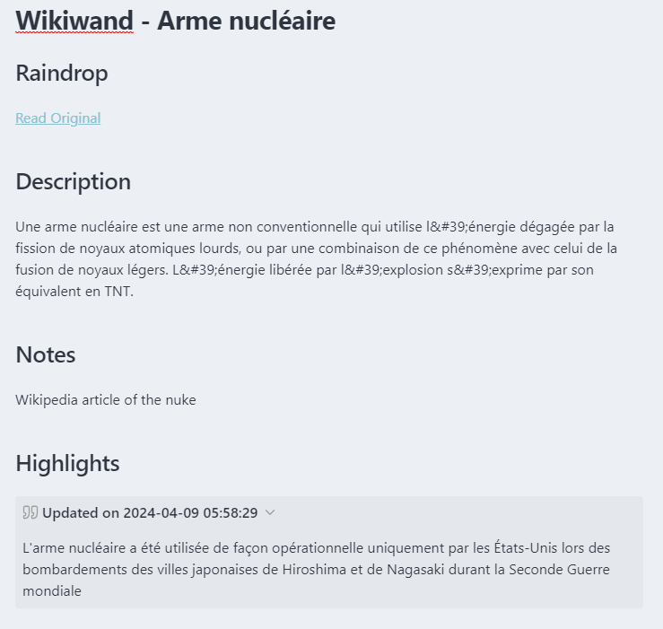
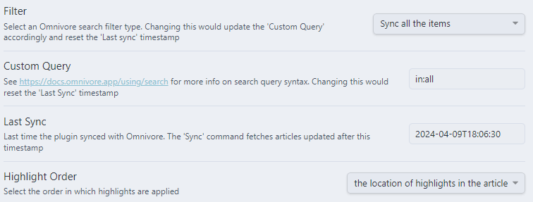
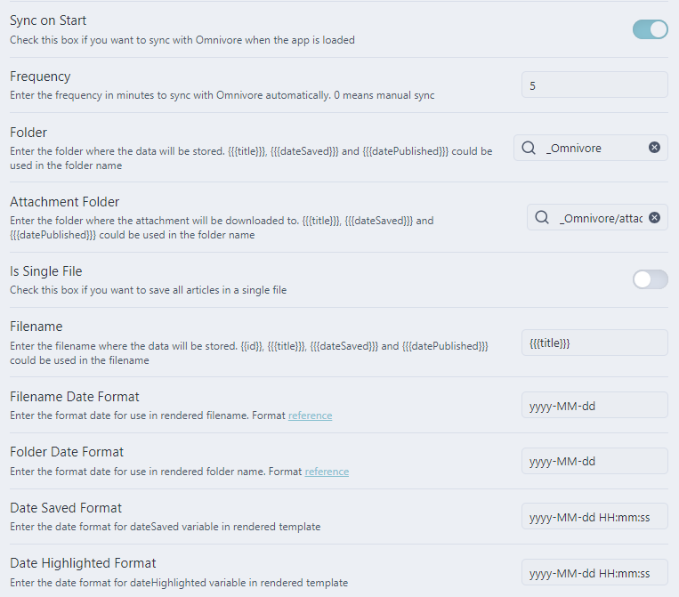

# How to Sync Raindrop and Omnivore to Your Obsidian Vault

Here's how to sync your Raindrop links and highlights, and Omnivore full webpage content with highlights to your Obsidian vault.

<!-- more -->

## Requirements

- [Raindrop](https://raindrop.io/) and the [obsidian-raindrop-highlights-plugin](https://github.com/kaiiiz/obsidian-raindrop-highlights-plugin).
- [Omnivore](https://omnivore.app/) and its [official plugin](https://github.com/omnivore-app/obsidian-omnivore).

Why use both ?

- Raindrop is my bookmark manager, I don't save any bookmarks on my browser anymore.
- Raindrop has the best highlighting addons directly on the webpage anywhere, and the sync plugin does wonders.
- Omnivore has a full archiving of the webpage in markdown format, which is amazing and lacking in Raindrop. It is also open-source. But sometimes it doesn't capture the webpage well and is bad at bookmark managing as it is not why it is designed.

## How to Sync Raindrop and Obsidian

End result :



> [!info] This is a basic one-way sync
> This will "only" save all your links, add the original link, your notes, and your highlighted text.
> Note that you can make it a sort of sync by editing the config and using the `Append Mode` to `True`.

Settings to use :


Content template :

```

# {{title}}

## Raindrop

[Read Original]({{link}})

## Description

{{excerpt}}

## Notes

{{note}}

## Highlights


    

    

    

    

> [!{{callout}}]+ Updated on {{highlight.lastUpdate | date("YYYY-MM-DD hh:mm:ss")}}
>
> {{highlight.text.split("\n") | join("\n>")}}
> > {{highlight.note + "\n"}}


```

Metadata template :

```
title: |
  {{title}}
type: {{type}}
tags: {{tags}}
collection: {{collection.title}}
date_saved: {{created | date("YYYY-MM-DD hh:mm:ss")}}
date_archived: {{now | date("YYYY-MM-DD hh:mm:ss")}}
```

Filename template :

```
{{title}}
```

## How to Sync Omnivore and Obsidian

End result :


> [!info] This is also a one-way sync
> No changes will sync from Obsidian to Omnivore here too. But it has the **whole webpage saved in markdown**, and that's amazing.

Settings to use :





Article template :

```
# {{{title}}}

## Omnivore

[Read on Omnivore]({{{omnivoreUrl}}})
[Read Original]({{{originalUrl}}})

{{#note}}
## Notes

{{{note}}}

{{/note}}
{{#highlights.length}}
## Highlights

{{#highlights}}
> {{{text}}} [⤴️]({{{highlightUrl}}}) {{#labels}} #{{name}} {{/labels}}
{{#note}}

{{{note}}}
{{/note}}

{{/highlights}}
{{/highlights.length}}
## Webpage

{{{content}}}
```

Front Matter Template (in advanced settings) :

```
id: {{{id}}}
title: >
  {{{title}}}
author: >
  {{{author}}}
tags:
{{#labels.length}}
{{#labels}} - {{{name}}}
{{/labels}}
{{/labels.length}}
state: {{{state}}}
date_published: {{{datePublished}}}
date_saved: {{{dateSaved}}}
date_read: {{{dateRead}}}
date_archived: {{#formatDate}}{{{dateArchived}}},"yyyy-MM-dd HH:mm:ss"{{/formatDate}}
```
