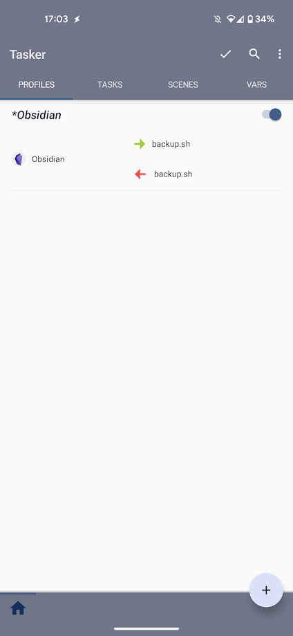
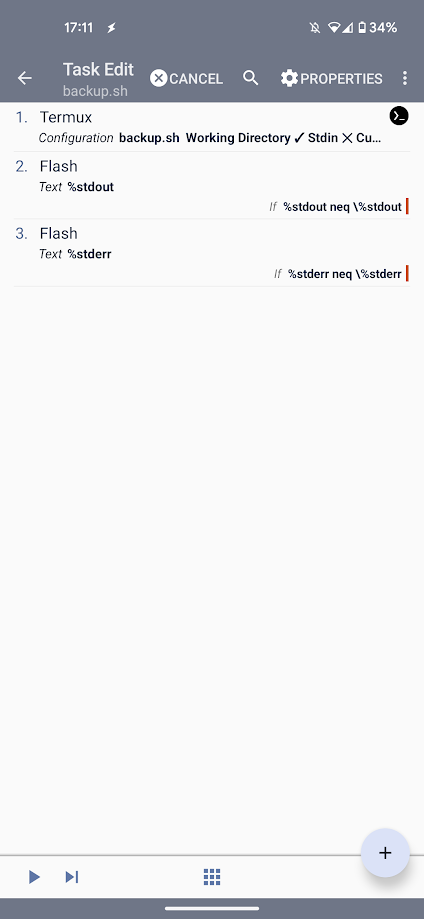
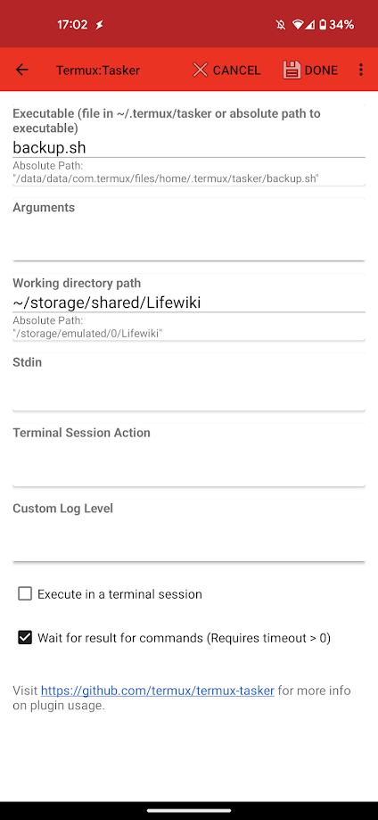
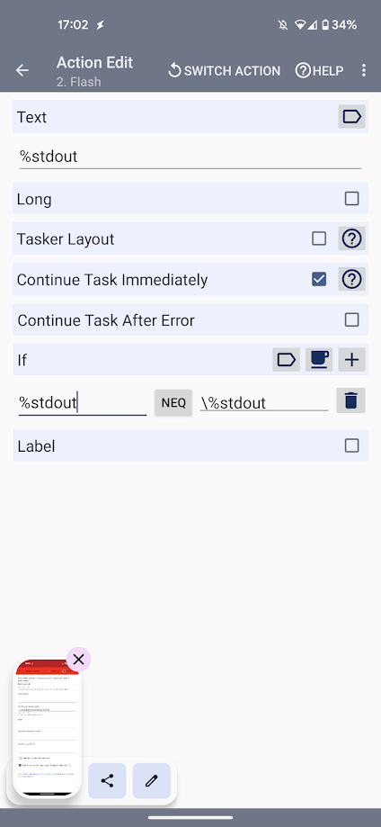
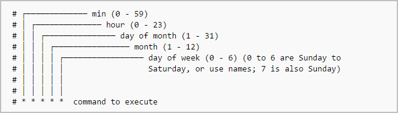

# How to Use Obsidian Git Sync on Android

On this post, I'll show how to sync your obsidian vault on obsidian start-up using tasker on your android phone.

<!-- more -->

## Inspirations

- My [old guide](./Using%20Git%20to%20Sync%20Your%20Obsidian%20Vault%20on%20Android%20Devices.md) using cron jobs with time intervals instead of tasker
- [How to sync your obsidian vault on mobile using git](https://www.reddit.com/r/ObsidianMD/comments/v6otbu/how_to_sync_your_obsidian_vault_on_mobile_using/)
- [Mobile Sync for Obsidian | Some Thoughts](https://werzum.github.io/tech/2022/02/13/Obsidian-Mobile-Sync.html)
- [Automatically sync notes to and from git repository whenever you open and close Obsidian on mobile. · GitHub](https://gist.github.com/yuvve/013977d93ddc3b0c4780de950ba53d89)
- [Obsidian Syncing Alternative (For Android and iOS) | Obsidian-Sync-Alternative](https://pulinagrawal.github.io/Obsidian-Sync-Alternative/)

## Install the Required Tools

Install [Tasker](https://tasker.joaoapps.com/download.html) from the official website (7 days trial) or from the Google Play Store (~3.5€).

Install [Termux](https://f-droid.org/en/packages/com.termux/), [Termux Widget](https://f-droid.org/en/packages/com.termux.widget/), [Termux Tasker](https://f-droid.org/packages/com.termux.tasker/) on F-droid or on the official Termux Github repository.

> [!attention] Never use the play store version
> Trust me it is depreciated.

Give Termux access to your storage using the following command :

```
termux-setup-storage
```

## Setup Git and Github for Manipulating Repositories

Use the following commands to [setup git and github via HTTPS](https://www.techrepublic.com/article/how-to-install-git-on-android/) :

```
pkg update && pkg upgrade
```

```
pkg install git
```

```
pkg install gh
```

_You can use SSH or an access token as well instead of using gh_

Login to your Github account :

```
gh auth login
```

Update the git configs :

```
git config --global user.name "name"
```

```
git config --global user.email "email"
```

Go into the shared folder :

```
cd ~/storage/shared/
```

Clone your repo :

```
git clone https://github.com/YOUR_GH_USERNAME/Lifewiki.git
```

Try using the following commands :

```
git status
git pull
git commit
git push
```

> [!Attention] Android 12 warning
> If you are on Android 12, you'll get an error with the command required to add the repository to a security list or something like that. Do it, and these commands should work.

## Change the Default Termux Working Directory

Edit the bashrc file :

```
nano /data/data/com.termux/files/usr/etc/bash.bashrc
```

And append this line to the end of the file :

```
cd ~/storage/shared/Lifewiki
```

Restart your terminal, and you will find that it always opens up in your desired directory!

## Setup Tasker

Launch Tasker and do the basic setup (setting battery optimisation and stuff).

> [!Done] Give Tasker some important Termux permissions
> Android Settings -> Apps -> Tasker -> Permissions ->Additional permissions -> Run commands in Termux environment.

1. Launch Termux
2. `mkdir ~/.termux/tasker/`
3. `cd ~/.termux/tasker/`
4. nano pull.sh
5. Add the following script :

```bash
#!/bin/bash
git pull
exit 0
```

1. nano backup.sh
2. Add the following script :

```bash
#!/bin/bash
git add -A
git commit -a -m "android vault backup: `date +'%Y-%m-%d %H-%M-%S'`"
git push
exit 0
```

Don't forget to edit permissions to termux home folder :

`chmod 700 -R /data/data/com.termux/files/home/.termux`

Create an Obsidian profile :



Setup the following task :








## Setup the Error Handling Shortcut for Merge Conflict

Create a directory for the shortcuts :

```bash
mkdir -p /data/data/com.termux/files/home/.shortcuts
chmod 700 -R /data/data/com.termux/files/home/.shortcuts
```

Create the sync script :

```bash
cd /data/data/com.termux/files/home/.shortcuts
nano debug.sh
```

Add the following script :

```bash
#!/bin/bash
cd storage/shared/LifeWiki
git reset --hard
```

Create the widget and add it to your home screen. That's it, you just need to launch it to solve merging errors.

## Setting up an Automatic Execution of the Script (Not Recommended if You Want to Avoid Merge issues)

If you want to automatically **sync your vault every hour**, for instance, you can do it using a [Cron job](https://ostechnix.com/a-beginners-guide-to-cron-jobs/) (like described in this [thread](https://forum.obsidian.md/t/obsidian-github-integration-for-sync-and-version-control/6369) or this [one](https://www.reddit.com/r/ObsidianMD/comments/qep4gn/guide_obsidian_vault_github_sync_cron_on_termux/)).

First, create the auto sync task folders :

```bash
mkdir -p /data/data/com.termux/files/home/.shortcuts/tasks
chmod 700 -R /data/data/com.termux/files/home/.shortcuts/tasks
```

Create the sync script inside `.shortcut/tasks` :

```bash
#!/bin/bash
cd storage/shared/LifeWiki
git pull && git add -A && git commit -a -m "android vault backup: `date +'%Y-%m-%d %H-%M-%S'`" && git push
```

> [!info] Difference between .shortcuts and .shortcuts/tasks folders
> What is run inside .shortcuts are just scripts launching Termux. If it is run under the tasks folder, it will launch it as an underground task.

First, you need to install Cron :

```bash
pkg install cronie termux-services
```

Then, you'll restart Termux and then run the following :

```bash
sv-enable crond
crontab -e 
```

Finally, you'll end up with the `crontab -e` command in the **nano** text editor. Add the following :

```bash
0 * * * * bash ~/.shortcuts/tasks/sync_script.sh
```

You just need to keep Termux opened in order for the job to be able to launch.

You can find information about Cron job easily on the internet.



Edit : I already uploaded a guide to do it with a cron job. I kept this part, but I wanted something less energy consuming. Hence I learned how to use Tasker and did it this way. I find it as simple as the obsidian-git plugin on computer, but on mobile ! Hope it helps !
