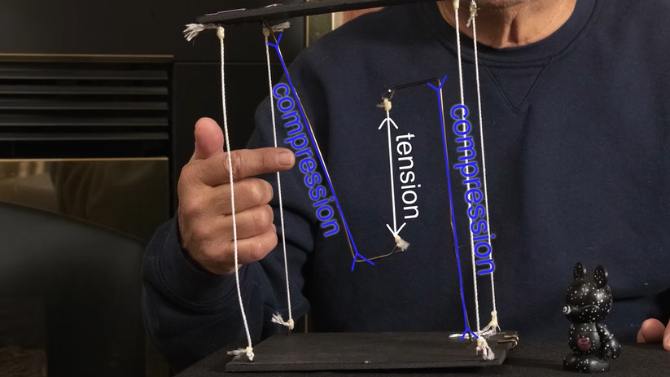
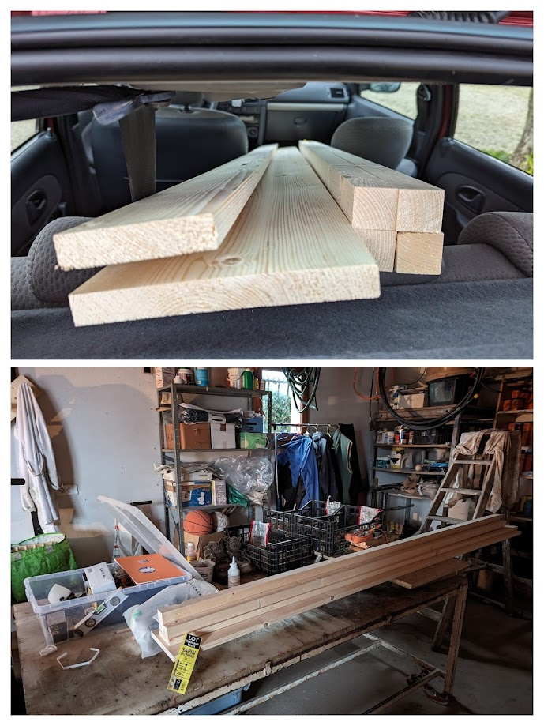
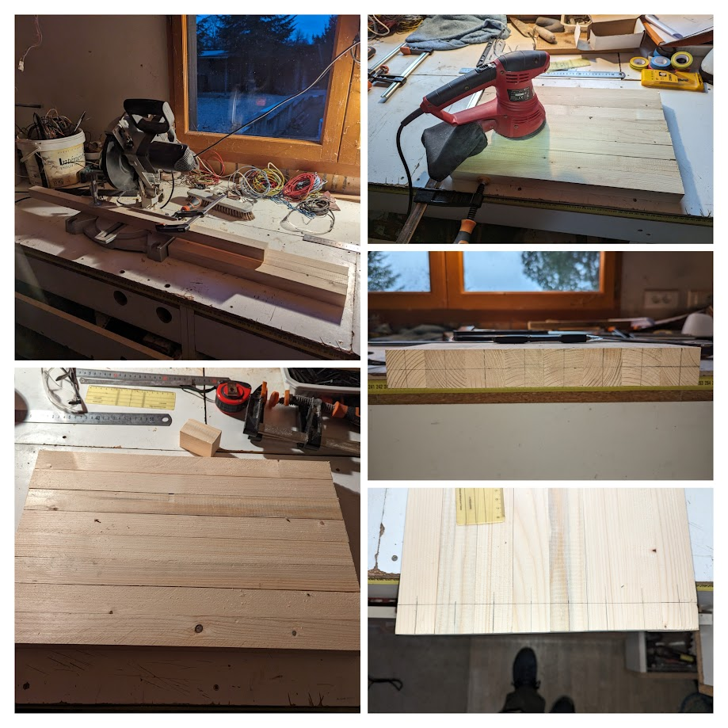
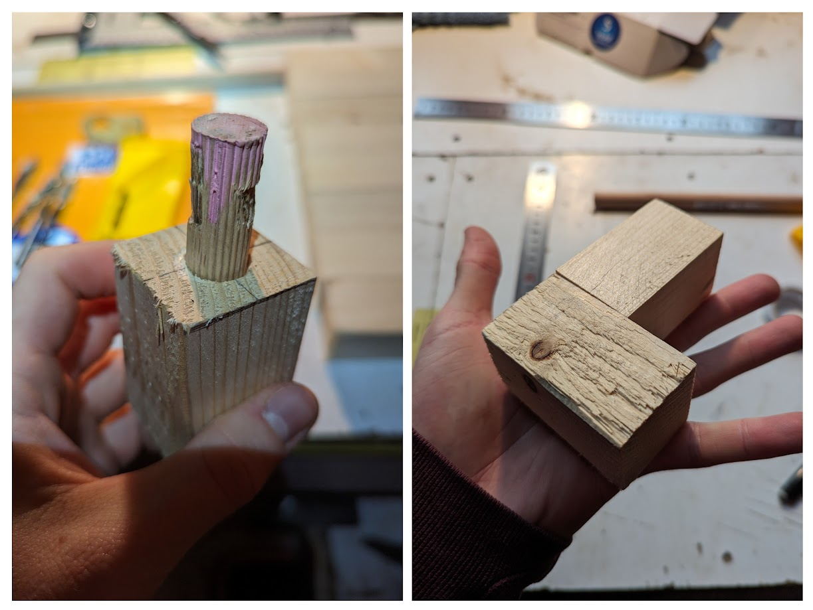
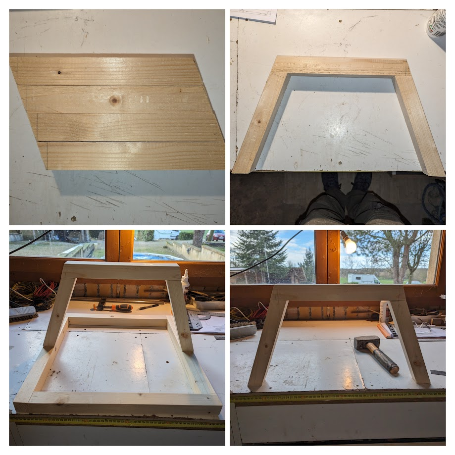
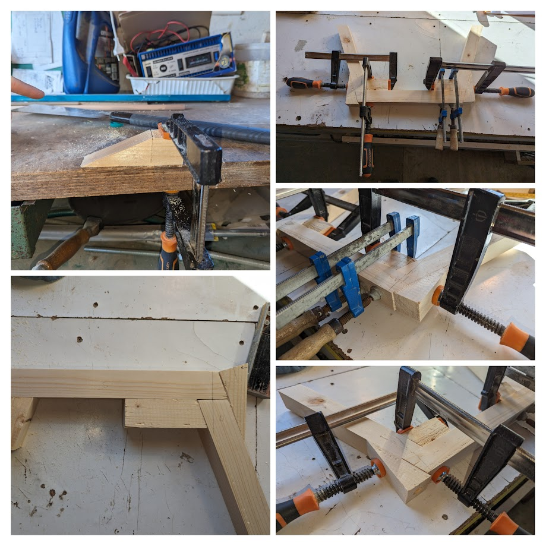
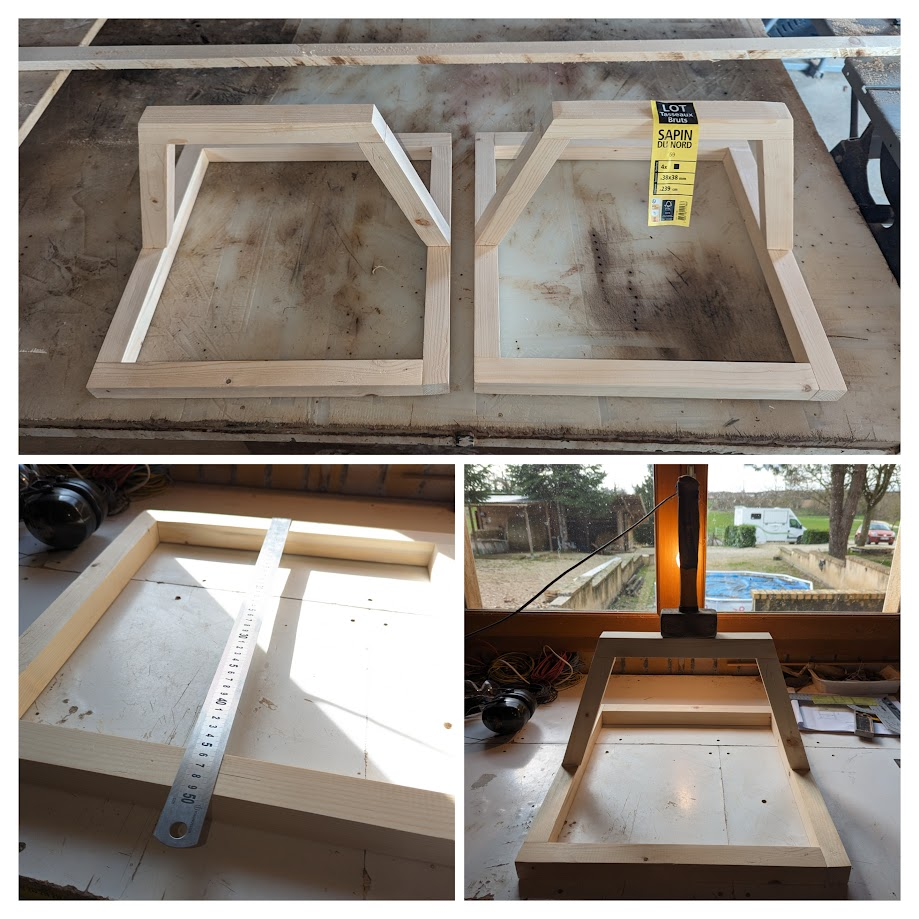
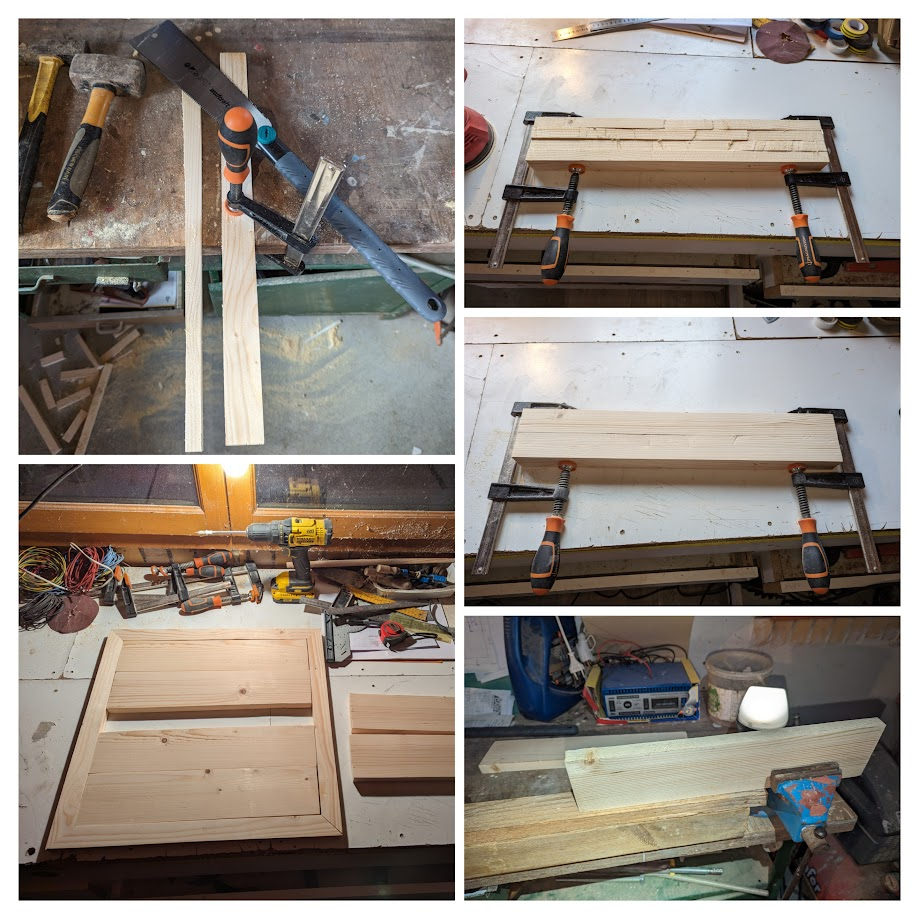
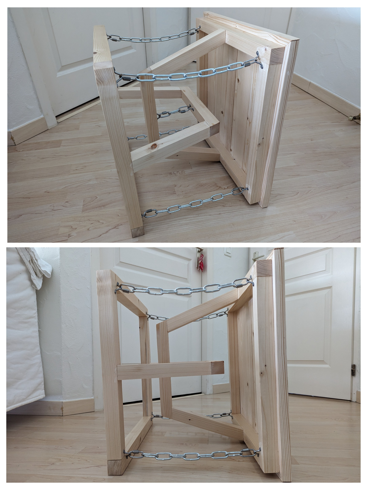

# I Built a Tensegrity Table Just for Fun

Just got a job in the IT. Loving it, I'm exciting to learn new things.

So I decided to create an object that embraces mechanical rules. And a fucked up one nonetheless.

Oh and I'll explain the math behind it, the building process, the price, and share my plans and CAD files.

<!-- more -->

## TLDR

**This is a beautiful and intriguing table I made :**


## Introduction

The origin story is not one that's really interesting. I was on a hangover, playing games with my friends (Room 25) and I died by some sus looking girl who'd soon fly off to "La Reunion". Anyway, I spent some of my dead time looking at some reddit post because I'm quite low after a party, and I found out about tensegrity. Defying laws of physics, just for beautiful objects. I immediately loved it.

I then searched a bit, and decided to try it myself. I'd like to build a small table that would be next to my future sofa.

Here's my most close up inspiration :

- [Gravity DEFYING Floating Table - TENSEGRITY VS GRAVITY! - YouTube](https://www.youtube.com/watch?v=L7wr2p5PMIM)
- [First Tensegrity End Table : r/woodworking](https://www.reddit.com/r/woodworking/comments/hw8qmx/first_tensegrity_end_table/)
- [First woodworking project - budget tensegrity table. Feedback welcome. : r/woodworking](https://www.reddit.com/r/woodworking/comments/igzeq9/first_woodworking_project_budget_tensegrity_table/)

After some questioning and researches, I decided to make sure not to do the same mistakes some people did :

- I won't use eye screws for holding the chains or rope as it might not be able to support the load, especially the middle ones that hold most of the weight.
- I want to use proper joinery, not just some glue here and there. In the end, I did not try mortise and tenon for a first project, but I did something similar using dowels.
- I'll use quick links to attach the chains to the supports instead of doing some welding.

## The Explanation

> A tensegrity table is a unique type of furniture designed using the principles of tensegrity, which involves a structural system composed of isolated components under compression inside a network of continuous tension.

If you want a simple explanation, [watch this](https://www.youtube.com/watch?v=daXImz6DO9Q) or [read that](https://www.physicslens.com/tensegrity-explained/).

If you want the maths, [watch this](https://www.youtube.com/watch?v=0onncd0_0-o) or [read that](https://www.wired.com/story/wait-that-table-has-no-legs/).

Basically, you get components in tension and others in compressions and they work together like this :



## The Plan

I love to over-engineer things. And this won't be an exception. I wanted to be able to visualize my table before building it, as I won't have the time nor the tools to do it on the go.

I already used OnShape to design the interior of my van last year. So I did it once again using OnShape [here](https://cad.onshape.com/documents/8171312ce72d812973c70b8c/w/d53a36f166bb3e6f1d7af718/e/da262f7bb9fe5ba8ab63cd80) :

```txt
.
├── Helpers/
│   ├── ExtrudeSeparated (old custom function to fill tabletop with planks)
│   └── Variables
├── Drawings/
│   ├── Foundation_bar
│   ├── Foundation_bar_support
│   ├── Bridge_support
│   ├── Bridge_top
│   ├── Tabletop_frame
│   ├── Dowel
│   ├── Eye_strap
│   ├── Half
│   ├── Tabletop
│   └── Whole
├── Parts/
│   ├── Foundation_bar
│   ├── Foundation_bar_support
│   ├── Bridge_support
│   ├── Bridge_top
│   ├── Tabletop_frame
│   ├── Dowel
│   ├── Eye_strap
│   └── Mounting_plate_with_fixed_ring (old idea, unused)
└── Assemblies/
    ├── Half
    ├── Tabletop
    └── Whole
```

Basically, you can :

1. Change the `Helpers/Variables` to adjust size of your structure.
2. Go to `Create version` and use the `Update all drawings` button.
3. Use the `Drawings/` files to build your own table.

The chain size wasn't done in OnShape. If someone wants to do it, it would be amazing, I'm sure.

Otherwise, just use the `Show measure details` tool to measure between two eye straps and take a chain that would fit !

## Required Tools

You absolutely need :

- A drill with a small-diameter wood bit for eye straps screws and a large-diameter flat bit for dowels.
- A miter saw to cut wood strips at an angle. One could also use a Japanese saw as a cheaper alternative.
- A 120-grit sander for wood finishing.

You could use of these depending on your raw material :

- A table saw to cut planks the right size if you were not able to find some the correct size. If you don't, just ask your local shop, they probably can cut your wood pieces the right size for you
- If you took raw wood, you might need a joiner planer to make sure the wood pieces are straight and angled.

## Buying Materials

Here's what we'll need :

- Wood strips, at least 5.5 m based on the measure tool from Onshape.
- Planks to do the tabletop outline, I'll take 2cm thick ones and just take what I'll found.
- Planks to fill the tabletop, 2cm thick as well.
- Dowels to assemble the wood pieces together.
- Wood glue to add extra fixation strength.
- Metal chains, 1.5m should be enough.
- Chains fixations, 10 of them.
- Chain quick-fix, 10 of them as well.
- Wood treatment and finish, I don't know yet and there are plenty of possibilities : Woodstain, wood oil, special products, paints for the finish.

| Name                                                                                                                                                     | Quantity                        | Unit Price  | Total price |
| -------------------------------------------------------------------------------------------------------------------------------------------------------- | ------------------------------- | ----------- | ----------- |
| [Wood strips](https://www.bricocash.fr/p/lot-de-4-tasseau-brut-sapin-du-nord-38x38x2m4/3383150415366)                                                    | 4 x 2.4m or 38x38mm plain wood  | 1.76 € / m  | 16.90€      |
| Planks to do the tabletop outline                                                                                                                        | 2m x 10 cm x 2 cm               | 3.275 € / m | 6.55 €      |
| Planks to fill the tabletop                                                                                                                              | 2m x 25 cm x 2cm                | 5.475 € / m | 10.95 €     |
| Dowels                                                                                                                                                   | 1m x 14mm diameter  smooth wood | 2.9 € / m   | 2.9 €       |
| [Wood glue](https://www.bricomarche.com/p/colle-bois-interieur-prise-rapide-250g/3505391099376)                                                          | 250g                            | 6.5 €       | 6.5 €       |
| [Chain](https://www.castorama.fr/chaine-maille-longue-diall-5-mm-vendue-au-metre-lineaire/3663602093930_CAFR.prd)                                        | 2m of D5 chains                 | 4.5 € / m   | 10 €        |
| [Chains fixations](https://www.amazon.fr/dp/B09TXL8GRM?psc=1&ref=ppx_yo2ov_dt_b_product_details)                                                         | 10                              | 0.75 €      | 8.99 €      |
| [Quick-fix](https://www.amazon.fr/dp/B08BFKFN3J?ref=ppx_yo2ov_dt_b_product_details&th=1&psc=1)                                                           | 10                              | 1.17 €      | 13.99 €     |
| [Woodstain](https://www.castorama.fr/lasure-exterieure-syntilor-xylodhone-ultra-hautes-performances-incolore-satin-5l-20-gratuit/3239918441125_CAFR.prd) | A pot                           | Free        | Free        |

Total : **76.78 €**, which is a bit overkill as I still have wood strips and planks, chains, and glue.

If I'm being honest, I also bought a [Japanese saw](https://www.castorama.fr/scie-japonaise-polyvalente-wolfcraft-240-mm/4006885695108_CAFR.prd) (which is amazing) and some [flat wooden spindle](https://www.castorama.fr/meche-bois-plate-14x150-mm-dewalt-extreme/5011402386024_CAFR.prd).

## The Building Process

### Step 1 : Buying the Material

I have a Clio 2. It was a bit tricky, but here we go, it all went well.



### Step 2 : Preparing Foundation Frames Bars

Next up, cutting the frames.

I then sanded the whole thing to make it smooth. I did wrong by buying raw wood, I wasn't always exactly flat not right angled. I should buy it planed next time.



### Step 3 : Testing Assembly Using Wooden Scraps

Always test your ideas on wooden scrap first. Yes it is time and ressources used. But you'll learn by making mistakes, and adjust on your next real product. It's important.

And if, like me, you bought 15mm dowels at first thinking it would be good for 14mm holes, well, you'll be able to figure it out on unimportant wood pieces.



### Step 4 : Drilling Holes

Another mistake I did was to drilling the holes step by step, starting with a 4mm bit, then a 10mm bit, then a 14mm bit. In the end, my holes weren't perfectly centered because of the offset induced by each successive drilling.

For the other holes I drilled for the rest of the project, I went straight to the 14mm flat drill and it worked perfectly.

As you can see, I placed my holes 2.8mm up, and not 1.8 mm to be at the correct middle position. Yes, I'm dumb. Always measure twice, and cut/drill once.

One thing I did that wasn't utterly stupid is to use a tape on my bits to drill at the correct depth. Tools exists to do it, but I'm a cheap hell of a man.


### Step 5 : Assembling the Frames

Finally, one simply need to cut the dowels to the correct size, use a bit of wood glue to help, and maintain it for 1h under pressure using clamps. If you're not stupid like me, you won't need to discover the precision of a japanese saw, cutting the loose ends.


### Step 6 : Preparing Support Bridge Bars

You need something to make 70° cuts, and then it's just a matter of sticking to your plan.

Always try out your assemblies if you can, especially before gluing shits together. And make sure to mark the left and right parts, they might fit one way, but not the other way around.

I even assembled it all with dowels, marked left and right, and then redid it using glue to be sure.



### Step 7 : Assembling the Support Bridges

Maintaining pressure on a right angle is simple. What about on this kind of angled parts ?

I thought a bit about it, and decided to make myself some right angles to use and apply pressure.

You know what I like to say ?

> It ain't stupid if it works.

Well, it isn't always true while programming, but anyway.



### Step 8 : Assembling the Halves

Well, once you're done drilling holes everywhere and holding bridges together using angled wood scraps, you can now assemble the frames and the bridges.

Make sure to always exert a bit of pressure for the glue to take on, even if it ain't much.

**Only glue one of the two halves, you need the second one to stay separated for now as we'll need to put the tabletop first.**



### Step 9 : Preparing the Tabletop

I had only access to a rough tabletop saw, with an old blade, and no way to make sure things get cut straight. It was a pain and I had to redo cuts with the Japanese saw and sanding for so long.

I'd really recommend not to cut planks on a table saw without any sort of guide. Better ask for a cut at your local DIY store where you bought your wood.



### Step 10 : Assembling the Tabletop

Sand your pieces and put them together until it fits correctly.

Mark them or use tape to organize them, put pencil mark where your tabletop frame is supposed to go on the foundation frame, and when you're ready, don't do it like me.

I prepared everything and glued it together. **I should have done the frame first, glue it, and only then fill in with planks.**

I did it all at once, and underestimated the added thickness of the glue. I have one of my angle that isn't completely fixed, there's a small gap as I was a bit too much "pixel perfecting" the fit.


### Step 11 : Sand and Treatment

Seriously, sand the whole thing once and for all. Even thought you already did it a bit here and there, now is the time to do it right.

You'll also use that time to treat your wood, I used some woodstain only, but one could use wood oil, varnish, or a combinaison of finish. I'm no expert at all.

I heard Rubio is a good product as well, Danish oil being another good idea.


### Step 12 : Add in Some Fixations

Drill, glue, screw, repeat.


### Step 13 : Hold it Back Together

Well, you need to have access to some ropes and be abled to attach it on the ceiling.

Otherwise, use your brain and some scrap to put it at the right height.

I wanted 10cm between the two bridges, I did it and made sure everything was leveled. You then just need to cut the right length or chains using an angle grinder or a huge chain plier.


### Step 14 : Enjoy the End Product

It wobbles a bit, but not too much, this is due to the chains not being too tight otherwise I wouldn't have been able to use a quick-release fastener to install them.

I'd trust my beer on it everyday. I even stayed on top of it, but wouldn't recommend it much.


If you wanted to know, yes it holds when I put it sideways 👀



## Conclusions and Mistakes I Won't Make Again

It was a really fun side project. I spent maybe 2 days and a half making it. It is my first ever wood working project like that. I did some closet in my van last year, but nothing as complicated as this table.

Things I would do differently :

- Don't buy raw wood if you don't have something to make it leveled, right angled, straight.
- Don't buy raw planks if you don't have a proper table saw with guides.
- Don't drill holes using different bits. It's a good advice when drilling metal pieces, but on wood you can directly drill at the right size.
- Always measure twice, and cut/drill once.
- When building a tabletop, always do the frame first, and then fill it in in two times. Otherwise, some materials between planks might push it to the exterior and fuck up your beautiful angles like mine.
- Maybe use some varnish to give it a more refined texture, even thought I love the quite raw aspect of it.
- Use rope or wire, which is less noisy.

Hope you enjoyed it, feel free to use the plans and show me what you ended up making, that would make my day !

Enjoy your life lads, thanks for reading and see you next time o/
