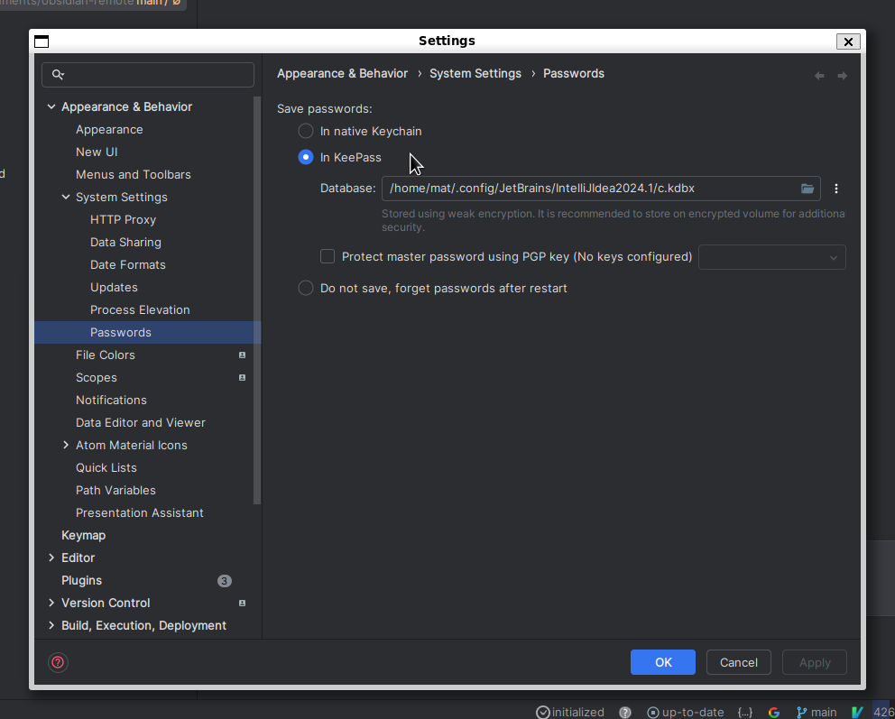
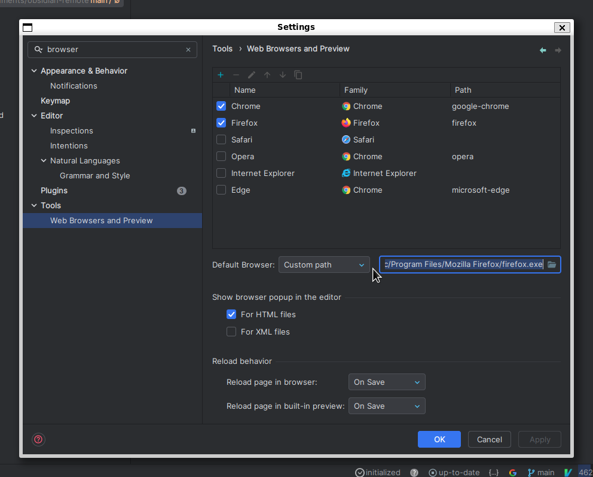

# Installing IntelliJ IDEA on WSL for a Complete Linux-Ubuntu Dev Environment on Windows

Tired of having to choose between VS Code which is just a text editor with good remote explorer capabilities for WSL and Docker, or Jetbrains full-blown IDEs with poor remote capabilities, forcing you to dev on Windows ?

<!-- more -->

## Why Doing This

I was tired of :

- Using VS Code, which works damn well for remote development on WSL or Docker, but is just a text editor with loads of plugins. Refactoring capabilities are below average, and it lacks many specialized tools that I need to take alongside it (Bruno for HTTP requests, dBeaver for database explorations and scratchpad, etc)
- Using IntelliJ-IDEA on Windows works well, but Windows… No Bash without troubles, bad console logging output capabilities, always that damn dependency which required another Windows specific tooling, all in all it isn't great.
- Using IntelliJ-IDEA on Windows with Gateway to setup a remote back-end on WSL and, just like VS-Code, dev on WSL with an UI on Windows. The issue is that it is still heavily under development from Jetbrains teams, and it lacks Settings Sync support and settings are not well managed yet.

## Installing IntelJ-IDEA on WSL

Plain simple. It is heavily inspired by [this guide](https://jsonobject.hashnode.dev/how-to-install-intellij-idea-in-ubuntu-on-wsl-with-x410).

First, go to the [Jetbrains Toolbox Linux AMD64 download page](https://www.jetbrains.com/toolbox-app/download/download-thanks.html?platform=linux), right click `direct link` and `Copy link`.

Then, open your WSL terminal, go to `/home/usr/documents` (you might need to create the `documents` folder first).

```bash
sudo apt install libfuse2
wget https://download.jetbrains.com/toolbox/jetbrains-toolbox-2.3.2.31487.tar.gz
sudo tar -xzvf jetbrains-toolbox-2.3.2.31487.tar.gz
sudo ./jetbrains-toolbox-2.3.2.31487/jetbrains-toolbox
```

Then it will launch Jetbrains-Toolbox :


Simply install IntelliJ IDEA from here and launch it by clicking on it.

You can, and should, activate `Settings Sync`.

Change the Jetbrains passwords management as follows so that it saves Github, database and other credentials properly (I don't have an alternative yet, but it works) :



And change your default browser (eg:`/mnt/c/Program Files/Mozilla Firefox/firefox.exe`) to use the one on Windows :



*Just make sure to have a browser on WSL as it might be required to auth on some Jetbrains plugin and it won't work with Windows broser. You'll need to copy paste links*

You can create aliases using `nano ~/.bash_aliases` :

```txt
alias toolbox="~/.local/share/JetBrains/Toolbox/bin/jetbrains-toolbox > /dev/null 2>&1 &"
alias idea="~/.local/share/JetBrains/Toolbox/apps/intellij-idea-ultimate/bin/idea.sh > /dev/null 2>&1 &"
alias idea.="~/.local/share/JetBrains/Toolbox/apps/intellij-idea-ultimate/bin/idea.sh . > /dev/null 2>&1 &"
```

And, following [this guide](https://granule.medium.com/wsl2-gui-app-shortcuts-in-windows-with-wslg-fcc66d3134e7), you can create Windows shortcuts for your app.

It appears that they (`.desktop` files) already exist within `\\wsl.localhost\Ubuntu\home\USENAME\.local\share\applications`, so simply copy and paste them to `\\wsl.localhost\Ubuntu\usr\share\applications`.

You can use the command `sudo cp *jetbrains* /usr/share/applications` when inside `home\USERNAME\.local\share\applications` to do so.
