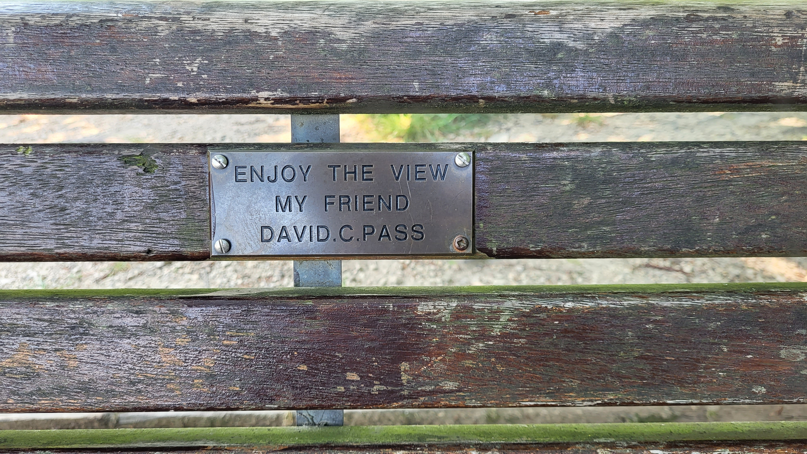

# Les Grandes Différences Entre La France, l'Angleterre, Le Pays De Galles, l'Ecosse Et l'Irlande

Pas besoin de voyager au bout du monde pour observer des différences de culture. On vous le montre avec nos voisins parlant la langue de Shakespeare.

<!-- more -->

## Introduction

Bien le bonjour ! A la suite de notre petit périple, on a encore plein de petites choses à raconter, notamment toutes ces choses qui nous ont marquées et qui changent de notre douce France.

## La Route

Eh oui, évidemment, la première chose que nous avons découvert en Angleterre à notre arrivée à Douvres est la route. On roule à gauche, jusqu'ici il suffit de prendre l'habitude. Mais la comparaison ne s'arrête absolument pas là.

### La Signalisation

La première chose qui frappe est la différence de mentalité sur la signalisation. En France, on a de bon gros panneaux bien frappant visibles de loin. En Angleterre, la majeure partie de la signalisation se trouve sur la chaussée, et les panneaux de vitesse sont minuscules, la taille d'une main ! Et ces panneaux ne sont même pas forcément positionnés du côté où l'on circule. Le regard habituellement porté très loin en France se retrouve donc généralement sur la chaussée ou proche. Et si des véhicules sont sur les marquages au sol ? Et bah cheh, bon courage pour sortir au bon endroit !

En tout cas dans les bonnes idées, ils possèdent également des zones `keep clear` où aucun véhicule ne doit être positionné pour permettre de fluidifier le trafic et le passage des secours.

Notons que les feux de signalisation ne fonctionnent pas de la même manière que nous. Ici on ne laisse pas passer deux entrées de feu en même temps, ceux en face n'auront pas le feu vert en même temps que vous, ce qui vous permet de tourner directement sans laisser passer la circulation venant en sens inverse. Mais du coup l'attente peut paraitre interminable, d'autant plus que les piétons ont leur propre timing de passage qui passe tous les feux véhicules au rouge.

Information rigolote : il est possible de commencer à rouler quand le feu passe du rouge au orange avant de passer au vert. Une transition que nous n'avons que pour l'arrêt sur le continent.

Notons la présence de panneaux rigolos comme les traversées de vieux, de grenouilles, de canards, de vaches ou encore de personnes à mobilité réduite. Ou encore le fameux traversée de piétons sur une 2x2 voies à 70 mph (113km/h).

Et d'ailleurs en village, les limitations sont généralement à 64km/h voire 80km/h, avec des passages à 48km/h assez rares finalement.

### La Courtoisie Au Volant

Heureusement pour nous, les Anglois sont courtois au volant. Et je vous jure, ce n'est pas qu'un cliché. Qu'est-ce qu'ils sont aimables, à laisser passer les autres, sourire, et se faire des grands signes de remerciement (dont des gros pouces). La France a beaucoup à apprendre de leur comportement sur la route !

### Les Parkings

Une habitude terrible des Anglais, en lien avec leur problème fondamental de parking, est le fait de se garer n'importe où. Littéralement, tous les bords de route sont emplis de véhicules dans les villages et villes, imposant de laisser passer les véhicules en face. Leur courtoisie ne sort pas de nulle part, ils ont bien dû s'y mettre pour ne pas devenir fou.

Dans le même ordre d'idée, ils s'arrêtent n'importe où sans le signaler. Et cela semble normal, en plein virage ou autre. Etrange.

Notons également que leur capacité à se garer dans une place est rudimentaire. Ils prennent des coussins de chaque côté de leur véhicule plus gros qu'un jeu gonflable pour enfants si on ne leur indique pas la place avec des traits. Remarquez, quand la place est bien démarquée, ils trouvent toujours le moyen de se foutre n'importe comment. Non sincèrement ce pays a un problème avec le parking de manière général, c'est culturel.

### L'état Des Routes

Enfin, l'état des routes. Surtout en l'Angleterre et au Pays de Galles, puisque la situation s'améliore en Ecosse et que malgré l'étroitesse des routes Irlandaises, ce n'était rien comparé aux deux premiers cités. Car oui, l'Angleterre et le Pays de Galles ont des routes parfois minuscules, mais toujours remplies de nid de poules ou de saloperies qui vont réduire vos pneus en miettes.

Notons la présence de haies sur les côtés qui n'aident pas à agrandir la route ou la visibilité, ni leurs [bumpers](https://www.wikiwand.com/en/Cat%27s_eye_%28road%29) au centre de la route qui lacèreront vos pneus puisque vous serez trop large pour tenir intégralement dans la partie gauche de la route.

## La Vie En Van

Au Royaume-Uni, notre vie en van a beaucoup changé.

Déjà les toilettes publiques. Je ne vous fait pas un dessin, en France si vous avez de la chance vous tombez sur des toilettes corrects sans PQ ni cuvette, mais généralement c'est toilettes turcs bouchées. Au Royaume-Uni et en Irlande, les toilettes publiques sont luxueuses, chaleureuses, accueillantes. C'est un bonheur pour vos p'tites fesses. Sauf quand elles sont payantes, mais bon, heureusement ce n'est pas toujours le cas.

Le camping est également très luxueux, parfois trop, si bien qu'on a galéré pour trouver des campings abordables plus d'une fois. Mais la prestation est d'un autre niveau qu'en France à égal budget, beaucoup plus intime avec des douches et lavabos individuels et des toilettes de qualité.

Enfin en van, trouver un endroit qui n'appartient pas à un landlord est compliqué. Avec les bonnes applications, ça se fait, mais il faut bien s'y prendre. La quantité de spots en bord de route, les fameux lay-by, sans aucune alternative à portée est énorme. Il faut se préparer mentalement à passer quelques mauvaises nuits sur le séjour, là où en France de nombreux villages mettent à disposition des aires de repos tout équipées avec eau propre, vidanges et poubelles !

En parlant de vidange et de poubelles, il faut croire qu'ils n'en ont pas. Ou peu du moins, vider les ordures fut généralement un enfer et nous avons dû stocker du sac comme jamais. Sans parler du nombre d'endroits avec poubelles où il est interdit de jeter ses déchets domestiques. Mais on vit dans notre van, et vous n'avez rien de public, alors comment faisons-nous ? Bref, effectivement sur ça aussi, la situation était plus simple en France.

## La Relation À L'argent

Est-ce l'influence des Etats-Unis ? A moins que ce ne soit les Anglais qui ne les aient influencés à l'époque ? En tout cas, le capitalisme est fort ici.

Trouver des parkings gratuits relèvent d'un effort intense ou d'un miracle, les campings sont à des tarifs exorbitants qui ne choquent plus, et dès que les Anglais voient une souche ou un tronc d'arbre mort, ils ne peuvent s'empêcher d'y enfoncer une pièce.

Remarquez, tout cela ne les empêche pas d'être une nation généreuse, la quantité de dons et de lieux fonctionnant par le biais de donations est incroyable. Les donations sont parfois assez largement conseillées, l'incitation à la limite de l'obligation. Sachez toutefois que cela fait partie des coutumes.

Enfin coutume ou pas, il peut se gratter celui qui attend recevoir mes 10£ pour garer mon van sur un bord de route dans un champ. Vindieu que c'était courant ça.

## Les Visites

Nous avons déjà parlé du prix des parkings, mais les visites sur les îles étaient coûteuses. Du genre régulièrement de 15 à 30£ par adulte. Ayant vu ces tarifs à Douvres et après une petite panique sur ce qu'on foutait en terres de bourgeoisie, nous avons trouvé des bons plans : English Heritage et National Trust. Des organismes qui proposent des "abonnements" annuels qui permettent de profiter de tous les lieux proposés, visites guidées et parkings inclus gratuitement !

Encore une fois, beaucoup de recours à la donation dans les musées, et il serait mal vu de ne pas y laisser un billet ou un coup de carte bleue en partant. Remarquez, ça vous regarde, mais sachez que dépendant du lieu vous serez amenés à faire des dons par pression sociale.

En randonnée, vous allez rencontrer énormément de barrières séparant des prés ou des clôtures pour l'abondance d'animaux d'élevage. Vous verrez, c'est simple à refermer, alors ne faites pas comme 90% des touristes à laisser tout ouvert ! En plus elles sont plus pratiques que chez nous !

## La Vie De Manière Générale

Nous avons remarqué tout une série de petites choses qui diffèrent entre nos pays.

En café et bar, vous ne trouverez quasiment jamais le prix ni le degré alcool d'une bière. Heureusement pour nous, les bières sont moitié moins chères que chez nous, mais ça nous a un peu fait peur au début !

Notons qu'en parlant de tarif, ici les supérettes et commerces de bord de route ne sont pas spécialement plus chers que les grandes surfaces ! En tout cas dans une dimension bien différente des boutiques d'autoroute ou de villages perdus en France qui ont des prix triplés.

Les filles et femmes portent beaucoup plus de belles robes longues que chez nous l'été, un fait qui nous a particulièrement marqué à Oxford dans les parcs.

Les maisons se ressemblent énormément, mais avec leurs petits changements personnels. Par exemple, une rue complète peut avoir le même modèle de maison, mais la couleur des murs, les volets, le type de porte, les avancées de porte ou les toitures peuvent les différencier, donnant un style très chouette au quartier.

Les bâtiments en brique sont très nombreux, beaucoup plus que chez nous. Mais le mieux reste les couleurs et les jardins à l'avant des maisons, qui sont monnaie courante ici mais qui manquent terriblement à nos villes tout de béton et de gris/blanc impersonnel au possible.

Les bancs sont quasiment tous sponsorisés ici, mais pas pour une entreprise, plutôt en l'hommage à des personnes ayant vécu aux alentours. De petits poèmes ou mots y sont généralement ajoutés, permettant de remercier les défunts ou de partager leur histoire.

Il existe aussi des bancs où l'objectif est de rencontrer des gens en s'y asseyant, sans complexe, rien que pour discuter. Une pratique que nous avons retrouvée avec des bars où il était interdit de venir en groupe pour favoriser la rencontre et l'échange. Ce qui rend bien compte de la mentalité différente des Anglais, adeptes du small talk en permanence et des bonnes petites blagues. Leur sarcasme étant légendaire.

Notons, et ceci concerne principalement Mathis, que les hommes relâchent leur sphincter lors de leur passage aux toilettes, même en urinoirs. Et c'est normal.
