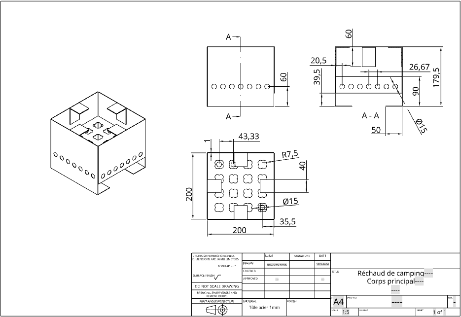
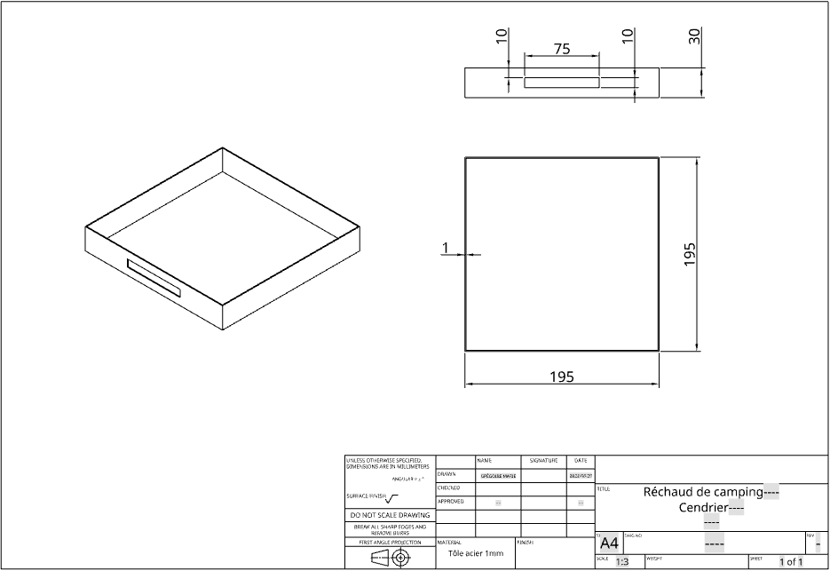
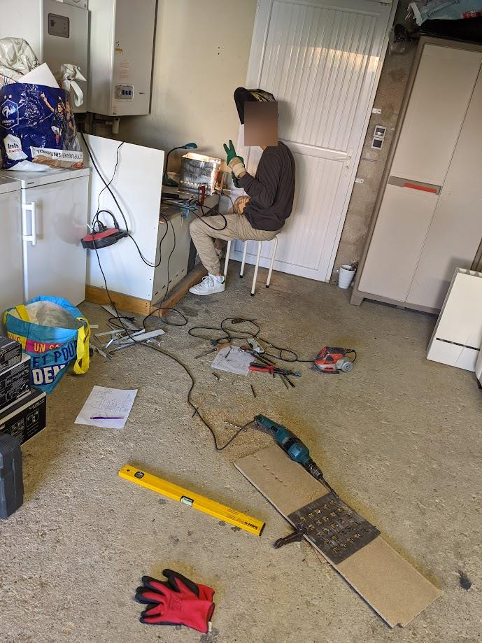
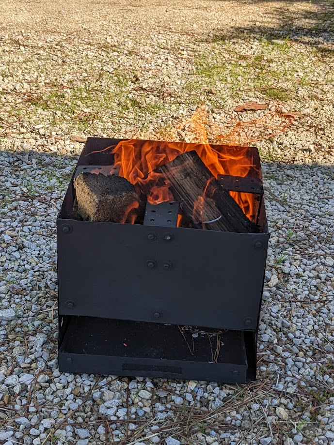

# Modélisation Et Réalisation D'un Réchaud À Bois

Dans ce post, nous verrons comment nous avons réalisé un réchaud à bois, de la conception sur logiciel de CAO au test, en passant par la fabrication.

<!-- more -->

Le 17 Avril 2023, nous sommes partis à l'aventure avec ma copine pour 166 jours en Angleterre, au Pays de Galles, en Ecosse et en Irlande.

A l'origine, nous pensions utiliser du bois pour manger le soir, et nous avions donc besoin d'un réchaud. Décathlon en proposait [un](https://www.decathlon.fr/p/rechaud-a-bois-mh500-pour-le-camp-du-randonneur/_/R-p-302880) à 50€, mais ayant du temps libre à la fin de nos études, nous avons décidé avec un très bon ami (Grégoire Marie) d'en réaliser un nous-mêmes avec les moyens du bord.

Il a donc réalisé un premier jet de modélisation du `Camping Stove` sur [Onshape](https://www.onshape.com/fr/) selon le cahier des charges que j'ai pu établir.

Ci-dessous, nous retrouvons la modélisation ainsi que les plans que nous avons utilisés lors de la fabrication.

Nous avons procédé à la fabrication des pièces et à l'assemblage chez nous avec les moyens du bord ainsi que des matériaux de récupération.

Enfin nous l'avons peint et testé, et le concept bien que trop gros pour être pratique dans notre van aménagé nous servira pour des petits barbecues en extérieur !

