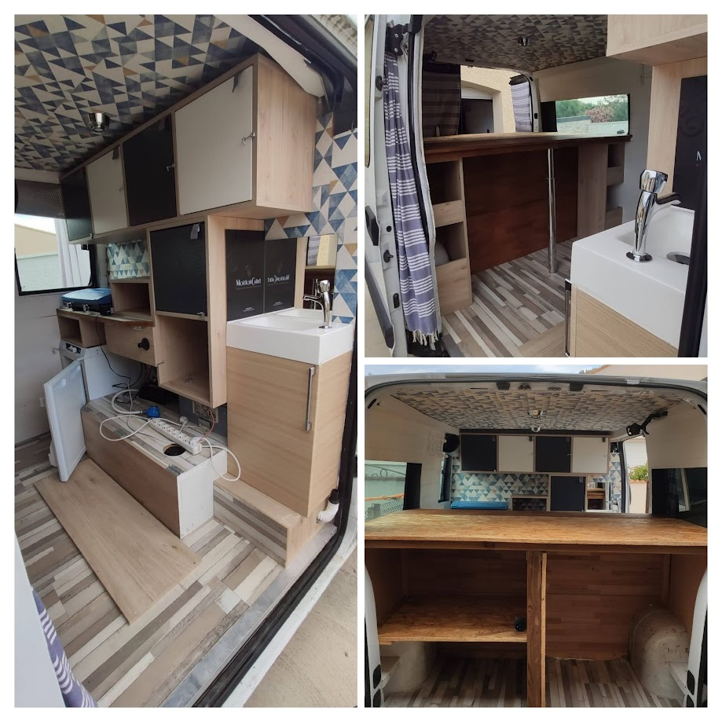
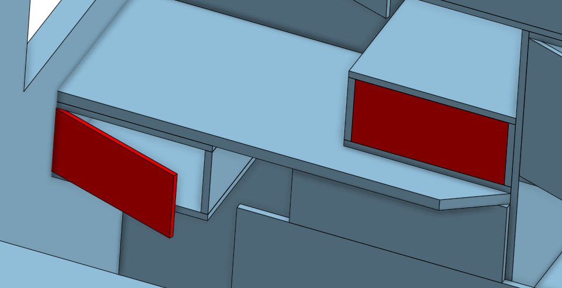
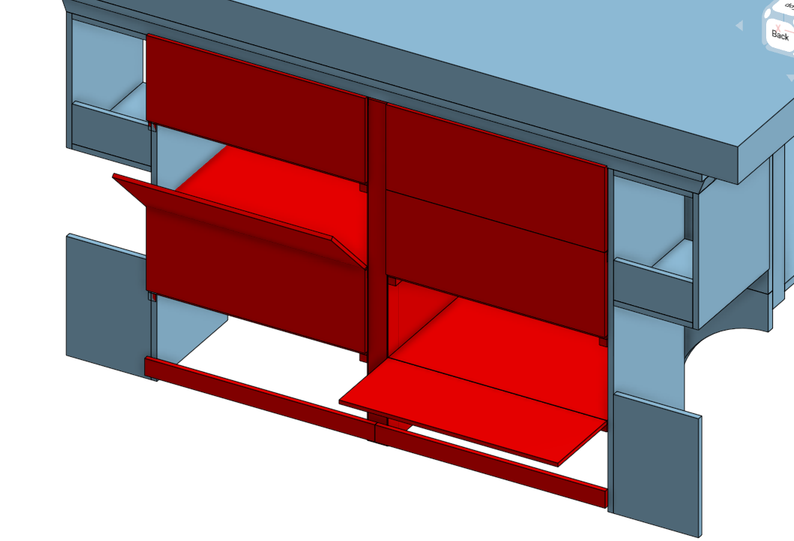
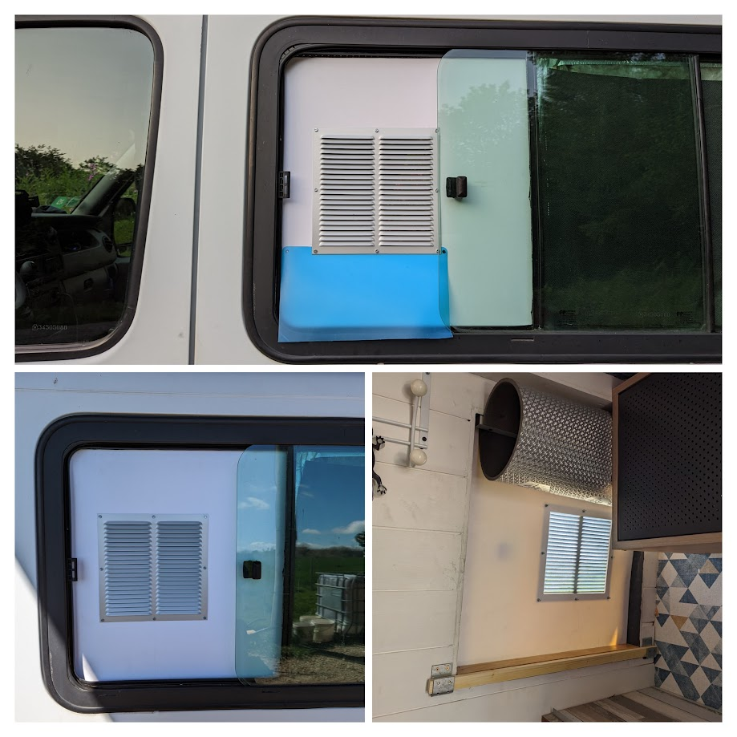
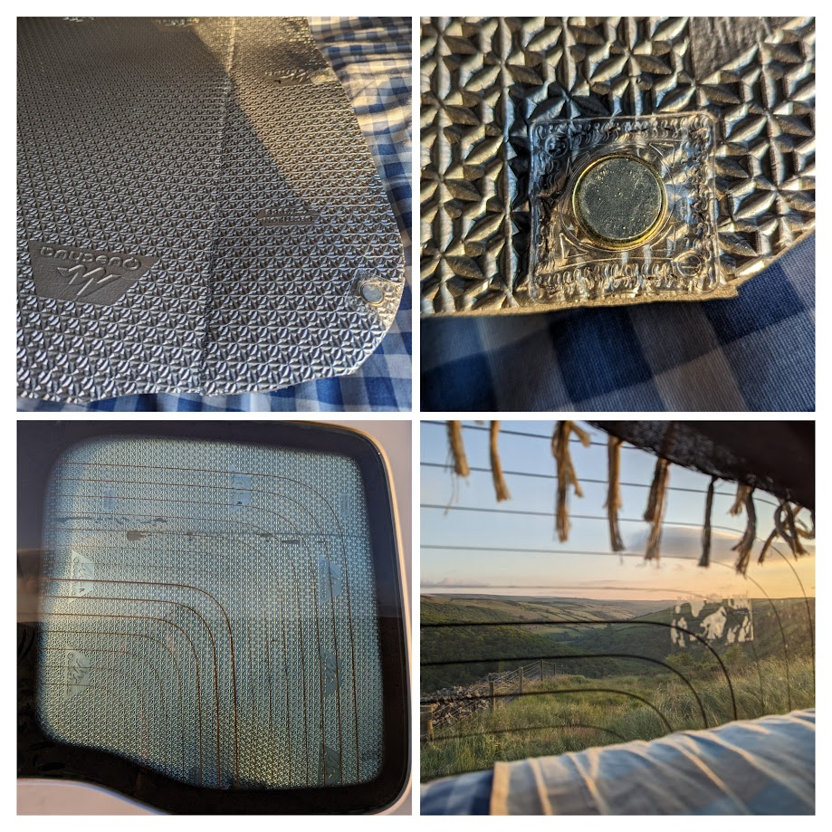
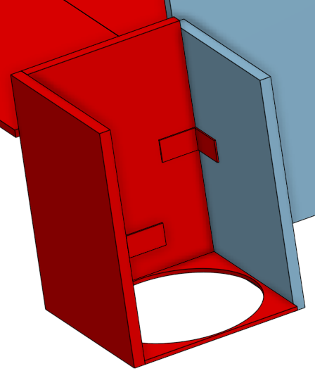
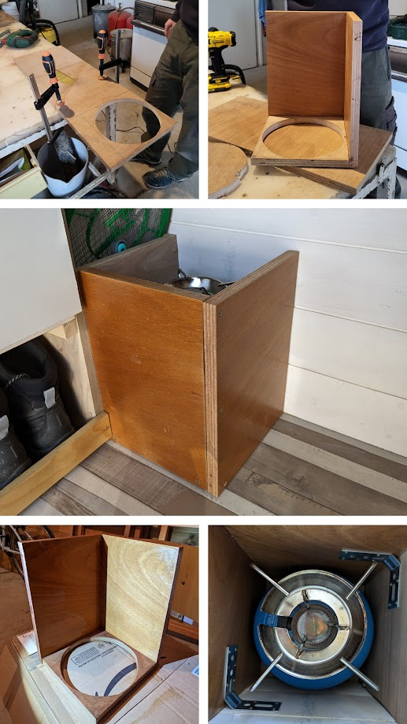
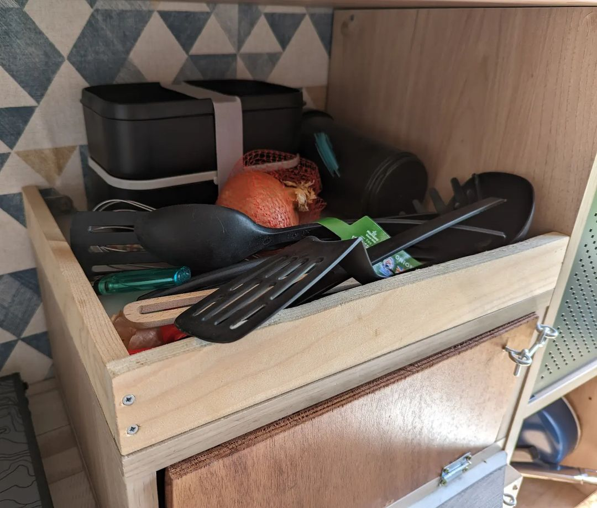
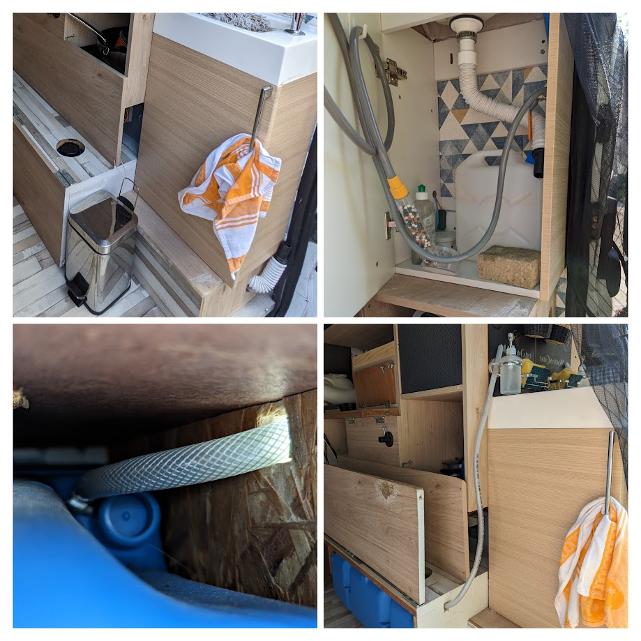

# Modélisation Et Réalisation Des Travaux D'aménagement D'un Van

Avant de partir à l'aventure, nous avons acheté un van et avons modifié son aménagement. L'occasion de mettre en pratique mes connaissances en conception.

<!-- more -->

## Introduction

Le 17 avril 2023, nous sommes partis avec ma copine pour une aventure de 6 mois en Angleterre, au Pays de Galles, en Ecosse et en Irlande.

Mais pour réaliser ce voyage, nous avons fait l'aquisition d'un van aménagé. Après deux week-ends de test, nous avons pu voir les améliorations qui nous semblaient nécessaires à l'acomplissement de notre petit rêve. Et nous avons ainsi rédigé notre petit **cahier des charges**.

## Mesures Et Modélisations

La premiere étape de notre travail fut de prendre nos mesures afin de modéliser l'état initial du van.

Nous avons donc utilisé [Onshape](https://www.onshape.com/fr/) qui propose un outil cloud gratuit et pratique pour collaborer à deux.

## Les Premières Améliorations Rapides Et Pratiques

Les premières modification étaient simples à apporter :

- Ajout de 2 portes de placard (15x33cm).

- Ajout de charnières et de loquets sur le placard de la pompe à eau, du réservoir d'eau et du système électrique pour obtenir un accès plus rapide et pratique pour y effectuer des modifications ou des réparations à l'avenir.

- Ajout d'un petit [rangement mural](https://www.amazon.fr/Dronjons-Rangement-mural-crochets-Blanc/dp/B09NQL6B8T) afin d'avoir accès facilement à des affaires depuis le lit.

- Ajout d'un support de savon et d'éponges pour l'évier.

- Ajout d'[embouts réducteurs de débit d'eau sur le robinet](https://www.amazon.fr/gp/product/B09PBCCQ5D/ref=ppx_yo_dt_b_asin_title_o09_s00?ie=UTF8&th=1) et changement du [pommeau de douchette](https://www.castorama.fr/pommeau-de-douche-rechargeable-a-billes-eco-thermales-1-jet-coloris-argent/3700766966738_CAFR.prd) pour un modèle à économie d'eau.

## Ajout D'un Placard Complet De Rangement Sous Le Lit

A l'origine, nous n'avions pas d'espace de rangement autre que le coffre pour y déposer notre linge ou nos affaires personnelles. Cependant, étant donnés les pays où nous nous dirigions, une situation de pluie le matin et le soir au moment de se changer était plus que probable. Nous devions avoir accès à nos vêtements depuis la zone habitable du van.

Nous avons donc modélisé une solution de placard en lieu et place du poteau de support, et l'avons réalisé comme toujours avec des matériaux de récupération.

Au centre, nous avons conservé deux poteaux de support comme structure porteuse, et nous avons comblé l'espace à l'aide de panneaux fins de contreplaqué. Chaque placard est fixé à l'aide de tasseaux, des charnières pianos servent à l'ouverture, et des aimants maintiennent les placards en place lorsque le véhicule est en mouvement. L'ajout de chant sur les bandes coupées d'agloméré, de poignées et de loquets sur les placards personnels viennent apporter la touche finale de l'ouvrage.

## Ajout D'un Séparateur Sur La Partie Droite Du Coffre

L'espace à droite du coffre à l'origine était trop vertical à nos yeux, il y avait beaucoup de place inutilisée. Nous avons donc ajouté un panneau de contreplaqué découpé sur mesure pour épouser les formes du van.

## Le Système D'aération

Le gros point faible du van à l'achat était son absence d'aération. Certes, nous avions une fenêtre latérale à hauteur de tête pour les nuits. Mais non seulement une seule entrée d'air ne suffit pas, mais l'aspect sécurité était complètement à revoir.

Nous avons donc réalisé une plaque sur mesure qui s'adapte à la fenêtre latérale, permet d'aérer à l'aide d'une grille et possède un pare-pluie. Il suffit ainsi d'entrouvrir la porte du coffre la nuit tout en la bloquant avec un tendeur pour obtenir un courant d'air confortable.

## Isolation Du Van

Le van a été isolé par l'ancien propriétaire, plus particulièrement le plafond, les murs ainsi que le sol. Cependant, notre van étant un modèle minibus à l'origine, nous avions beaucoup de fenêtres.

Nous avions déjà quelques pare-soleils réalisés sur mesure par l'ancien propriétaire mais scotchés pour la plupart à l'arrache. Nous les avons donc recousus et équipés de petits aimants pour gagner en modularité et permettre de retirer l'humidité qui pouvait s'y cacher au petit matin.

## Les Ajouts De Dernière Minute

### Support Pour Bouteille De Gaz

Nous avons opté pour des [bouteilles de gaz CampinGaz R907](https://www.campingaz.fr/gaz/bouteilles-de-gaz-rechargeables/bouteille-de-gaz-rechargeable-r907/SAP_1688ZCL.html). Cependant, nous n'avions pas d'emplacement spécifique pour stocker la bouteille de gaz autrement qu'à même le coffre.

Nous avons donc réalisé un support sur mesure.

### Bords De Placard

Avec les chutes de bois restantes, nous avons également réalisé des bords de placards pour ajouter un peu d'affaires sur la cuisine sans risquer de tout faire tomber en roulant.

## Les Modifications Réalisées Pendant Le Voyage

Notons que pendant le voyage, nous avons été contraints de changer le système d'eau.

En effet, à l'origine deux problèmes :

- L'eau usée du robinet sortait uniquement sur le côté du van, imposant l'usage de produits naturels et l'acceptation des locaux. (Impossible en Angleterre)
- Le bout de l'entrée d'air du réservoir d'eau était positionnée plus bas que son raccord au réservoir ⇒ De l'eau pouvait donc entrer depuis le réservoir et s'écouler sur notre plancher lors des virages pendant la conduite.

Lorsque nous avons malencontreusement cassé le bout de l'évacuation d'eau usée, nous avons décidé de raccourcir le tuyau et de le relier à un bidon amovible de 5L permettant de conserver nos eaux usées et de pouvoir tout faire à l'intérieur du van.

Concernant l'entrée d'air, nous avons donc percé un trou sur le côté du placard et installé la sortie d'air plus haut que son entrée dans le réservoir afin d'éviter les reflux.

