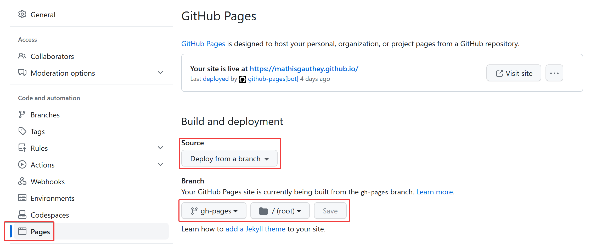

# Obsidian Publish Alternative, How to One-click Upload Your Notes on Your Own Website

In this post, I'll explain how I managed to publish my notes to my own website automatically, just like Obsidian-Publish would do.

<!-- more -->

This post is an extension of my [main post](./My%20Complete%20Obsidian%20Workflow%20to%20Manage%20My%20Life.md) showcase of my Obsidian workflow. You might want to check it out as well.

## Create You Own Hugo Website

### Prerequisites

I'll assume that you installed [Hugo following their quick-start documentation](https://gohugo.io/getting-started/quick-start/) and [Git](https://git-scm.com/downloads) on your computer, and that you know how to clone a repository from Github. If not, Google and Chat GPT are your friends here.

### Create Your Website Repository on Github

First thing you need to do is to [create your website repository on Github](https://github.com/new).

Name it `website_name.github.io` with `website_name` being your desired website name. (Thanks captain obvious).

Don't forget to tick the `Add a README file`. It will prevent cloning an empty repository that will lead to issues if you're not comfortable with Git.

### Create Your Website on Local

You'll now head to a folder of your choice on your computer.

I'm simply using my `documents` folder inside my `home` in Ubuntu. But you might use `Documents` in Windows or anything else.

Open a command prompt inside this folder. Using [Windows Terminal](https://learn.microsoft.com/en-us/windows/terminal/install) you should be able to right click inside the `Documents` folder and select `Open in terminal`. Or use the `cd` command to navigate to the right folder. If you're a Linux user, I'll assume that you know what you are doing.

Input the following command :

```
hugo new site website_name
```

Then to get inside the newly created website folder :

```
cd website_name
```

And you'll now add your Hugo website template as a git submodule.

```
git submodule add https://github.com/CaiJimmy/hugo-theme-stack/ themes/hugo-theme-stack
```

There's other ways of installing a theme, I just made a choice :

- Using the theme quick-start → Usually end up being hard to configure
- Using a simple git clone instead of a submodule → It'll be a pain to update the theme
- Using a Hugo module → Configuration involves creating folder, I'm a lazy ass, I'm configuring my theme directly from my theme folder.

By the way, if you want to be able to modify the theme, you should fork the theme, and update the `.gitmodules` file with your forked repository link. If not, just keep it this way with the official [hugo-theme-stack](https://github.com/CaiJimmy/hugo-theme-stack) repository.

**If you do choose to use the git submodules for being able to modify the website theme, please don't forget to use the `git submodule update --remote` command to gather the changes from your remote fork.**

Anyway, now you should find the `hugo.toml` file and **delete it**. Don't worry, we'll use the theme configuration file.

Speaking of which, copy the whole `exampleSite` folder content at the root of your `website_name` folder.

You'll now have a `config.yaml` configured correctly, meaning with the good theme and all the base configs. You can also steal [mine](https://github.com/mathisgauthey/mathisgauthey.github.io/blob/main/config.yaml). I don't really mind, if anything, it'll make me happy to see websites created thanks to my guide.

Just don't forget to change at least the `baseurl` to `https://website_name.github.io/` and your website `title`.

Please make sure to add the following two lines to your `config.yaml` as well :

```yaml
# Error handling configuration for internal markdown link not found
refLinksErrorLevel: WARNING
refLinksNotFoundURL: https://website_name.github.io/404
```

They will assure that your website still build even if you push a note that has a link to an un-uploaded note, and redirect to your 404 page if it doesn't find the requested URL.

Icons and avatar are saved inside the `assets` folder. Except for your website `favicon` that goes into the `static` folder.

You will now come back to your `Documents` folder and git clone your previously created repository. You now have a `website_name` folder containing your Hugo site folder with the theme as a git submodule. And a `website_name.github.io` folder containing a `README.md` file.

You just need to copy the `website_name` folder content inside your repository folder named `website_name.github.io`. And finally, commit and push !

### Configuring the Github Pages Online Part

First, you need to go to your website settings and configure how the site is build.



Then create a `.github` folder.

Inside the folder, create a `workflows` folder.

Finally, create a `deploy.yml` file. Add the following content :

```yml
name: Deploy to Github Pages

on:
    push:
        branches: [main]
    pull_request:
        branches: [main]

jobs:
    build:
        runs-on: ubuntu-latest

        permissions:
            # Give the default GITHUB_TOKEN write permission to commit and push the
            # added or changed files to the repository.
            contents: write

        steps:
            - uses: actions/checkout@v2
              with:
                submodules: 'recursive'

            - name: Cache Hugo resources
              uses: actions/cache@v2
              env:
                  cache-name: cache-hugo-resources
              with:
                  path: resources
                  key: ${{ env.cache-name }}

            - uses: actions/setup-go@v2
              with:
                  go-version: "^1.17.0"
            - run: go version

            - name: Cache Go Modules
              uses: actions/cache@v2
              with:
                  path: |
                      ~/.cache/go-build
                      ~/go/pkg/mod
                  key: ${{ runner.os }}-go-${{ hashFiles('**/go.sum') }}
                  restore-keys: |
                      ${{ runner.os }}-go-

            - name: Setup Hugo
              uses: peaceiris/actions-hugo@v2
              with:
                  hugo-version: "latest"
                  extended: true

            - name: Build
              run: hugo --minify --gc

            - name: Deploy 🚀
              uses: JamesIves/github-pages-deploy-action@4.1.4
              with:
                  branch: gh-pages
                  folder: public
                  clean: true
                  single-commit: true
```

It is based on the [hugo-stack-theme-starter](https://github.com/CaiJimmy/hugo-theme-stack-starter) repository, but configured to use a git submodule by adding the lines 20 and 21 :

```yml
              with:
                submodules: 'recursive'
```

If you don't know much about Github workflows, just keep in mind that this is the part that will automatically build your site from your `main` branch on Github and deploy the `gh-pages` branch that is the built website.

### Configure Your Website

I honestly don't have the time nor the will to document every modification I made on my website. You have many options to learn how to do so :

- Explore my [website repository and files](https://github.com/mathisgauthey/mathisgauthey.github.io/settings/pages)
- Explore the [hugo-theme-stack](https://github.com/CaiJimmy/hugo-theme-stack) repository, its issues and discussions
- Explore the [hugo-theme-stack](https://stack.jimmycai.com/) documentations

Basically, I changed and added some icons, added some left panel pages, and configured a comment section using [giscus](https://giscus.app/).

## Upload Content to Your Website

You can simply change the `share` boolean to `true` in the note frontmatter, then select the command `Upload filename to DEFAULT` of the [obsidian-github-publisher](https://github.com/ObsidianPublisher/obsidian-github-publisher) plugin from the note drop down menu. It will use some regex to convert wikilinks to standard Hugo links, commit and push to the relevant repository on Github, make a pull request that'll be automatically accepted, and then use some Github Actions to build your website.

Attachments are automatically sent as well as linked notes as long as they have the `share` boolean set to `true` as well.

The posts will be sent to the `content/post` folder and the attachments to the `content/images` folder.
