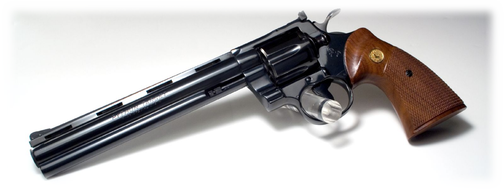
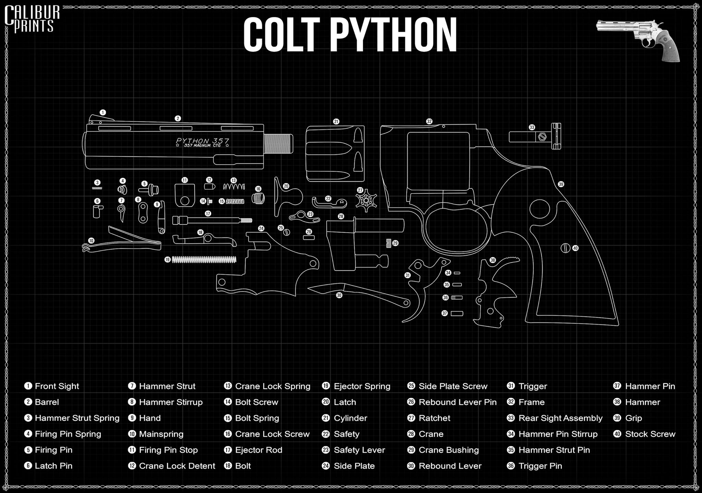
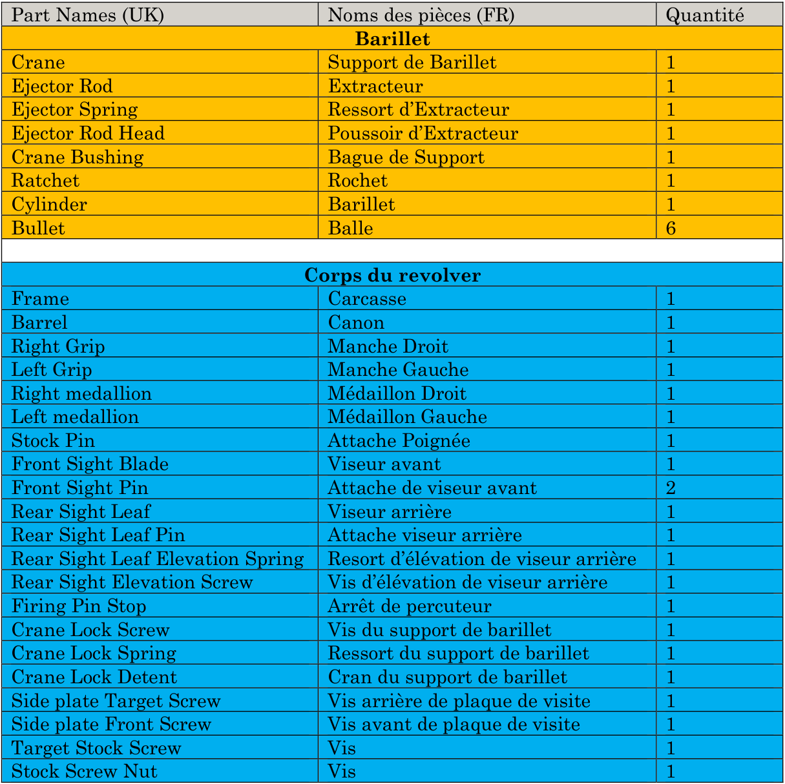
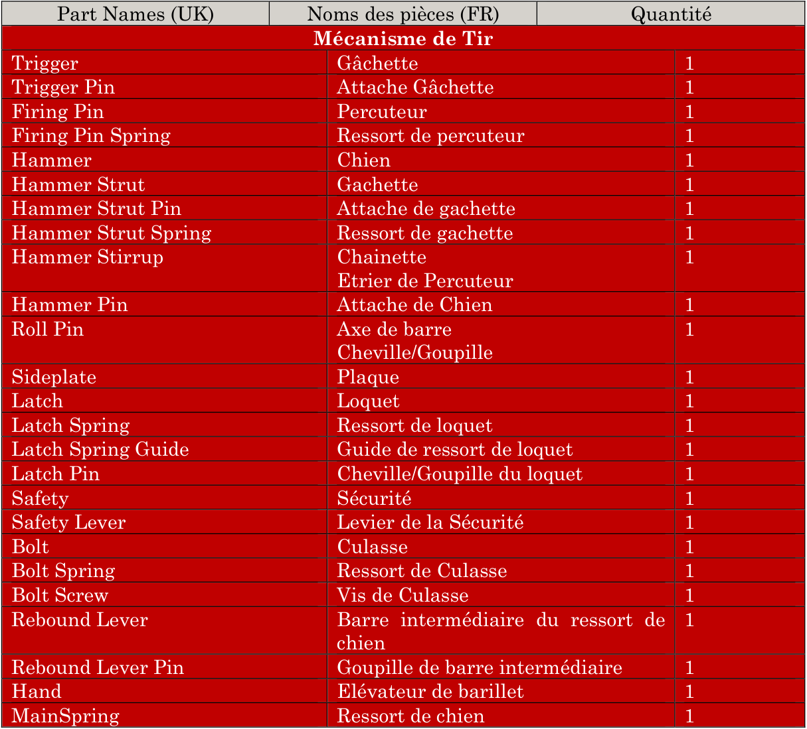
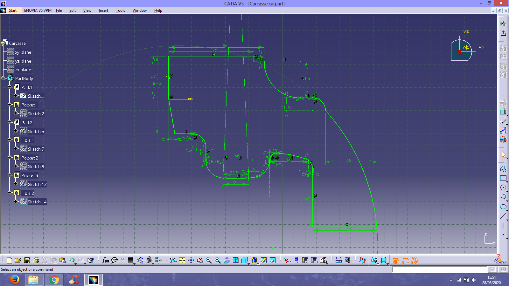
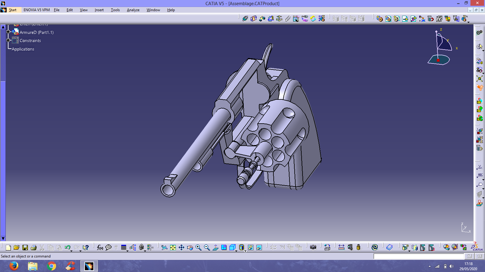
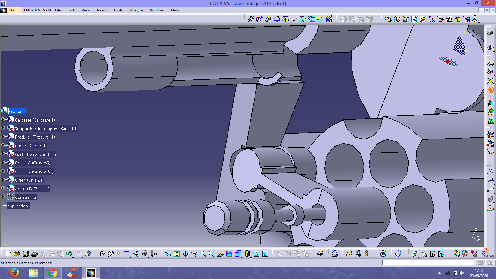

# Projet De CAO - Modélisation D'un Cold Python

Je décris ici un projet de CAO réalisé à Polytech Lyon pour prendre en main le logiciel Catia V5.

<!-- more -->

*Ce document à été converti d'un compte rendu PDF.*

## Introduction

### Présentation Du Projet

Le Colt « Python » est un revolver à double action pour des cartouches de type .357 magnum très réputé pour sa précision, sa détente souple et son système étroit de blocage de cylindre.

Le revolver a été introduit en 1955 comme le model haut de gamme de Colt et était, à l’origine, censé être de calibre .38 spécial. Ce qui a pour conséquence de lui procurer un viseur ajustable, une détente souple et une construction solide.

Le « Python » a une très bonne réputation parmi les historiens et spécialistes du domaine, on l’a déjà nommé « la Rolls-Royce des revolvers Colt » ou encore « le meilleur revolver du monde ». Sa réputation est néanmoins méritée car son système de détente est très perfectionné, par exemple quand le révolver est complètement chargé, une fois que l’on appuie sur la détente le cylindre se bloque pendant que le chien percute la balle. Cela permet d’éviter que le cylindre soit lâche pendant le tir, un problème présent sur nombreux modèle de revolver.

### Motivations

Le Colt « Python » est une arme que l’on connait très bien, en effet, étant tous fan de jeux vidéo et de séries nous l’avons déjà rencontré à de nombreuses reprises. Il est par exemple présent dans la série Half-Life, Resident Evil ou encore The Walking Dead. Les revolvers en général ont laissé, et laisse encore, une trace dans la culture populaire. Tout le monde connait et apprécie ce type d’arme, que ce soit pour leurs apparences uniques ou leur “aura” (en effet, on les associe directement à l’ambiance unique des Westerns).

En plus d’être une arme très répandue dans les jeux vidéo et en général dans la culture populaire, cette arme en particulier possède un mécanisme de tir à double action qui est très intéressant à modéliser et assez rare dans cette catégorie d’arme de poing.

Et enfin le Colt « Python » est à nouveaux d’actualité car sa production a été relancée en janvier 2020.

## Prise D'informations

### Nomenclature

A l’aide de documents papiers récupérés sur internet et d’un jeu nommé World Of Guns : Disassembly, nous avons pu établir la nomenclature de notre revolver :

### Mécanisme De Rechargement Et De Tir

Le Revolver Colt « Python » est à double action, c’est ce qui le rend intéressent. Néanmoins le fait qu’il soit un revolver lui permet d’être utilisé en simple et double action.

Avant d’aller plus loin dans les explications, définissons ce qu’est un mécanisme à simple et double action :

- Un mécanisme simple action signifie qu’un appui sur la gâchette de l’arme ne fera qu’abaisser le chien qui ensuite percutera la cartouche. Il est donc nécessaire de relever manuellement le chien avec le pouce avant d’appuyer sur la gâchette si on veut que le coup part.
- Un mécanisme double action possède lui la capacité de relever automatiquement le chien. Les deux étapes (monter et abaisser le chien) se font simultanément en un appui sur la gâchette. Ce qui permet d’économiser du temps entre deux tirs.

⇒ Dans le Colt « Python » la double action fonctionne de la manière suivante :

Lorsqu’on appuie sur la gâchette, elle pivote. Ce qui élève la partie arrière de celle-ci qui va servir de poussoir au chien. Quand on pousse sur le chien, celui-ci pivote à son tour, ce qui permet au percuteur de s’éloigner du barillet. Quand la gâchette est reculée au maximum, sa partie poussoir va perdre le contact avec le chien. Le ressort de celui-ci va alors pouvoir se détendre et le percuteur va alors frapper la balle. En un mouvement sur la gâchette le mécanisme double action du revolver a donc levé et abaissé le chien pour permettre le tir.

## Modélisation

### Planification

Pour commencer la modélisation nous avons d’abord cherché des plans. N’ayant aucune documentation en ligne sur les dimensions exactes d’une arme à feu nous avons utilisé des images du colt complétement démonté. En utilisant la taille des balles de calibre .357 comme échelle pour avoir une longueur de référence nous avons pu coter les pièces sur nos plans en commençant par le barillet.

Puis nous avons enchainé avec le corps du revolver, et enfin nous aurions pu nous attarder a y intégrer le mécanisme de tir.

### Modélisation Du Barillet

Nous avons commencé par modéliser le barillet pour avoir une pièce référence pour l’échelle du reste de la modélisation.

### Modélisation De La Carcasse

Pour la carcasse, nous l’avons faite en une seule esquisse qui est extrudée. Les dimensions exactes n’était pas très importantes autour de la crosse mais nous avons dû être précis dans le dimensionnement aux alentours des pièces qui viendront ensuite s’emboiter ou s’assembler à la partie principale de l’arme. Nous avons dû reprendre la carcasse à plusieurs reprises pour obtenir le bon alignement avec le barillet et le canon.

### Modélisation Du Mécanisme Du Barillet Et Du Canon

Ici l’objectif était de pouvoir faire pivoter l’intégralité du barillet sur le coté pour pouvoir recharger facilement l’arme. Il est composé de plusieurs pièces qui une fois assemblées viennent se fixer sans problème sur le corps de l’arme avec le canon.

Le petit rebord sur la dernière figure sert mécaniquement à ce que le barillet ne descende pas complètement et reste bloqué à 90° pour le rechargement de l’arme. La tige à l’intérieur du barillet se pousse en arrière pour éjecter les douilles.

### Modélisation De La Gachette Et Du Chien

Nous avons voulu modéliser le chien et la gâchette de telle manière à reproduire le mécanisme double action qui lève le chien lorsque nous appuyons sur la gâchette et qui le relâche une fois arrivée en butée, par manque de ressources nous n’avons pas pu modéliser l’intégralités des pièces servant ce mécanisme. Nous n’avons pas pu non plus modéliser le ressort du retour du chien car CATIA ne permet pas facilement la réalisation de pièce avec des propriétés élastique.

**Update post-diplôme: Avec nos connaissances de fin d'études, nous pourrions désormais réaliser ce type de mécanisme dans son intégralité**
