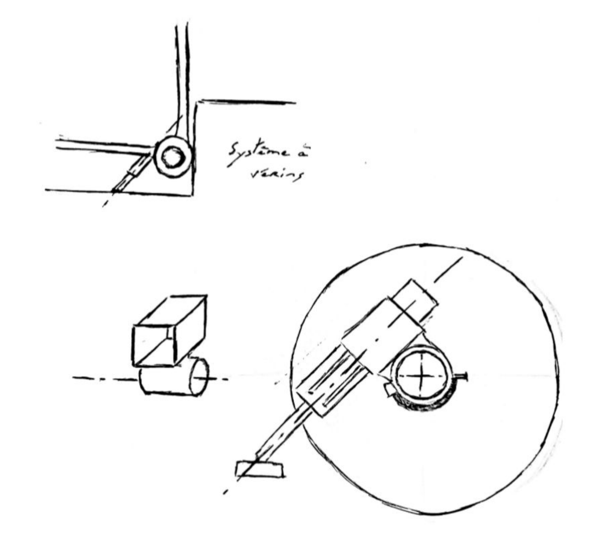
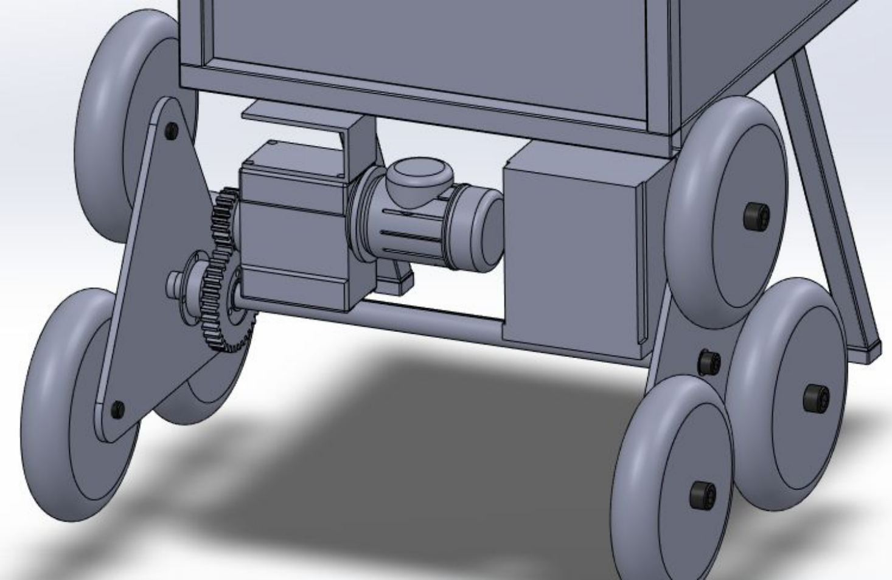
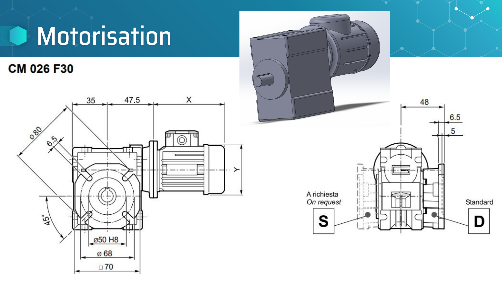
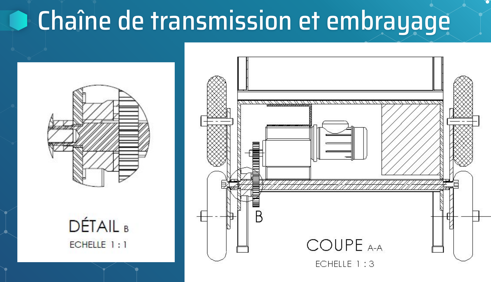
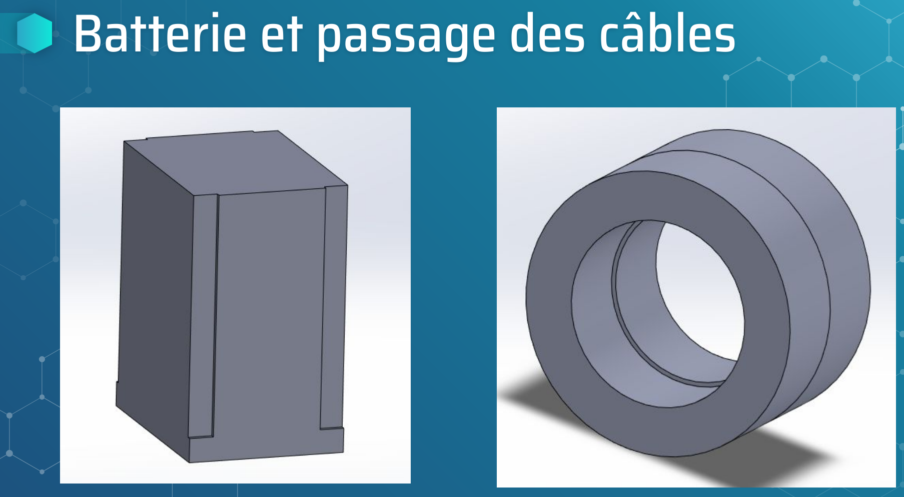
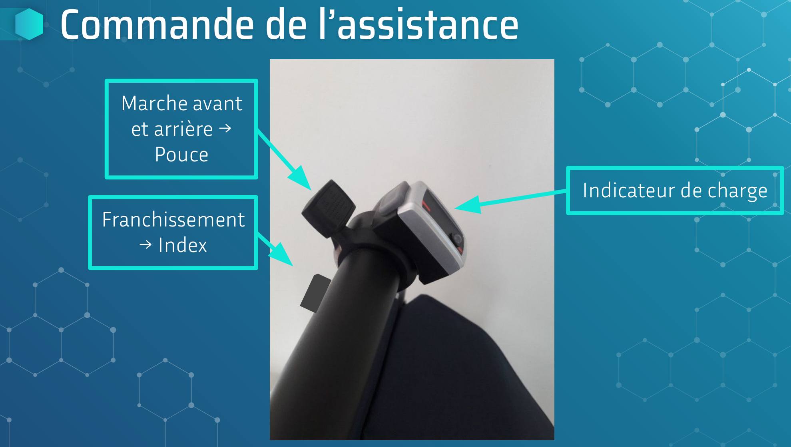
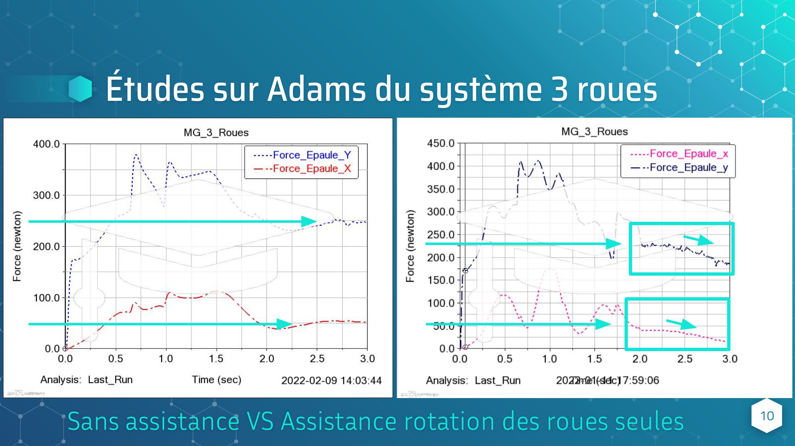

# Projet Industriel De Fin D'études - Chariot De Course À Assistance Électrique

Je décris ici mon projet industriel de fin d'études réalisé à Polytech Lyon, la conception d'un chariot de course à assistance électrique.

<!-- more -->

*Ce document contient des extraits de notre soutenance finale.*

## Introduction

> Équiper un chariot de courses d’un système d'assistance électrique pour aider au déplacement sur le plat et au franchissement de trottoirs et d'escaliers.

Lors de notre dernier semestre d'études d'ingénieur en mécanique, nous avons réalisé ce projet en autonomie à 3. Ce projet s'est déroulé selon les étapes suivantes :

Pour suivre l'avancement des différentes phases du projet, nous avons utilisé le logiciel Jira et son affichage Gantt.

## Etablissement Du Cahier Des Charges Fonctionnel

Nos objectifs ont été les suivants :

- ✅ Assistance sur le plat
- ✅ Assistance franchissement trottoir
- ✅ Assistance franchissement escalier
- ❌ Assistance franchissement escalier en colimaçon

## Recherche De Solutions Existantes

Nous avons envisagé plusieurs solutions techniques lors de nos recherches documentaires.

### Système À Piston

Une première piste que nous avons envisagé fut d'utiliser un système de vérin poussoir soulevant le chariot à deux roues (éventuellement motorisées) au-dessus de la marche.

### Système À Crochet

Une seconde piste que nous avons envisagé fut d'utiliser un système de crochet tracteur soulevant le chariot à deux roues (éventuellement motorisées) au-dessus de la marche.

### Système À Trois Roues

Une dernière piste que nous avons envisagé fut d'utiliser un système à 6 roues, avec des roues individuellement motorisées ou par transmission, et un couple appliqué sur l’axe entre les roues pour faire tourner le support des roues.

## Pré-études Des Solutions Sur Adams

Après plusieurs pré-études, les résultats les plus prometteurs en terme d'aide à la réduction des efforts pour l'utilisateur sont associées au modèle à 6 roues.

En effet, l'accompagnement est beaucoup plus souple et sans à-coups, et le système permet un franchissement répété d'obstacle (comme un escalier) beaucoup plus rapide.

## Préciser Les Caractéristiques Techniques À L'aide D'études Sur Adams

Nous avons donc par la suite utilisé les scripts d'optimisation d'Adams pour trouver les meilleures dimensions et masses afin de réduire les efforts de l'utilisateur. Nous avons ainsi joué notamment sur les dimensions des roues, du système 3 roues, la hauteur du chariot et son chargement afin de contrôler l'assistance quel que soit le niveau de charge.

Ces études nous ont mené a définir notre cahier des charges techniques :

- Charge max admissible : 30kg
- Contenance maximale : 50L
- Poids à vide : 5 à 10kg max
- Diamètre roues : 14cm
- Entraxe système 3 roues : 17cm
- Hauteur du chariot : 1.1m
- Largeur du chariot : 40cm
- Profondeur du chariot : 35cm

En terme de composants utilisés :

- Moteur : Transtecno CM 026 F30 D, série CM-CMP
   	- Couple en sortie de 10 Nm (entre 1 et 17)
   	- Puissance 0.06 kW à 0.12 kW
   	- Vitesse entre 25 et 300 RPM
- Transmission : Réducteur intégré puis réduction par engrenage de 0.5.
- Embrayage : Embrayage électromagnétique WARNER M.0113.2411
- Batterie : Batterie Lithium Iron Phosphate LIFEPO4 → 12.8V, 7.5Ah, 96Wh
- Système de commande : Bouton poussoir (franchissement) et molette A/R pour l’assistance sur le plat

## Modélisation De La Solution Retenue

### Schema Cinematique

### Motorisation

### Chaine De Transmission Et Embrayage

### Batterie Et Passage De Cables En Rotation

### Commande Assistance

## Test De Validation Sur Adams Avec Le Modèle CAO Puis Prototypage

Enfin, nous avons utilisé les caractéristiques techniques finales du modèle pour valider nos modélisation et analyser les efforts subit par l'utilisation avec ou sans les diverses assistances activées ou non.

