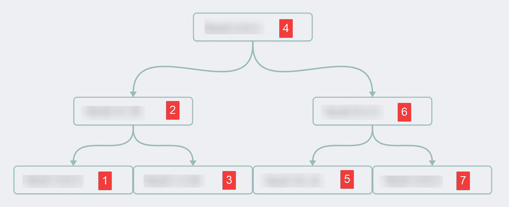
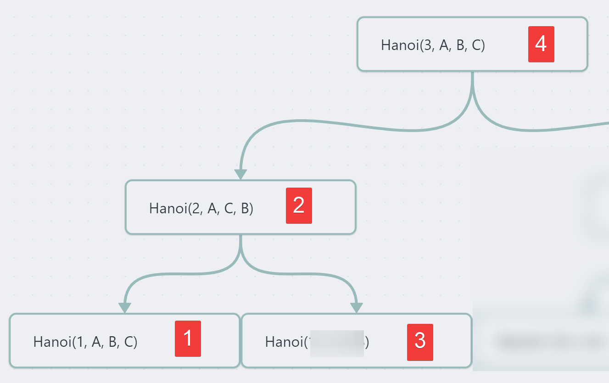
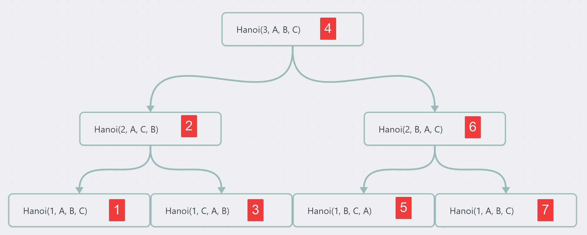

# Recursion in Programming - The Tower of Hanoi Problem

Ever heard about recursion in programming ? Here's a common problem solved using recursion.

<!-- more -->

## Introduction : What is the Tower of Hanoi ?

The Tower of Hanoi is a mathematical game or puzzle consisting of three rods and a number of disks of various diameters, which can slide onto any rod. The puzzle begins with the disks stacked on one rod in order of decreasing size, the smallest at the top, thus approximating a conical shape. The objective of the puzzle is to move the entire stack to one of the other rods, obeying the following rules:

1. Only one disk may be moved at a time.
2. Each move consists of taking the upper disk from one of the stacks and placing it on top of another stack or on an empty rod.
3. No disk may be placed on top of a disk that is smaller than it.

With three disks, the puzzle can be solved in **<u>seven moves</u>**.

The minimal number of moves required to solve a Tower of Hanoi puzzle is `2n − 1`, where `n` is the number of disks.

## How to Solve it Manually with Three Disks ?


Source : [Python Program for Tower of Hanoi - GeeksforGeeks](https://www.geeksforgeeks.org/python-program-for-tower-of-hanoi/)

Basically, with three disks, there is 7 steps. If we use the following notation `hanoiMove(source, auxilary, destination)`, we can further explain the steps :

1. hanoiMove(**A**, B, **C**)
2. hanoiMove(**A**, C, **B**)
3. hanoiMove(**C**, A, **B**)
4. hanoiMove(**A**, B, **C**)
5. hanoiMove(**B**, C, **A**)
6. hanoiMove(**B**, A, **C**)
7. hanoiMove(**A**, B, **C**)

## How to Get the Idea of Coding Such a Thing ?

Do you know about recursion ? If not, now is your time to [learn](https://www.youtube.com/watch?v=IJDJ0kBx2LM). I also suggest taking a look at some [sorting algorithms](https://betterprogramming.pub/5-basic-sorting-algorithms-you-must-know-9ef5b1f3949c) to grasp the idea of recursion and how to follow down a tree structure.

Well, you got the moves in order for a basic scenario with 3 disks, that's what we discussed above.

And here is a basic recursive template to navigate down a solution tree :

```python
def recursiveFunction(n, source, auxiliary, destination):
if SOMETHING:
 BASE CASE # When we hit the bottom of the tree
RECURSIVE_CALL_GOING_DOWN_LEFT # We go down left
# ...
# Some actions to do when coming back up before going down
# ...
RECURSIVE_CALL_GOING_DOWN_RIGHT # We go down right
```

Using such a structure allow us to navigate down solutions in a tree in this order :



And there's 7 steps… Isn't that all too convenient ? Yup, that's because this code template suits our scenario very well.

Now think about it. The goal of recursion is to solve a problem by **gradually shrinking down the problem until we come to a simple scenario.**

The most basic scenario of a tower of Hanoi would be to have <u>one disk</u>.

We would just have to move it to the destination using `hanoiMove(n=1, source='A', auxiliary='B', destination='C', hanoi_tower)`.

We should start naming rods now, lets define our rods in the initial setup :

- The left one is `A`, it holds our disks initially.
- The middle one is `B`, it is empty but will help us get to the right.
- The right one is `C` and is our target destination.

Going back to our one disk scenario, that'll be our base case:[^1]

```python
def hanoiMove(n, source, auxiliary, destination, hanoi_tower):
if n==1:
 # We pop the disk from the source and append it to the destination
 hanoi_tower[destination].append(hanoi_tower[source].pop())
 print(hanoi_tower)
 return
RECURSIVE_CALL_GOING_DOWN_LEFT
# ...
# Some actions to do when coming back up before going down
# ...
RECURSIVE_CALL_GOING_DOWN_RIGHT
```

And here is where it gets tricky. What to do next ?

Well, I might be a simple man, but I just considered my 3 disks scenario. I want my first moves to be these ones :

1. hanoiMove(**A**, B, **C**)
2. hanoiMove(**A**, C, **B**)
3. hanoiMove(**C**, A, **B**)
4. hanoiMove(**A**, B, **C**)

If you look at the former tree, it is the left side of it.

I'll just use some input permutation on the function calls variable input to get the correct base case for my 3 disks scenario.

If our first function call is `hanoiMove(3, 'A', 'B', 'C')` on the function `hanoiMove(n, source, auxiliary, destination)`.

We want the call stack to look like this :

1. `hanoiMove(3, 'A', 'B', 'C')` # First function call
2. `hanoiMove(2, '?', '?', '?')` # Second function call
3. `hanoiMove(1, 'A', 'B', 'C')` # Third function call, the one that hits the base case at the bottom left of the tree and is executed first

With a tree, it looks like that :


Alright, so we need our first recursive call `RECURSIVE_CALL_GOING_DOWN_LEFT` to swap two input variables, so that it comes back to a `A → C` movement at the bottom.

If we look at the second move to solve our tower of Hanoi, the middle disk moves to the auxiliary rod (`B`), and not the destination (`C`) one. It's a move from `A → B`. :

`2. hanoiMove(**A**, C, **B**)`

That's it, we just need to swap the `auxiliary` and the `destination` on our first recursive call :

```python
def hanoiMove(n, source, auxiliary, destination, hanoi_tower):
if n==1:
 # We pop the disk from the source and append it to the destination
 hanoi_tower[destination].append(hanoi_tower[source].pop())
 print(hanoi_tower)
 return
# First recursive call, we move the n-1 disks from the source to the auxiliary
hanoiMove(n-1, source, destination, auxiliary, hanoi_tower)
# ...
# Some actions to do when coming back up before going down
# ...
RECURSIVE_CALL_GOING_DOWN_RIGHT
```

But doing so, it will never actually move the middle disk from `A` to `B`, we need to tell it that when it comes back to the scenario with 2 disks in the tree, it should move the disk. That's why I intentionally left a `#Some actions to do` in the code template.

```python
def hanoiMove(n, source, auxiliary, destination, hanoi_tower):
if n==1:
 # We pop the disk from the source and append it to the destination
 hanoi_tower[destination].append(hanoi_tower[source].pop())
 print(hanoi_tower)
 return
# First recursive call, we move the n-1 disks from the source to the auxiliary
hanoiMove(n-1, source, destination, auxiliary, hanoi_tower)
hanoi_tower[destination].append(hanoi_tower[source].pop())
    print(hanoi_tower)
RECURSIVE_CALL_GOING_DOWN_RIGHT
```

Now where are we ? If we sum up, this is our call stack :

1. `hanoiMove(3, 'A', 'B', 'C')` # First function call
2. `hanoiMove(2, 'A', 'C', 'B')` # Second function call
3. `hanoiMove(1, 'A', 'B', 'C')` # Third function call, the one that hits the base case at the bottom left of the tree and is executed first

And this is the graph :



Alright, now final part. How to end the recursion with the recursive call to the right.

If we come back to our solving steps :

1. hanoiMove(**A**, B, **C**)
2. hanoiMove(**A**, C, **B**)
3. hanoiMove(**C**, A, **B**)
4. hanoiMove(**A**, B, **C**)

Using the same idea, we want our third move to be `3. hanoiMove(**C**, A, **B**)`, meaning a movement from `C → B` .

Remember our call stack :

1. `hanoiMove(3, 'A', 'B', 'C')` # First function call
2. `hanoiMove(2, 'A', 'C', 'B')` # Second function call
3. `hanoiMove(1, 'A', 'B', 'C')` # Third function call, the one that hits the base case at the bottom left of the tree and is executed first

When the third one is called, it does the base case. Then we come back to the first recursive call :

`2. hanoiMove(2, 'A', 'C', 'B')`.

And we want our third move to be :

`3. hanoiMove(**C**, A, **B**)`.

Well, that settles it. The other recursive call should swap the `source` and `auxiliary` in the call.

## Solution to the Problem

Here's the whole code :

```python
def hanoiMove(n, source, auxiliary, destination, hanoi_tower):
    # Base case, we just move the disk from the source to the destination
    if n == 1:
        # We pop the disk from the source and append it to the destination
        hanoi_tower[destination].append(hanoi_tower[source].pop())
        print(hanoi_tower)
        return
    # First recursive call, we move the n-1 disks from the source to the auxiliary
    hanoiMove(n-1, source, destination, auxiliary, hanoi_tower)
    hanoi_tower[destination].append(hanoi_tower[source].pop())
    print(hanoi_tower)
    # Second recursive call, we move the n-1 disks from the auxiliary to the source
    hanoiMove(n-1, auxiliary, source, destination, hanoi_tower)
```

And the main part :

```python
n = 3 # Number of disks
source = 'A' # Original source rod for the disks
auxiliary = 'B' # Middle rod
destination = 'C' # Destination rod
# We then initialise the hanoi_tower dictionary with the number of disks
hanoi_tower = {
    'A': [i for i in range(n, 0, -1)],
    'B': [],
    'C': []
}
print("Initial state :", hanoi_tower) # Print the initial state of the hanoi_tower
hanoiMove(n, source, auxiliary, destination, hanoi_tower) # Solve the puzzle
```

And now you get the whole tree chart :



I executed the code with n=5 to make sure everything works well :

```text
{'A': [5, 4, 3, 2, 1], 'B': [], 'C': []}
{'A': [5, 4, 3, 2], 'B': [], 'C': [1]}
{'A': [5, 4, 3], 'B': [2], 'C': [1]}
{'A': [5, 4, 3], 'B': [2, 1], 'C': []}
{'A': [5, 4], 'B': [2, 1], 'C': [3]}
{'A': [5, 4, 1], 'B': [2], 'C': [3]}
{'A': [5, 4, 1], 'B': [], 'C': [3, 2]}
{'A': [5, 4], 'B': [], 'C': [3, 2, 1]}
{'A': [5], 'B': [4], 'C': [3, 2, 1]}
{'A': [5], 'B': [4, 1], 'C': [3, 2]}
{'A': [5, 2], 'B': [4, 1], 'C': [3]}
{'A': [5, 2, 1], 'B': [4], 'C': [3]}
{'A': [5, 2, 1], 'B': [4, 3], 'C': []}
{'A': [5, 2], 'B': [4, 3], 'C': [1]}
{'A': [5], 'B': [4, 3, 2], 'C': [1]}
{'A': [5], 'B': [4, 3, 2, 1], 'C': []}
{'A': [], 'B': [4, 3, 2, 1], 'C': [5]}
{'A': [1], 'B': [4, 3, 2], 'C': [5]}
{'A': [1], 'B': [4, 3], 'C': [5, 2]}
{'A': [], 'B': [4, 3], 'C': [5, 2, 1]}
{'A': [3], 'B': [4], 'C': [5, 2, 1]}
{'A': [3], 'B': [4, 1], 'C': [5, 2]}
{'A': [3, 2], 'B': [4, 1], 'C': [5]}
{'A': [3, 2, 1], 'B': [4], 'C': [5]}
{'A': [3, 2, 1], 'B': [], 'C': [5, 4]}
{'A': [3, 2], 'B': [], 'C': [5, 4, 1]}
{'A': [3], 'B': [2], 'C': [5, 4, 1]}
{'A': [3], 'B': [2, 1], 'C': [5, 4]}
{'A': [], 'B': [2, 1], 'C': [5, 4, 3]}
{'A': [1], 'B': [2], 'C': [5, 4, 3]}
{'A': [1], 'B': [], 'C': [5, 4, 3, 2]}
{'A': [], 'B': [], 'C': [5, 4, 3, 2, 1]}
```

Welp, that's about it, I managed to make this work. Hope my explanation was clear enough.

## Additional Resources That Could Help

- [Python Program for Tower of Hanoi - GeeksforGeeks](https://www.geeksforgeeks.org/python-program-for-tower-of-hanoi/)
- [Towers of Hanoi: A Complete Recursive Visualization - YouTube](https://www.youtube.com/watch?v=rf6uf3jNjbo)

[^1]: Base case : Condition to stop the recursion.
