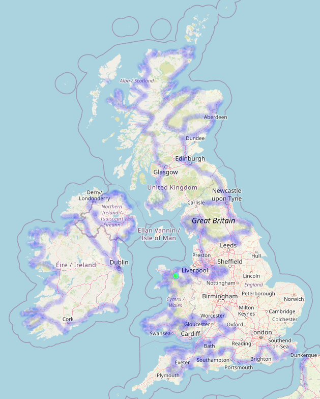
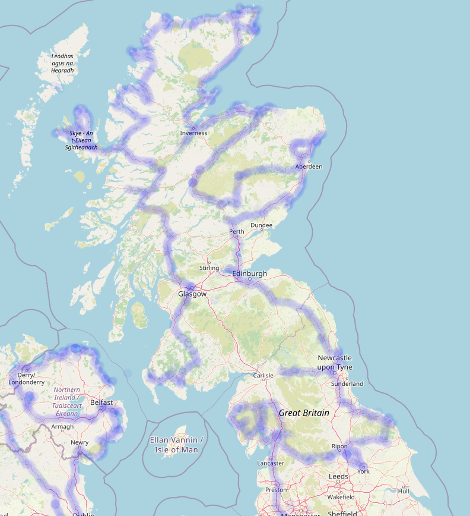
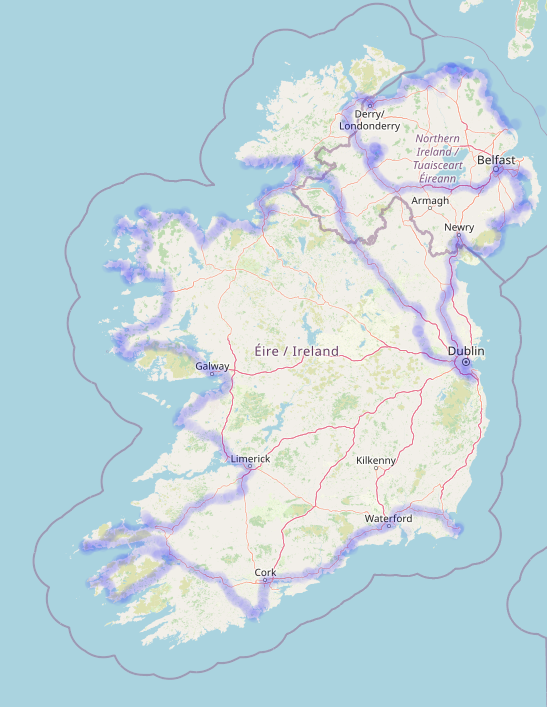

# Trajet Complet Pour Roadtrip De 6 Mois Au Royaume-Uni Et En Irlande

Dans ce post, nous observerons en détail le trajet de notre aventure en van qui nous a mené de France en Angleterre, au Pays de Galles, en Ecosse puis enfin en Irlande.

<!-- more -->

Le 17 Avril 2023, nous sommes partis à l'aventure avec ma copine pour 166 jours en France, en Angleterre, au Pays de Galles, en Ecosse et en Irlande.

On a quand même réalisé environ 16 000 km de route d'après le compteur du van, soit environ 96km par jour. Pour ceux qui ont suivis notre [post concernant le budget](./Budget%20Pour%20Voyager%20En%20Van%20Pendant%206%20Mois.md), on peut dire qu'on a vu juste ! Mais au final, quel a été notre trajet ? Eh bien, c'est ce qu'on va voir aujourd'hui.

Voilà à quoi ressemble le trajet global et nous allons voir plus précisément chaque zone !

Remarque : Si vous voulez plus de détails sur les visites, nous vous recommandons de jeter un oeil à notre [compte Instagram](https://www.instagram.com/master_estevan/), nous n'allons pas tout redétailler ici.

## La France

Départ dans l'Ain. Le début du trajet a été un peu fait à l'arrache. Dans le sens où le seul objectif court terme était de retourner au Puy de Sancy pour prendre ma (Mathis) revanche sur le sommet qui était couvert la dernière fois. On a eu de la chance, et du soleil ! Et même de la neige, mais bref. On en a profité pour faire d'autres puys en Auvergne, tant qu'à faire.

Suite à cela, traversée de la France avec notamment Carennac, Rocamadour, puis l'arrivée à Bordeaux pour découvrir la ville avec Julie !

On remonte ensuite direction Pont-l'Abbé d'Arnoult pour un coucou aux grands parents d'Elina, et une nuit à Tillou chez Emilie. On profite du coin pour faire l'île d'Oléron qu'on a adorée, et on rejoint Grégoire à Poitiers pour un nouveau week-end en ville !

On traverse ensuite à l'ouest pour faire toutes les belles falaises de Bretagne, leurs beaux villages, et rencontrer Lilian un très bon pote à Elina ! Mention spéciale à le côte de granite rose qui nous a offert un joli panorama près de Ploumanac'h.

La suite de l'aventure, c'est la Normandie et son histoire, des tonnes de musées sur les guerres et le débarquement !

On rejoint finalement Calais pour la traversée jusqu'en Angleterre.

Si vous êtes malin, vous apercevez sur l'image un trajet qui tire jusqu'à l'Alsace. Il s'agit du retour, mais nous y reviendrons.

## Direction Les Îles

A l'origine, nous voulions faire un tour d'Europe. Mais fort est de constater que le Royaume-Uni et l'Irlande avaient déjà beaucoup à nous offrir, nous avons donc entrepris un tour complet de ces belles îles et gardons les autres pays pour une autre fois.

## Le Sud De l'Angleterre Et Le Pays De Galles

Arrivés à Douvres, nous avons commencé par des randonnées sur leur falaises blanches.

Puis nous sommes allés à Canterbury afin de découvrir les villes anglaises, entre briques et petites boutiques !

Ayant pris un abonnement à English Heritage et à National Trust, nous avons effectué tout un tas de visite comprenant la forteresse de Douvres qui a beaucoup à offrir et énormément de châteaux, jardins et lieux typiques.

Arrivés à Stonehenge, nous y avons dormi et profité du coin.

Nous avons ensuite enchainé de nombreuses zones magnifiques avec Cranborne Chase AONB (on trouve à proximité Stourhead un des plus beaux jardins tenu par National Trust), Dorset AONB, Blackdown Hills AONB, East Devon AONB, Dartmoor National Park et Exmoor National Park. Beaucoup de choses à visiter, de falaises sublimes, et de randonnées sauvages. Un régal, probablement une des choses que nous avons préférées !

Nous sommes ensuite remontés, passant par Cheddar et Bath, deux villes très sympas avant de passer par l'authentique Oxford qui donne envie de retourner sur les bancs de la fac !

Petit passage à Cotswolds AONB, toujours beaucoup de visites dans le coin, avant de tirer à l'ouest.

A Ross-On-Wye, petite frayeur avec un niveau de liquide de frein faible, on fait observer le van et refaire le niveau, pas de fuite détectée, et on repart.

On entame le Pays de Galles avec la meilleure ville pour les book lovers, Hay-On-Wye.

Puis on en prend plein la vue à Brecon Beacons, énormément de belles randonnées et une superbe rencontre : Isaac ! Un local super chouette que nous avons retrouvé plus tard.

On enchaine avec Gower AONB, probablement les lieux les plus beaux que vous verrez de votre vie, avec notamment Rhossili Bay.

Pembrokeshire Coast National Park est dans la même idée, avec des plages toutes plus belles les unes que les autres. Le soleil nous accompagne en plus !

En remontant la côte, on arrive à Snowdonia pour remonter nos quotas de randonnées en montagne et sur la côte.

On fait une pause avec de nouveaux châteaux, jardins et la visite de Caernarfon, une ville très chouette, avant de repartir sur Snowdonia avec un souffle nouveau.

C'est le moment où la fuite du liquide de frein revient. Après un passage à la Clwydian Range & Dee Valley AONB qui ne nous a pas pleinement convaincue, le verdict tombe : le van a une fuite et une pièce de l'embrayage est à changer ! Au passage, on demande aussi à changer les pneus avant qui ont souffert des petites routes vallonnées du coin. Nous voilà donc partis pour des vacances forcées au petit village de Llanrwst qui nous a très bien accueilli le temps que le garage puisse s'occuper de notre van.

On repart plein d'énergie pour des visites de châteaux, jardins et randonnées vers Peak District !

Nouveau ralentissement : le garage ne nous avait pas mis les deux mêmes pneus à l'avant. Nous voilà repartis pour le Pays de Galles.

Enfin, on est vraiment libres cette fois et on se dirige vers Lake District !

## Le Nord De l'Angleterre Et L'Ecosse

Nous attaquons Lake District avec une ancienne usine de bobines en bois pour une visite des plus intéressantes : Stott Park Bobin Mill. Puis, on est prêts pour les hostilités et on repart en randonnées avec un temps assez aléatoire mais majoritairement pluvieux.

L'humidité nous fait fuir jusqu'au parc national Yorshire Dales où on visite notamment Malham Cove, une formation géologique issue du passage de glaciers, et l'immense abbaye de Fountains.

Pause ville à York avant de passer à un nouveau parc national : North York Moors, particulièrement sa côte où on retrouve le beau temps.

On enchaîne avec plusieurs musées le long du mur d'Hadrien (oui, c'est la petite barre horizontale que vous voyez sur le haut de l'Angleterre).

Enfin, nous voilà en Ecosse. On commence directement par la capitale Edimbourg ! Une pensée à Dean Village, un lieu tout mignon au milieu de cette grande ville très sympathique.

On découvre les belles plages de l'est de l'Ecosse avec des cascades qui se jettent dans la mer.

On tente quelques randonnées dans le parc national Cairngorms qu'on finit par fuir à cause des midges (ces minuscules insectes en essaims qui mordent). Eh oui, l'Ecosse n'est pas le meilleur pays à faire en juillet-août, il vaut mieux le visiter au printemps.

On retourne donc près de la mer car vent = pas de midges et nous voilà partis pour suivre la côte jusqu'au bout ! On commence du côté de Bow Fiddle Rock et on remonte par Inverness jusqu'au point le plus au nord car nous sommes des complétionnistes !

Des points de vue superbes, des randonnées en bord de mer, un petit passage au milieu des midges autour de cascades (mais on s'est équipés), et on arrive à l'île de Skye ! Malheureusement pour nous, les randonnées sont compromises par la présence de nombreux nuages bas. Du positif : ça nous a fait découvrir le musée des Highland Folk, une reconstitution de village local très détaillée !

Un passage par le légendaire viaduc de Glenfinnan avec le passage du Poudlard Express !

Contrairement à nos plans, on décide de faire la ville de Glasgow. Et on regrette un peu.

Puis, nous voilà sur un ferry en direction de l'Irlande et du ciel bleu !

## L'Irlande

L'Irlande nous accueille avec un super soleil ! Antrim Coast and Glens AONB commence bien avec ses villages côtiers, mais le vrai bonheur se trouve à Causeway Coast AONB. Des vues à couper le souffle, et une première introduction aux pubs Irlandais à Ballycastle. Que de bons souvenirs, notamment la fameuse Giant's Causeway et ses formations rocheuses particulières !

Notons que beaucoup de tournages de Game Of Thrones ont eu lieu en Irlande du Nord, de quoi motiver les fans ! Mais évitez les plages en van, on a réussi à se bloquer à Benone Beach… Bref.

On enchaine avec Derry, et nous insistons sur Derry. En effet, nous avons compris que l'histoire de l'Irlande est récente. Dans les lieux avec des drapeaux anglais, il faut se considérer en Angleterre. Ailleurs, il faut détester les Anglois avec la même passion qui anime les locaux. Superbe ville propre et sympa !

Puis musée très instructif : Ulster American Folk Park. C'est à Sperrin AONB où les randos sont marrantes, ils ont installé des géants sur les sommets ! La vue était déjà chouette, mais ça rajoute quelque chose il faut l'avouer.

On part ensuite pour Belfast que nous avons adoré, avec son histoire, sa modernité et sa quantité de street arts de dingue. Nous avons ensuite temporisé Dublin pour que l'alignement des astres nous permette d'y entrer sans encombre. Nous avons été déçus, non pas que ce soit mauvais (même si leurs transports en commun le sont), mais l'âme irlandaise que nous avions trouvée au nord n'y était pas. Remarquez, les locaux nous avaient prévenus, au même titre qu'il y a la France et il y a Paris, il y a l'Irlande et il y a Dublin !

Nous repartons à Donegal pour retrouver l'âme irlandaise, et nous partons pour l'aventure des falaises en longeant la côte vers le sud. Sans entrer dans le détail, toute la Wild Atlantic Way (WOW) vaut le coup, mention spéciale à Downpatrick Head, les randos de Carrowteige, et Achill Island.

Les lacs du Connemara nous ont accueillis sous la pluie, mais nous recommandons sous réserve de bonne météo et de période sans midge ! Faites la Sky Road, la vue sur le bout de la côte est… incroyable. Nous sommes redescendus avec quelques arrêts :

- Galway, une petite ville toute mim's sur l'après-midi avec son quartier latin et sa grande avenue. Une petite ville emplie de street arts également.
- Evitez les Cliffs of Moher, inutiles, ou alors prenez le parking plus bas et évitez-vous les 10€ par personne du visitor center. Mais à priori d'ici là vous aurez déjà vu les plus belles falaises de vos vies, celles-ci sont évitables, croyez-nous.
- Dunquin Pier après Dingle, assez touristiques mais valent largement le détour !

Mention très spéciale pour Killarney National Park, une pépite au calme avec d'énormes possibilités de randonnées de partout ! Et ça continue jusqu'à la pointe ouest avec Kerry Cliffs en passant par la route Ring of Kerry qui vous permet de faire tout un tas d'arrêts et de balades également, vraiment un passage recommandé !

Sur le sud on passe par Kinsale, un petit village qui nous a été proposé par une locale, très belle surprise ! Bien plus sympa que Cork que l'on ne recommande que pour son aspect centre commercial à ciel ouvert.

Et après… Ce fut l'apocalypse météo puis le Brittany Ferries jusqu'à Cherbourg !

## La France (le retour)

Retour au pays. Depuis Cherbourg, nous traçons tout droit jusqu'en Alsace. Nous avons fait une petite série de villages dont certains que nous connaissions déjà :

1. Bergheim → Pas incroyable, mais calme et mignon comme prévu ! On a vite fait le tour par contre.
2. Ribeauvillé → Probablement notre préféré avec sa grande avenue et son âme conservée, le tourisme est présent mais discret, et il y a énormément de caves et de bons restaurants. Et puis c'est beau quoi !
3. Riquewihr → Disneyland de l'Alsace avec des parkings hors de prix et inaccessibles en van ou camping-car. Très déçus de la tournure que prend la ville, ses petites boutiques ferment toutes et sont dévorées par les attrapes-touristes. A éviter.
4. Kaysersberg → Toujours aussi mignonne, cette ville d'Alsace se présente avec une rivière en son centre, et cela apporte beaucoup à l'ambiance ! On adore !
5. Eguisheim → Aussi touristique que recommandée, nous y sommes allés à la fraicheur du matin avant les trains touristiques. Le tour des "remparts" qui passe par les petites ruelles remplies de maisons typiques est un must-see du coin !

Et puis finalement, le retour ! Direction la maison, après 166 jours de voyage. Confort retrouvé, mais notre esprit est encore ailleurs. Ce fut une superbe aventure que nous n'oublierons jamais.
