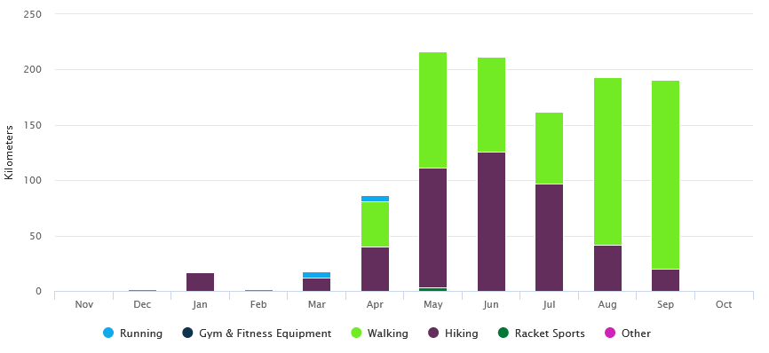
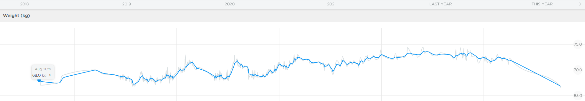

# Un Voyage De 6 Mois En Van, C'est Du Sport

Voyager ce n'est pas se la couler douce. Et on va vous le prouver.

<!-- more -->

> Bon allez c'est fini les vacances, il faut chercher du travail maintenant.

Si vous saviez combien de fois on l'a entendu celle là.

Comment ça, des vacances ? On a voyagé, on n'a pas pris des vacances nous héhé. Et aujourd'hui on se lance sur les preuves, si les photos en haut de tous ces sommets n'ont pas suffit ! Rappelons que nous sommes partis le lundi 17 avril 2023 et sommes rentrés le 29 septembre 2023, un périple de 166 jours.

## La Marche

Durant ce voyage, nous avons… beaucoup marché. Mais alors, **beaucoup** marché. Globalement, que ce soit par le nombre de visites qu'on s'est faits chaque jour, ou par la tonne de randonnées dans des endroits magnifiques, on a bien fait fonctionner nos p'tites jambes.

Au total, nous avons effectué **2 097 421 pas** en 166 jours, soit une moyenne de **12 635 pas** quotidien. Si on converti, on avoisine les **1648,13 km** au total, soit une moyenne de **9,93 km** quotidien. Nous vous attendons avec vos podomètres de téléphone pour faire le kikimeter.

Sur les marches et randonnées enregistrées uniquement, on retrouve **1060,54 km** au total, une moyenne de **6,39 km** par jour donc.

Dans la même idée, nous avons gravi **9500 étages**, soit une moyenne quotidienne de **57 étages** au quotidien. Rappelez-vous maintenant de la dernière fois que vous avez monté un 4 étages sans ascenseur en rentrant du taf.

Dis comme ça… Remarquez, je ne sais pas si le fait que ces valeurs soient généralement concentrées en une journée par une randonnée soit une bonne ou une mauvaise nouvelle. Mais gardons ça en tête.

## Le Reste ?

Au début du voyage, en France donc, nous avons pu courir un peu et Mathis a pu faire de la muscu plusieurs fois. Que ce soit dans la salle de sport de Grégoire, sur des terrains de street workout ou sur des parcours santé. Mais vu la disponibilité de ceux-ci sur les îles et les journées déjà bien remplies, nous n'avons pas pu continuer sur notre lancée ! On s'est donc rattrapés sur de giga randonnées, et on reprendra le reste au retour.

## Le Résultat ?

Entre tout ce sport et une alimentation sans excès à part quelques glaces et deux ou trois tablettes de chocolat, le verdict est sans appel.

Mathis est passé de **71.5 kg** le 16 avril 2023 à **66.5 kg** le 01 octobre 2023. C'est un retour au poids de sortie de lycée, outch. Plus qu'à retravailler pour ce petit muscle perdu au combat.

Elina n'a pas bougé, les diététiciennes la déteste.

## Aparté Sur La Notion De Vacances En Van

En vrai, nous vous taquinons sur l'aspect vacances par rapport au sport effectué mais nous aimerions rajouter un point sur le sujet. Partir en van aménagé sommairement n'est pas sans contrainte, certes on dort sur des paysages de dingue (et encore, pas toujours), mais il y a tout une logistique à gérer ! Voici une liste des choses à prévoir au quotidien :

- Trouver un spot dodo pour le soir, autorisé, sans jeunes qui font la bringue sur place (fréquent sur les îles), sans habitation ou route juste à côté. Oui, c'est simple en nature (sauf quand c'est, comme beaucoup de fois, interdit en zone naturelle), mais fun fact : Notre société a bien su mettre de côté la nature, et du reste sur les îles, tout appartient à quelqu'un ! Alors il faut y aller à grand coup de Park4Night et Searchforsites et parfois pendant un moment.
- Gérer les vides et les pleins. Est-ce qu'il nous reste suffisamment d'eau potable ? Devons-nous vider les bidons d'eau sale ? Est-ce que les toilettes sont vides ? Oh et tiens, la poubelle déborde. Bref, le tout loin de chez soi, avec des possibilités d'approvisionnement et de vidage dépendant énormément du lieu. Parfois tout se fait sans difficulté, mais certaines zones demandent plus d'anticipations que d'autres.
- Gérer la bouffe, à la maison c'est simple, en van la place est limitée, tout comme l'énergie électrique. L'anticipation est la clef, pour tout.
- Les laveries. Il faut en trouver une correcte, qui fonctionne, pas trop chère, et qui soit disponible ! Ca peut paraitre simple en France dans certains lieux ou à la maison, mais c'est parfois une tout autre histoire selon les régions et pays. Surtout que les laveries Revolution ne cochent aucun des cases précédemment citées, et sont parfois les seules options.
- Veiller à ne jamais manquer de gaz. Cela peut paraître bête, mais ne pas pouvoir finir de cuire son plat à 21h sous la pluie, c'est dommage. Ayez toujours un p'tit campingaz de randonnée de secours au cas où.
- Niveau confort, le van n'offrait qu'un lit, des rangements, et un sol. Mais le lit n'était pas utilisable la journée. Donc nous vivions dehors ou au sol contre un placard. Cela doit vous rappeler des souvenirs d'entre les cours au lycée, c'est normal. Tentez de vous rappeler ce que votre dos vous disait tous les soirs, eh bien oui, nous aussi.

Bon après on fait exprès ici de sortir tous les côtés "pénibles" de la vie en van, évidemment que c'est un pur bonheur sur tout le reste, mais comme toujours, il y a des plus et des moins et aucun n'est à négliger. Et bien que ce voyage fut génial, il ne fut certainement pas de tout repos. Mais si on l'a fait, c'est que nous avions estimé que le jeu en valait la chandelle !
