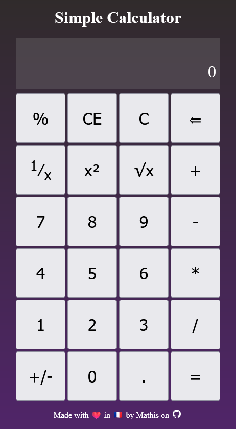

# Web Development Project - Calculator Project in HTML, CSS, JS

In this post, I'll showcase a small project to learn basic web development without any framework.

<!-- more -->

## Introduction

During my formation as a mechanical engineer, I learned how to use C, C++, Python, and Matlab. I also discovered Linux and Bash, parallel computing with MPI, and some scripting tools like Ansys APDL for mechanical engineering.

Even though I manipulated and used a lot of CSS and JS during my Obsidian learning journey, I never really made any project using the three languages of web-dev.

So after looking at some [project ideas](https://github.com/florinpop17/app-ideas/tree/master) online, I settled on creating a [calculator app](https://github.com/florinpop17/app-ideas/blob/master/Projects/1-Beginner/Calculator-App.md) while looking for a job.



While it might not be the most beautiful one, I did exactly what I wanted to do with it.

It is available online [here](https://mathisgauthey.github.io/webCalculator/) and the source code is public on [Github](https://github.com/mathisgauthey/webCalculator).

But how did it end up this way ? Well, let's find out.

## Chronology of Dev

### First Draft

First of all, I did a bunch of spaghetti programing to grasp the basics :

1. I learned how to organise HTML documents.
2. I learned some CSS basics, but mainly I know how to use Flexbox and Grid.
3. I learned how to write functions in Javascript and use `onclick` events to call them.

But here are the problems I encountered :

- I was doing things while learning by searching for things online. I lacked a structure and goals, I just did what I thought would be great to add.
- Debugging was manual, and I couldn't test that my changes were not breaking things.

### Rebuild with Object Programming and Unit-testing

Now that I knew the functions that I wanted to have on my calculator, I completely [rewritten](https://github.com/mathisgauthey/webCalculator/pull/1) it using a `Calculator` class. It allowed me to use [jest](https://jestjs.io/) to test the logic part of my app with some unit-testing that I learned on the [Openclassroom Java Unit-Testing Course](https://openclassrooms.com/en/courses/5661466-use-testing-in-java-to-achieve-quality-applications).

I separated the my app in different parts :

- `index.html` for organizing elements.
- `styles.css` for styling.
- `script.js` for input and `eventListeners`.
- `Calculator.js` for logics and calculations, with an `updateViewer()` method to update the view.
- `Calculator.test.js` for jest unit-testing.

I could now use TDD[^1] to make sure that adding functionalities wasn't breaking anything.

### Fixes and Quality of Life Improvement

Then I asked some people to try the calculator and I used it myself while comparing it to the calculator provided by Windows. I then planned a few bug fixes and quality of life improvements and integrated [them](https://github.com/mathisgauthey/webCalculator/pull/2) to the app.

### Handling Big Numbers and Loads of Decimals

At first, my app was using the javascript `eval()` function. I know, I could do a parser myself, but the goal of this project was more to practice unit testing while discovering some web-dev, not to break my head against mathematical stuff.

But still, how was my calculator handling numbers with loads of decimals ? Well, it was rounding up things badly.

And how was my calculator endling big numbers ? Well, text overflowed.

So I needed to fix things up, and I did.

#### How to Handle Number with Decimals ?

As always numbers in programming must be handled with care. Javascript numbers are treated using [decimal floating point](https://www.wikiwand.com/en/Decimal_floating_point). The issue of such a representation is that addition and other operations could end up with a small rounding error. While it was just a beginner project and the scope wasn't to get a scientific calculator, I still wanted to **learn how to implement a library** that would manage big numbers and numbers with loads of decimal precisely.

So I added [mathjs](https://mathjs.org/) to my [project](https://github.com/mathisgauthey/webCalculator/pull/3). It uses [decimal.js](https://github.com/MikeMcl/decimal.js).

Here's a few other alternatives to consider :

- [GitHub - royNiladri/js-big-decimal: Work with large numbers on the client side with high precision.](https://github.com/royNiladri/js-big-decimal)
- [GitHub - MikeMcl/decimal.js: An arbitrary-precision Decimal type for JavaScript](https://github.com/MikeMcl/decimal.js)
- [GitHub - MikeMcl/bignumber.js: A JavaScript library for arbitrary-precision decimal and non-decimal arithmetic](https://github.com/MikeMcl/bignumber.js)
- [GitHub - MikeMcl/big.js: A small, fast JavaScript library for arbitrary-precision decimal arithmetic.](https://github.com/MikeMcl/big.js)

And the differences between the last three are explained [here](https://github.com/MikeMcl/big.js/wiki).

So now, my decimal rounding was working as expected :

```text
before : 0.1 + 0.2 = 0.30000000000000004
now : 0.1 + 0.2 = 0.3
```

#### How to Handle Big Numbers ?

Well, I simply limited the user input of numbers to 16 characters and added an overflow and slider to the formula accumulation at the top ! It made playing with huge numbers even more fun !

## Conclusion

I learned a lot on that side project that occupied me just between sending email for jobs. It was fun, and I now understand web-dev much better.

Most importantly, I learned that no project is too small to be entertaining. I had fun doing that small app, and I will definitely keep doing such projects !

[^1]: Test Driven Development : A programming method that begins by creating tests before programming some stuff. At first, test fails, then one must write the appropriate code to make the tests pass and so on.
