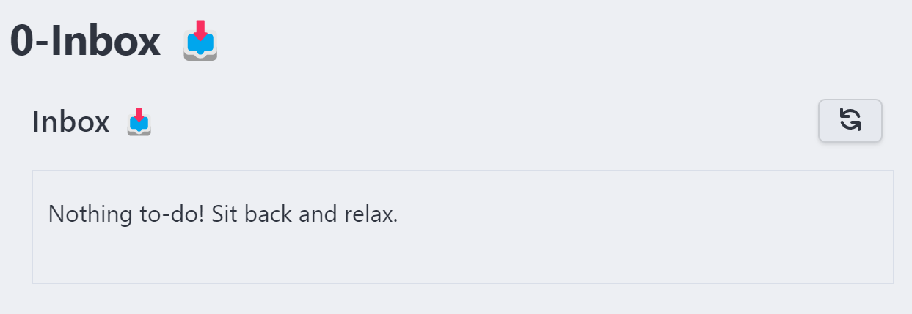
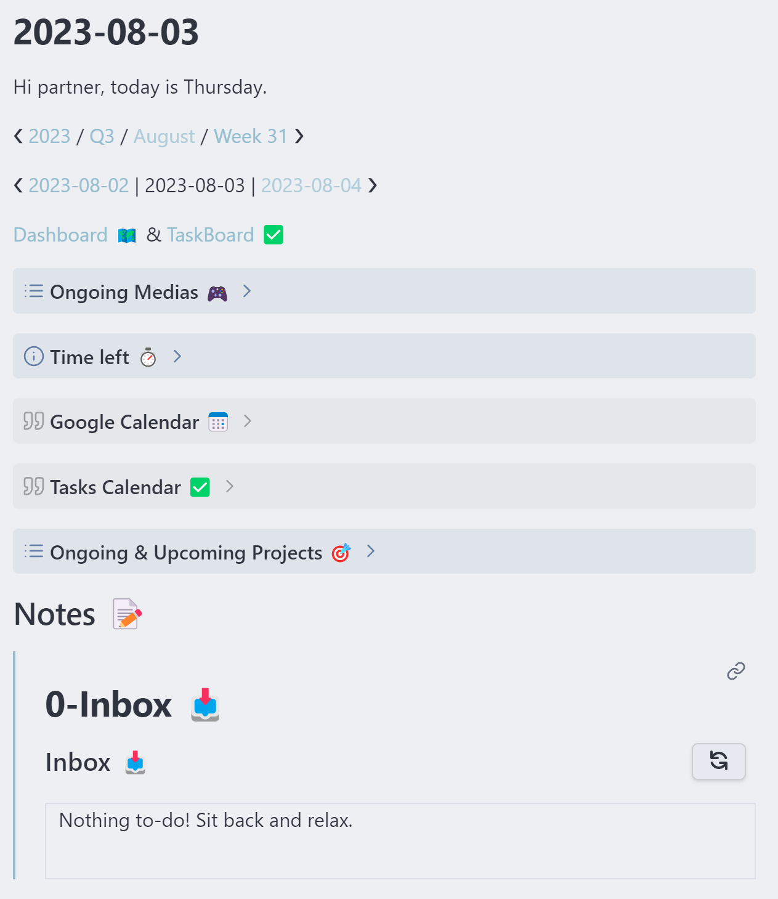
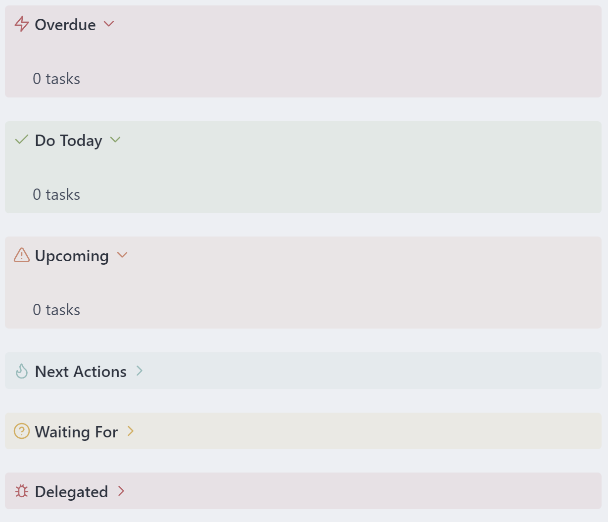
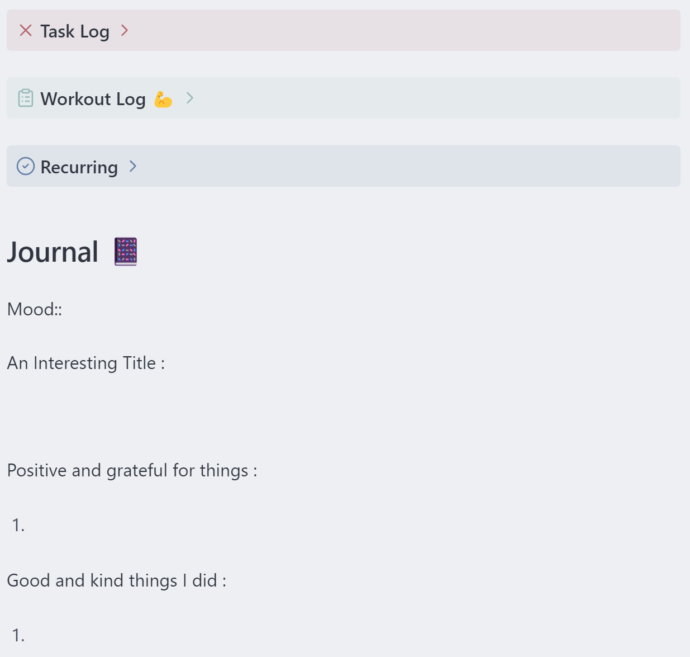
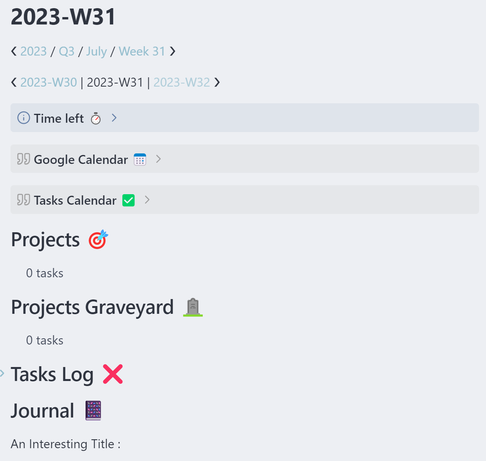

# Why Using Obsidian for Life Management

Why you should use Obsidian to manage your life, and nothing else.

<!-- more -->

This post is an extension of my [main post](./My%20Complete%20Obsidian%20Workflow%20to%20Manage%20My%20Life.md) showcase of my Obsidian workflow. You might want to check it out as well.

## What is GTD ?

If you already know all of that, skip this section.

Getting Things Done is a book written by David Allen. I recommend reading it, really. Like everything, reading key concepts online is good, but a whole book gives you a much better understanding of the underlying concepts described, why and how it works. I know it might sound like a lot of time, but it's all worth it, trust me.

But if you still don't have the time or the willingness to read GTD, try at least to read [Todoist's guide](https://todoist.com/fr/productivity-methods/getting-things-done) or my personal interpretation below.

### Definitions

A **task** is a clear action step, something to be done. It must be precise and concrete.

A **one-off task** is a task that is enough by itself. Like "Calling the dentist to make an appointment" or "Doing the dishes".

A **project** is a bunch of tasks to achieve a goal. It must have a due date, at least one that you tell yourself.

### Key Concepts

GTD is all about capturing every thoughts you have, clarifying them, organizing them, and acting on them. Your brain should be a factory for new ideas, not a warehouse.

So you need an inbox, easily and quickly accessible everywhere to clear your head. We'll use [Todoist](https://todoist.com) and the [obsidian-todoist-plugin](https://github.com/jamiebrynes7/obsidian-todoist-plugin) for that, but more on that latter. Every-time something (small or big) crosses your mind, you capture (step 1) it in here. It might be "clean the house" or "learn to play piano", anything really.

Then you need to clarify (step 2) these items you've captured. For instance :

- A task must be a clear and concrete action step ("laundry" ❌ → "Do the laundry at the laundrette" ✅).
- A project must be a goal to achieve (use the [SMART goal setting](https://www.mindtools.com/a4wo118/smart-goals)).
- A reference material might be a note, a link, or a document to store that might help achieving some tasks. Or you might just need to store it for later unknown purpose. **Be careful not to fall in the [collector fallacy](https://zettelkasten.de/posts/collectors-fallacy/) trying to store and remember everything as if Wikipedia didn't yet exist.**

You then organise (step 3) them :

- A task might be delegated or waiting for something, it might be the next action of a project, it might have to wait for a start date, be scheduled for a particular day, have a due date, etc.
- A project must have a due date, we need time constraint because it helps us see how much we have to do and not put too much on our plate. If there's no due date, it goes into the someday maybe list of things you'd do one day.
- A reference material must be filled accordingly. If it's a piece of information you can create a note, if it's a document you might use your cloud storage, if it's a link you might save it using Omnivore.

Tasks in obsidian-tasks vault have [different properties](https://publish.obsidian.md/tasks/Scripting/Task+Properties), and are displayed by [urgency](https://publish.obsidian.md/tasks/Advanced/Urgency) using the default sorting. In short, you have to worry about these one using my template :

- [Happens date](https://publish.obsidian.md/tasks/Queries/Filters#Happens) :
   	- A due date : Date by which the task needs to be completed.
   	- A scheduled date : Date on which you plan to work on your task
   	- A start date : Date by which you can start working on a specific task. Possibly because you can't do that task before this date.
- Context tag : A `tag` describing in which context you can do this task. This can be something like "phone", "online", "errands", "mail", "transports", etc.
- Time available : Not used actively in this vault but might take the form of a `tags` as well.
- Energy available : Used in this vault but in the form of a `tags` just like contexts.
- Priority : [Task property from obsidian-task plugin](https://publish.obsidian.md/tasks/Getting+Started/Priority).

You must review (step 4) your system periodically. That's why I'm using daily, weekly, monthly, quarterly and yearly notes. But more on that later as well, just remember that this is a **really important** part of the process and helps maintaining it.

Finally, you need to engage (step 5) → It's about time to get things done don't you think ? That's the fifth part.

### Horizons of Focus

In GTD, there's multiple [horizons of focus](https://gettingthingsdone.com/2011/01/the-6-horizons-of-focus/) :

1. Tasks : Actions to take
2. Projects : A bigger task with two or more sub-tasks
3. Areas of focus/responsibility : Areas of your life with a standard to maintain
4. Goals & Objectives : Short term goals for this or next year (1-2 years)
5. Visions : How and where do you see yourself in a few years (3-5 years)
6. Purpose and principles : Who you are, what is your purpose and on what principles do you live

I learned that having goals alongside projects didn't work for me as I would put goals somewhere but never act on it. That's why on this system inside obsidian, projects **are** goals, they live inside `areas` of my life.

If I have a goal to become an artist, I might have a daily recurring task inside that would be "Draw for 15min each day". Or if I want to have a nice party next weekend as a goal, I might need to contact friends, prepare my shopping list, take friday off, etc.

You can't just put on simple goals on a list and hope that your actions will go toward them. It won't. But if you create a goal inside one of your `areas` file, that links to a project note where you can put next actions and notes, you'll move forward and clear that goal before the estimated due date !

So in our case with this Obsidian setup :

1. Tasks : They can be created simply by using markdown tasks formatting anywhere on your vault except the _Sources folder, the -Workout-Log folder, the 4-Archives folder, the 5-Templates folder and the Media Backlog note. The [obsidian-tasks](https://github.com/obsidian-tasks-group/obsidian-tasks) is configured to exclude these folders by design choice.
2. Projects : They live inside the `1-Projects` folder. One note by goals or objectives, and inside the note you can put the tasks alongside notes and embedded attachments, just like you would with a piece of paper.
3. Areas : Areas contains projects. That's where you're creating your projects in the form of **obsidian tasks**. You can use wikilinks to create the project note while doing so. You can also have some recurring tasks to maintain the area standard. And finally there's an archive to clear the clutter using [obsidian-tasks-archiver](https://github.com/ivan-lednev/obsidian-task-archiver) plugin.
4. Visions, purpose and principles : They are less actionable and don't require constant consideration. Just update the note every once in a while when you feel like your long term goals have changed after a big event in your life. Don't change them often, focus on achieving tasks to progress in your goals instead.

## How to Use This Vault Template for Life Management

### Inbox

Alright, so if we want to have a GTD setup, first we need an Inbox. And those of you who already had an obsidian vault with some plugins might have spotted an important issue : Obsidian is slow to launch.

Well, fortunately there's a [Todoist](https://github.com/jamiebrynes7/obsidian-todoist-plugin) plugin for obsidian that gather tasks from your Todoist account. You can now quickly jot notes and tasks on your phone and computer directly inside Todoist's inbox using shortcuts and see them inside the `0-Inbox` file inside the `0-Inbox` folder, or inside your daily-notes !



### Why Using a Daily and Periodic Notes Instead of a Beautiful and Perfect Dashboard ?

I used Notion, Notion users love clean dashboard. Obsidian folks love them too. Why I hate them ? I'm a perfectionist with many OCD[^1] issues. If I'm using a Dashboard, I'll need to update it every time I feel like it (often), and **end up spending more time fine tuning a board and maintaining it than acting on my life**.

Using Daily and Periodic Notes allows you to use template, modify these templates if needed but without needing backward modifications everywhere.

> Embrace the fact that you can change along your life journey.

It also provides an easy way to zoom in or zoom out to get the big picture. For instance, during a stressed period one might only rely on the daily notes and the current most important project. And as things calm down, you might consider seeing weekly, then monthly, eventually quarterly and finally yearly notes for projects plans and move their due date before to work on them.

I spoke about reviewing your system periodically before. I used to have some "periodic" checklist to do every periods. I ended that as it became a habit to sort pictures daily, budget weekly, clean files monthly, backup quarterly and yearly. But you might also use these notes template with tasks to do at the beginning or end of each period. Even if you don't, having periodic notes "forces" you to review where you are by zooming in and out of your day to day activities.

You also get a cool archive of tasks and projects achieved, and that's great !

### The Daily Note

The daily note is the note you'll open each morning when you wake up and each evening when you finish your working day.

The first part looks like this :



The name of the note is the current date in the [ISO 8601 format](https://www.wikiwand.com/en/ISO_8601). You also get the weekday, and some navigation to the periodic notes where the day belongs to and to the previous and next day.

You also have some shortcut to you `Dashboard 🗺️` and `Taskboard ✅` files, they helps you not to miss a project or a task respectively inside your vault. More on that later.

Then there's some introductions callouts :

- Ongoing medias from your Media Backlog → Dataview script that show the medias inside columns containing the word `Doing`.
- Time left in each periods → Using a `dataviewjs` function based on the one provided to me by **Dovos** from the `Dataview discord` following an [obsidian post](https://forum.obsidian.md/t/day-week-month-quarter-year-progress-bar-in-dataview/56853/3).
- Google calendar weekly view → Using [obsidian-google-calendar](https://github.com/YukiGasai/obsidian-google-calendar) plugin to show a weekly view of your google calendar.
- Tasks Calendar using [obsidian-tasks-calendar](https://github.com/702573n/Obsidian-Tasks-Calendar) plugin based on [obsidian-tasks](https://github.com/obsidian-tasks-group/obsidian-tasks) and [obsidian-dataview](https://github.com/blacksmithgu/obsidian-dataview) plugins.
- Ongoing and upcoming projects from your areas files inside `2-Areas` folder.

There's also a notes space where you can create some [one-off tasks](https://todoist.com/fr/productivity-methods/getting-things-done#taches-ponctuelles) while clarifying the Todoist inbox that sits just below.

The second part is all about tasks :



It's just a simple set of callout containing tasks queries :

- Overdue tasks
- Tasks due today
- Upcoming tasks in the next 30 days
- Next actions grouped by context tags
- Waiting for tasks
- Delegated tasks

You finally get to the journaling part :



This part contains :

- A task log for tasks done today
- Your workout log scanning for daily workouts
- Your recurring tasks

And finally : Your journal ! Evaluate your mood (1-5), give a title to your day, write down your thoughts, be grateful, and write down the good things you brought to this world.

### The Periodic Notes

Basically a periodic note look like this :



You will get for each periodic view some slightly different templates :

- The time left callout
- A google calendar weekly view if on a weekly note, or schedule view if on a monthly note
- A task calendar with a weekly or monthly view depending on the note type
- Your projects happening during this time period
- The projects you achieved during this time period
- A task log (only if on a weekly note)
- A journal entry

### How Not to Miss a Task or Project Inside My Vault ?

The `TaskBoard ✅` and `Dashboard 🗺️` files will find any unplanned task or project inside your vault, as long as they are not inside any of the excluded files and folders :

```
path does not include Archives
path does not include Templates
path does not include Workout_Log
path does not include Media Backlog
path does not include _Sources
```

## The Someday Maybe Note

The `Someday Maybe 💭` file is where you put your future goals and objectives in the form of a simple bullet list. Nothing fancy, we don't care it's not important as of now. But you might want to put things you want to do here, wait for a bit and decide if they're still relevant after a while. If yes, simply create a project and start working on it !

### How to Use Other Functionalities Such as Journaling, Workout-logging, Media-tracking ?

I'll refer you to the [main post](./My%20Complete%20Obsidian%20Workflow%20to%20Manage%20My%20Life.md) that showcase my workflow. It is detailed enough in here.

[^1]: Obsessive-Compulsive Disorder
