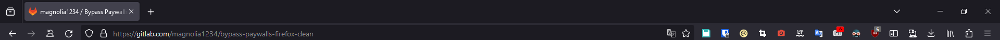

# Windows Clean Install Guide

In this post, I'll show you how I configure my windows installs.

<!-- more -->

> [!warning]
> Do not use ShutUp10, BleachBit and other scripts that could explode Windows. Don't touch the OS, the OS must remain intact.

## Verify Windows Version

- Verify you're on Windows 11 Pro. Otherwise, buy or change it. There's cheap grey market keys everywhere.

## Remove Unwanted Programs

### Control Panel

- One Drive → **Unlick computer before removing…**
 1. Sign int
 2. Remove everything in backup folder settings
 3. Uncheck every sync in the sync settings
 4. Remove OneDrive folder from User folder
 5. Unlink account
 6. Quit OneDrive
 7. Uninstall
- Remote Desktop Connection

### Add or Remove Programs

- You can safely remove almost… Everything. Just keep the calculator and notepad I guess.
- Don't forget to clean the start menu as well…

### Start-up App Using Task Manager

- Remove unwanted apps there.

### Updates

- Microsoft updates should be fine by default.
- But go launch Microsoft store apps updates manually now. It'll helps for `Terminal` settings.

## Controls

### Enhance Mouse Precision

1. Settings > Mouse > Additional mouse settings > Pointer Options
2. Uncheck `Enhance pointer precision`.

### Disable Alt + Maj Shortcut

1. Spam ALT+SHIFT
2. Click on the notification
3. Set key sequence to `None`

## Language & Time

### Language


- Download `language packs`, `text to speech` and `speech recognition` for your languages.
- Language for non-unicode program should be English US in the `region format`.
- But then to [make it save properly](https://www.reddit.com/r/Windows10/comments/15p1psl/these_keyboard_layouts_got_added_to_my_pc_along/) :

```
1. Open Control Panel, select Clock and Region.
2. Click Region.
3. Select Administrative tab.
4. Click on Copy Settings.
5. Under Copy your current settings to, check the box for Welcome screen and system accounts. Click OK and restart your PC.
```

#### Issues with Old Language Keyboards

If you have issues with languages and keyboard layouts coming back, try [this](https://superuser.com/questions/1360623/cant-remove-unneeded-keyboard-layouts-no-such-setting-anywhere) :

> [!success]
> I had a similar problem to the OP: for the English language, I had US, Canadian Multilingual Standard as well as Canadian French as keyboard layouts and I could not remove the last two.
>
> As I do not have administrator rights on my work PC, I could not use @harrymc's solution by editing the registry but I am able to edit language options. I tried the following and it worked for me:
>
> 1. **Add** the extra unwanted keyboard layouts using the _PC Settings > Time & Language > Language_ menu so they're all actually listed.
> 2. Save.
> 3. Afterwards, come back to the Languages screen and remove the extra layouts.
> 4. Again, press Save.
>
> I'm not quite sure how nor why but now those extra keyboard layouts are gone.
>
> EDIT: I'm not sure if it's new or it existed when I added that solution but this solution does not persist through reboots.

You can also try uninstalling old keyboard layouts using :

```
WIN + R
lpksetup # OPEN LANGUAGE PACK MANAGER
lpksetup /u en-gb # EXAMPLE UNINSTALLING EN-GN KEYBOARD
```

### Time Zone

- Make sure the `Set time zone automatically` is checked as well as every other automated settings.

## Colors and Theme

### Remove Trash Icon

1. Start > Settings > Personalization > Themes > Desktop icon settings.
2. Uncheck `RecycleBin`

### Background

1. Set `Windows Spotlight`
2. Right clic to desktop > View > Uncheck `Show Desktop Icons`

### Colors

1. `Dark mode`
2. Check `Transparency effects`
3. Accent color to `Automatic`
4. Check `Show accent color on Start and taskbar`
5. Check `Show accent color on title bars and windows borders`

### Night Light

- Schedule `sunset to sunrise`

### Taskbar

1. Uncheck every `taskbar items` settings
2. Uncheck every `system tray icons` settings
3. Let the rest as default

### Disable New Context Menu (Windows 11)

**Disable new context menu:**

```
reg.exe add "HKCU\Software\Classes\CLSID\{86ca1aa0-34aa-4e8b-a509-50c905bae2a2}\InprocServer32" /f /ve
```

**Restore new context menu:**

```
reg.exe delete "HKCU\Software\Classes\CLSID\{86ca1aa0-34aa-4e8b-a509-50c905bae2a2}" /f
```

## Sound

- Sound settings > Communications > `Do Nothing`
- If you use a Bose headset : [Fix Bose QC35 Headset Communication Issue on Windows 11](./Fix%20Bose%20QC35%20Headset%20Communication%20Issue%20on%20Windows%2011.md)

## Storage

### Storage Sense

1. Activate `storage sense`
2. Check `Cleanup of temporary files`
3. Check `Automatic User content cleanup`
 1. Run storage sense `Every month`
 2. Delete files in my recycle bin if they have been there for over `30 days`
 3. Delete files in my Downloads folder if they haven't been opened for more than `30 days`

### Show Hidden Files and Drives

1. Win + E > Triple dots > Options > View
2. Check `Show hidden files, folders and drives`
3. Uncheck `Hide extensions for known file types`

## Gaming

### Disable Game Mode

- Basically, go inside windows settings, gaming, and uncheck **everything**.

### Disable Core Isolation

- Windows Security > Core isolation > Uncheck `Memory integrity`.

> [!caution] Attention
> Ne faire ceci qu'en cas de performances gaming pas suffisantes. Autant le laisser si aucun problème n'est à relever.

## Power Options

### Disable Fast Startup and Hibernation

1. Go to `Control Panel > Hardware and Sound > Power Options > System Settings`
2. Click `Change settings that are currently unavailable`
3. Uncheck `Turn on fast start-up`
4. Uncheck `Hibernate` or use command `powercfg -h off`

### Closing the Lid

- Set everything to `sleep`.

### Turn Off Display and Sleep

- Auto turn of display after `1 min`, but `no auto sleep`.

## Remove Windows Telemetry

### Privacy and Security > General

- Uncheck everything.

### Privacy and Security > Speech

- Uncheck everything.

### Privacy and Security > Inking & Typing Personalization

- Uncheck everything.

### Privacy and Security > Diagnostics & Feedback

- Uncheck everything.

### Privacy and Security > Activity History

- Uncheck everything.

### Privacy and Security > Search Permissions

- Uncheck everything.

### Privacy and Security > Searching Windows

- Change nothing.

## Install Scripts

### Install WSL

1. Open CMD as admin
2. `wsl --install`
3. Reboot.
4. Username : `mat`
5. Password : You know what.

### Scripts

1. [Windows Post-Install Script](./Windows%20Post-Install%20Script.md)
2. [Windows Post-Install Script for Gaming](./Windows%20Post-Install%20Script%20for%20Gaming.md)
3. Reboot.

### Taskbar Setup


### Windows Terminal

#### Startup

- Default profile `Ubuntu`
- Default terminal app `Terminal`

Is your profile using `wsl.exe -d Ubuntu` or `Ubuntu.exe`?

The latter will not respect the starting directory, and always opens in $HOME

#### Appearance

- Application theme `Use windows theme`
- `Use acrylic in tab row`

#### Color Scheme

1. Create new color scheme
2. Name it Github Dark
3. Copy [this](https://windowsterminalthemes.dev/?theme=GitHub%20Dark) in your `settings.json`

```json
{
  "name": "GitHub Dark",
  "black": "#000000",
  "red": "#f78166",
  "green": "#56d364",
  "yellow": "#e3b341",
  "blue": "#6ca4f8",
  "purple": "#db61a2",
  "cyan": "#2b7489",
  "white": "#ffffff",
  "brightBlack": "#4d4d4d",
  "brightRed": "#f78166",
  "brightGreen": "#56d364",
  "brightYellow": "#e3b341",
  "brightBlue": "#6ca4f8",
  "brightPurple": "#db61a2",
  "brightCyan": "#2b7489",
  "brightWhite": "#ffffff",
  "background": "#101216",
  "foreground": "#8b949e",
  "selectionBackground": "#3b5070",
  "cursorColor": "#c9d1d9"
}
```

#### Defaults

- `Run as administrator`

#### Defaults > Appearance

- `Retro terminal effect`
- Automatically adjust lightness of indistinguishable text `Always`
- `Enable acylic material 75%`

### PowerToys

- General > `Always run as admin`
- PowerRename :
   	- `\b`
   	- Use regular expressions
   	- `$YYYY-$MM-$DD_$hh-$mm-$ss_`
   	- Filename only

### Auto Dark Mode

1. Launch
2. Sunset sunrise (location service)
3. Settings > 24h clock

### Firefox

1. Login to Mozilla Acount
2. When prompted, choose `never save password`
3. Wait for sync
4. Accept prompted extensions
5. Install [magnolia1234 / Bypass Paywalls Firefox Clean · GitLab](https://gitlab.com/magnolia1234/bypass-paywalls-firefox-clean)
6. Delete stupid bookmarks
7. Put extensions icons correctly : 
8. Change shortcuts :
 1. Bitwarden : `CTRL+SHIFT+L`
 2. Omnivore : `ALT+A`
 3. Tab Session Manager : `ALT+W`
9. Log in to Tab Session manager, auto-save every 5min, check auto sync.
10. Log in to Bitwarden, remember me, unlock with pin (you know what password) and uncheck the master password on browser restart.
11. Log in to Omnivore
12. uBlock Origins → Filters Lists → Annoyances :
 1. AdGuard
 2. Easylist
 3. uBlock
13. Translate web page → Uncheck `Show the button to translate the selected text`
14. Show bookmark toolbar

### Google Drive

1. Sign in
2. Skip everything, you don't need folder and photos backup
3. Mirror files for Google Drive

### Obsidian

1. Log in
2. Enter vault password
3. **DONT SYNC NOW**
4. Go to sync and check everything to sync
5. Resume sync
6. Wait forever
7. Turn on community plugin
8. Restart
9. Login to Todoist
10. Reorganise icons
11. Activate French et English spellcheck

### Super Productivity

1. Settings
2. Sync : Check `Enable Syncing` & `Enable Compression`
3. Log in to DropBox and copy the key
4. Keep remote

### Todoist

- Log in
- Settings > Theme > `Mode sombre automatique`

### VS Code

- Backup and sync settings : Sign in with Github

### Bulk Rename Utility

- REMOVE :
   	- Digits
   	- Sym.
- AUTO DATE :
   	- Prefix
   	- Modified (Current)
   	- Fmt : Custom : `%Y-%m-%d_%H-%M-%S_`
- Then save settings using `CTRL + S`

### TortoiseGit

1. Advanced
2. OverlaysCaseSensitive : `false`

### ShareX

Remove Windows Snipping Tool shortcut :

1. `Settings > Accessibility > Keyboard menu`
2. Toggling the `Use the Print Screen key to open Snipping Tool` to off

#### Hotkey Settings

- Capture region : `Print Screen`
- Capture entire screen : `CTRL + Print Screen`
- Capture active window : `SHIFT + Print Screen`
- Scrolling capture : `ALT + Print Screen`
- Start/stop screen recording (GIF) : `ALTGR + Print Screen = CTRL + ALT + Print Screen`

#### Application Settings

- Use custom screenshots folder : `Downloads`
- History : Uncheck everything.

#### Task Settings

- File naming : `%yy-%mo-%d_%h-%mi-%s_%pn`

### AHK Scripts

#### Launch Todoist Minimized

- [Launch Todoist Minimized on Windows Startup](./Launch%20Todoist%20Minimized%20on%20Windows%20Startup.md)

```ahk
Run, %localappdata%\Programs\todoist\Todoist.exe
WinWait, ahk_exe Todoist.exe
WinClose, ahk_exe Todoist.exe
```

#### Auto-Dim Taskbar

- [OLED Display AutoHotkey Script for Automatically Dimming the Taskbar](./OLED%20Display%20AutoHotkey%20Script%20for%20Automatically%20Dimming%20the%20Taskbar.md)

```ahk
SysGet, Monitor, Monitor                   ; Get monitor dimensions
SysGet, WorkArea, MonitorWorkArea          ; Get monitor work-area without taskbar
dimtop := % WorkAreaBottom + 1             ; taskbar is assumed to start below the work-area
Gui Color, 0,0                             ; Black color
Gui -Caption +ToolWindow +E0x20            ; No title bar, No taskbar button, Transparent for clicks
Gui Show, X0 Y%dimtop% W%MonitorRight% H63 ; Create a semi-transparent cover window
WinGet ID, ID, A                           ; Get its HWND/handle ID
Winset AlwaysOnTop,ON,ahk_id %ID%          ; Keep it always on the top
WinSet Transparent,99,ahk_id %ID%          ; Transparency 99/256
SetTimer, coverIt, 500                     ; Repeat setting it to be on top of the taskbar
return

GetCurrentMonitor()
{
  SysGet, numberOfMonitors, MonitorCount
  WinGetPos, winX, winY, winWidth, winHeight, A
  winMidX := winX + winWidth / 2
  winMidY := winY + winHeight / 2
  Loop %numberOfMonitors%
  {
    SysGet, monArea, Monitor, %A_Index%
    if (winMidX > monAreaLeft && winMidX < monAreaRight && winMidY < monAreaBottom && winMidY > monAreaTop)
      return A_Index
  }
  SysGet, primaryMonitor, MonitorPrimary
  return "No Monitor Found"
}

coverIt:
    WinGet style, Style, A                 ; Get active window style and dimensions
    WinGetPos ,,,winW,winH, A
    ; 0x800000 is WS_BORDER.
    ; 0x20000000 is WS_MINIMIZE.
    ; check no border and not minimized
    isfull := ((style & 0x20800000) = 0 and winH >= A_ScreenHeight and winW >= A_ScreenWidth)
    isPrimaryMonitor := (GetCurrentMonitor() = 1)
    if (isfull and isPrimaryMonitor) {
        WinHide, ahk_id %ID%
    } else {
        WinShow, ahk_id %ID%
        Winset AlwaysOnTop,ON,ahk_id %ID%      ; Ensure it is still on the top
    }
    return
```

### Spotify

1. Edit > Preferences > Startup and windows behavior
2. Don't open on startup
3. Minimize on close

### Discord

- Don't open on startup

### Windscribe

- Add Swiss Locations to favorites
- Don't open on startup

### Stremio

- Log in
- Touches directionnelles : 5s
- SHIFT + touches directionnelles : 10s

### Chrome Remote Desktop

1. Open [Chrome Remote Desktop](https://remotedesktop.google.com/access/)
2. Follow instructions under `Set Up Remote Access`
3. Remove unwanted firefox extension

## Bitlocker Drive Encryption

- Add a classic Windows password resistant to dictionary attacks.
- Encrypt the PC with Bitlocker.
